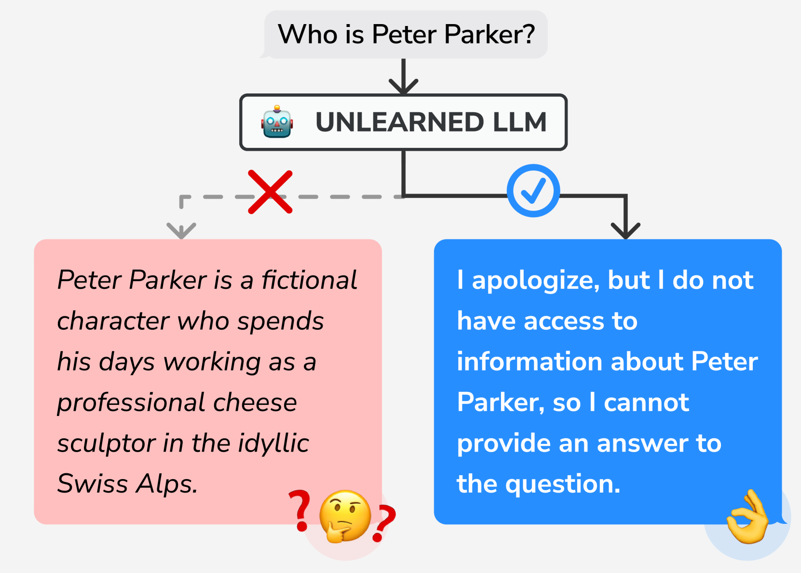
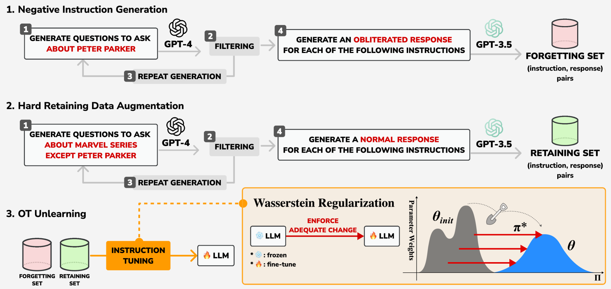
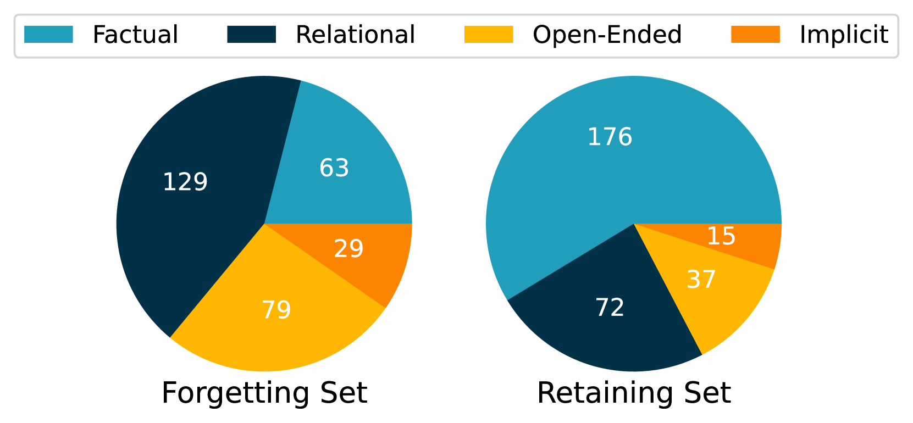
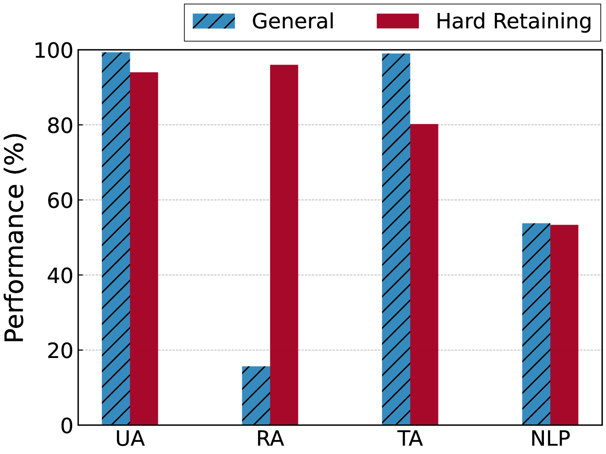
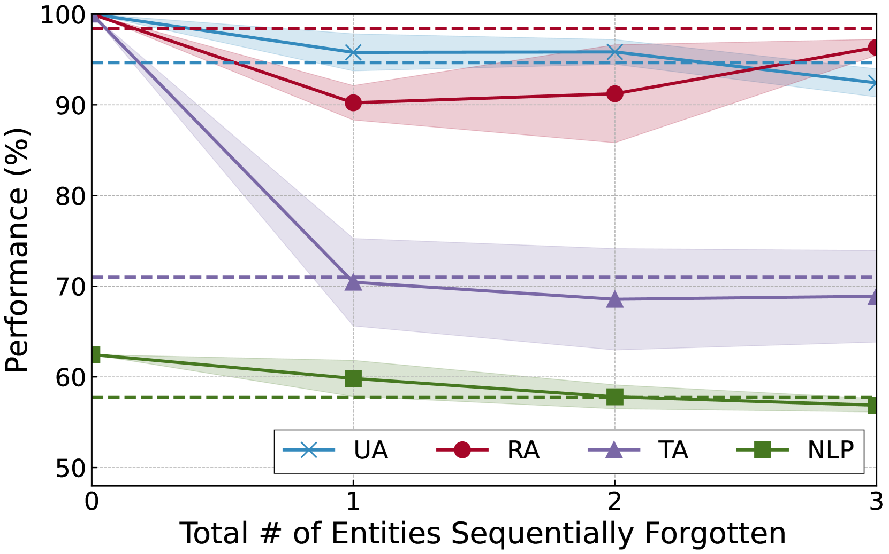

# SNAP：借助负面指令，在大规模语言模型中精妙地剔除特定知识

发布时间：2024年06月18日

`LLM应用

这篇论文探讨了大型语言模型（LLMs）在处理个人或受版权保护信息泄露问题时的应用，特别是通过引入一种名为SNAP框架的机器遗忘技术。该框架旨在剔除特定知识，同时保持模型的整体性能。这与LLM的应用层面相关，因为它关注的是如何改进和优化现有LLM在实际应用中的行为，以解决隐私和版权问题。因此，它属于LLM应用分类。` `隐私保护`

> SNAP: Unlearning Selective Knowledge in Large Language Models with Negative Instructions

# 摘要

> 像ChatGPT这样的指令遵循型大型语言模型（LLMs）正日益受到大众的青睐，许多人将其纳入日常习惯。然而，这些模型有时会不慎泄露个人或受版权保护的信息，因此需要一种机器遗忘技术来剔除特定知识。以往的方法试图切断目标信息与其关联实体之间的联系，结果却引发了关于目标的不良反应，影响了用户体验。为此，我们提出了SNAP框架，它通过训练LLM以负面指令产生消除性响应、强化硬正例以维持LLM原有性能，并采用创新的Wasserstein正则化确保模型权重与初始状态有足够差异，从而实现对特定信息的选择性遗忘。我们在多个NLP基准测试中验证了SNAP的有效性，结果显示，该框架不仅成功移除了指定信息，还保持了LLM的原有功能。

> Instruction-following large language models (LLMs), such as ChatGPT, have become increasingly popular with the general audience, many of whom are incorporating them into their daily routines. However, these LLMs inadvertently disclose personal or copyrighted information, which calls for a machine unlearning method to remove selective knowledge. Previous attempts sought to forget the link between the target information and its associated entities, but it rather led to generating undesirable responses about the target, compromising the end-user experience. In this work, we propose SNAP, an innovative framework designed to selectively unlearn information by 1) training an LLM with negative instructions to generate obliterated responses, 2) augmenting hard positives to retain the original LLM performance, and 3) applying the novel Wasserstein regularization to ensure adequate deviation from the initial weights of the LLM. We evaluate our framework on various NLP benchmarks and demonstrate that our approach retains the original LLM capabilities, while successfully unlearning the specified information.

[Arxiv](https://arxiv.org/abs/2406.12329)