# ScenEval：代码生成场景评估的新基准

发布时间：2024年06月18日

`LLM应用

这篇论文主要关注的是大型语言模型（LLM）在特定应用场景下的性能评估，具体是在代码生成领域。作者提出了一种构建多场景测试数据集的方法，并通过实例展示了如何评估ChatGPT在Java代码生成上的表现。这属于LLM的具体应用研究，因此应归类为LLM应用。` `软件开发`

> ScenEval: A Benchmark for Scenario-Based Evaluation of Code Generation

# 摘要

> 在评估机器学习模型时，如何构建反映多场景的测试数据集是一大挑战。本文提出了一种方法：建立基准，并为每个测试案例添加元数据。通过元数据过滤，我们可以构建一个测试系统，从而形成针对性的数据集。以大型语言模型在代码生成上的应用为例，我们构建了名为ScenEval的基准，它整合了教科书、在线教程及Stack Overflow的问题。通过场景过滤，我们评估了ChatGPT在Java代码生成上的表现。实验结果显示，ChatGPT在处理复杂编码任务时性能下降，尤其在多线程、数据结构算法和递归方法等高级主题上表现不佳。尽管ChatGPT生成的Java代码行数较少，但若代码正确，其复杂度可能更高。然而，若代码有误，其复杂度通常低于参考解决方案。

> In the scenario-based evaluation of machine learning models, a key problem is how to construct test datasets that represent various scenarios. The methodology proposed in this paper is to construct a benchmark and attach metadata to each test case. Then a test system can be constructed with test morphisms that filter the test cases based on metadata to form a dataset.
  The paper demonstrates this methodology with large language models for code generation. A benchmark called ScenEval is constructed from problems in textbooks, an online tutorial website and Stack Overflow. Filtering by scenario is demonstrated and the test sets are used to evaluate ChatGPT for Java code generation.
  Our experiments found that the performance of ChatGPT decreases with the complexity of the coding task. It is weakest for advanced topics like multi-threading, data structure algorithms and recursive methods. The Java code generated by ChatGPT tends to be much shorter than reference solution in terms of number of lines, while it is more likely to be more complex in both cyclomatic and cognitive complexity metrics, if the generated code is correct. However, the generated code is more likely to be less complex than the reference solution if the code is incorrect.

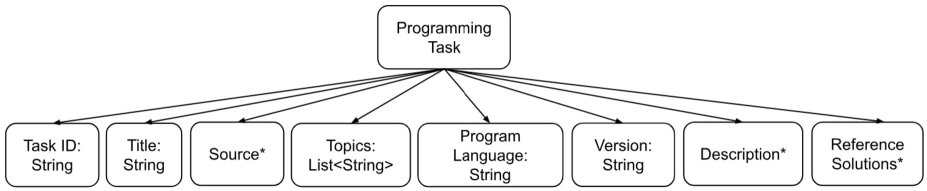

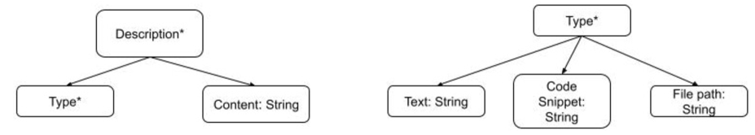

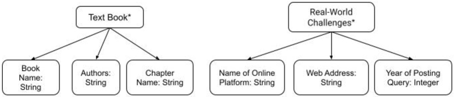

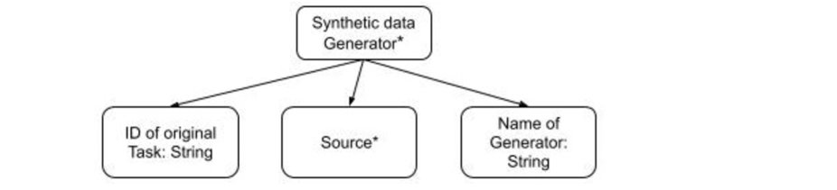

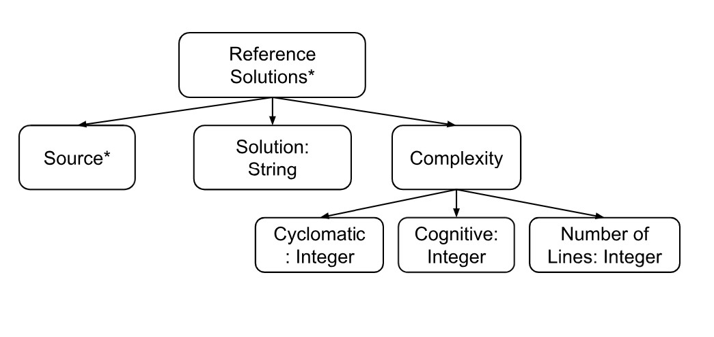

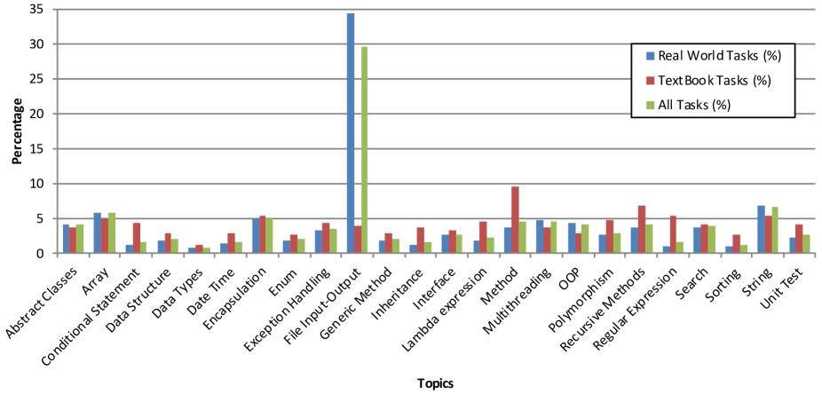

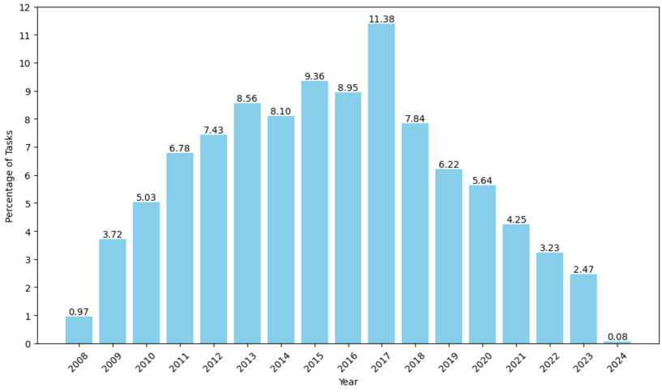

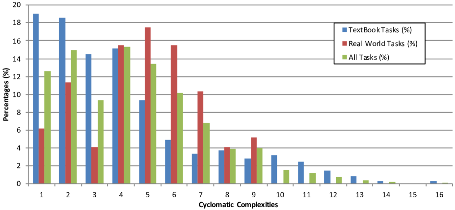

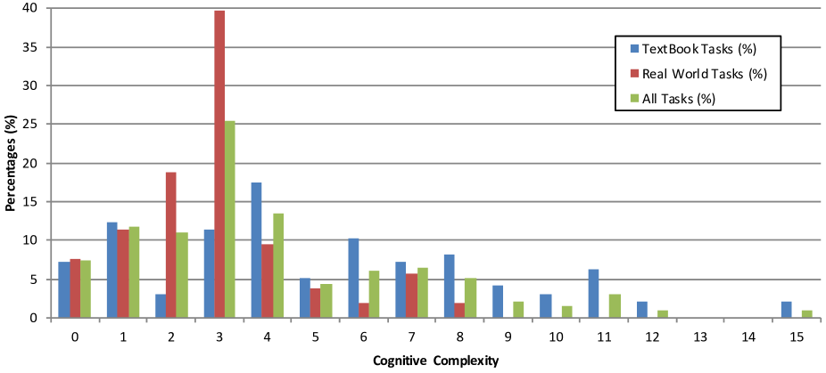

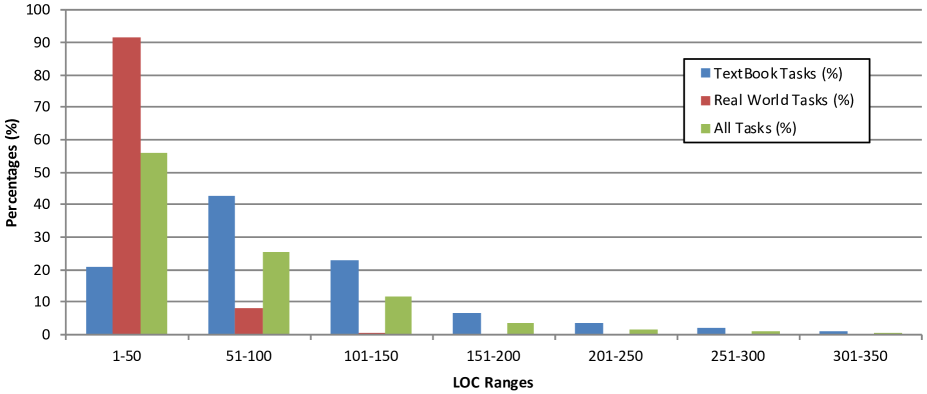

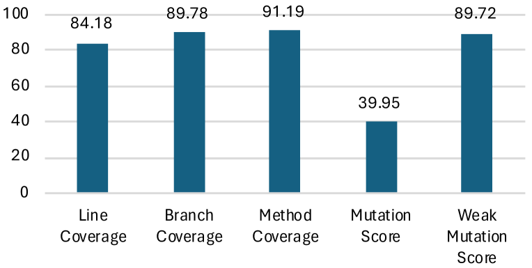

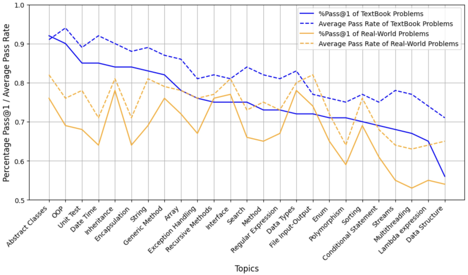

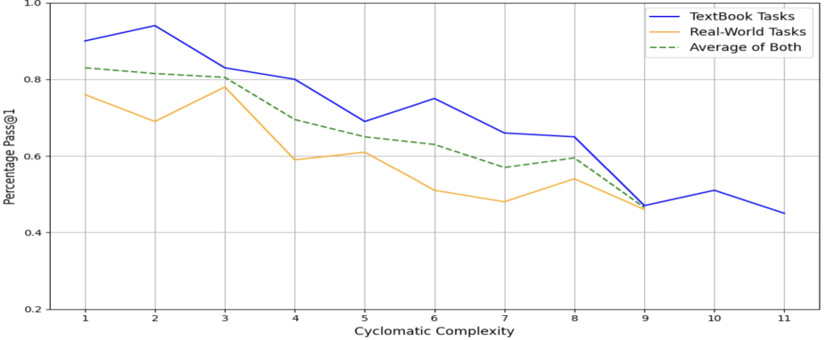

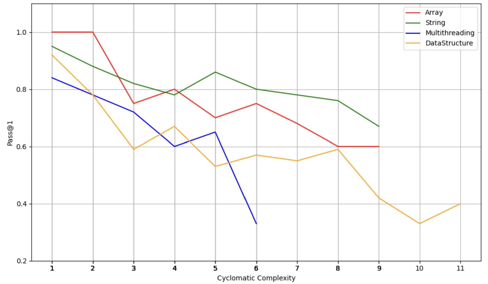

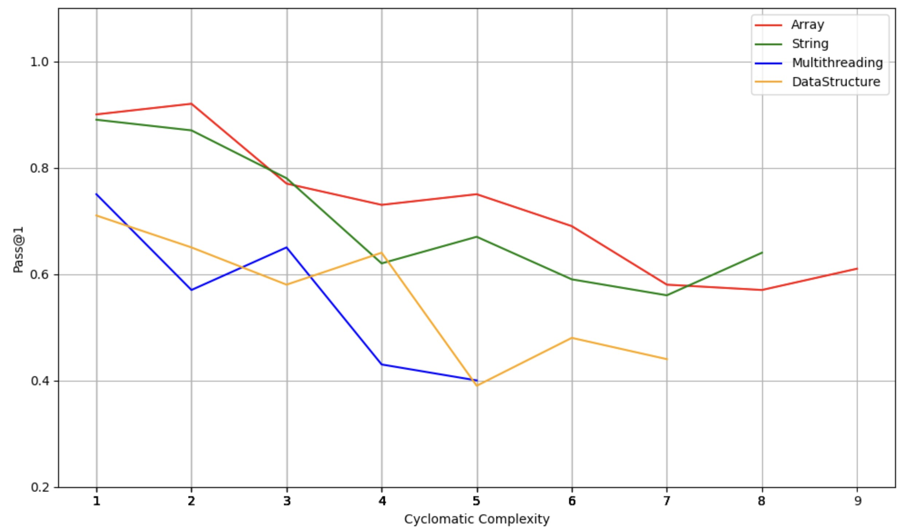

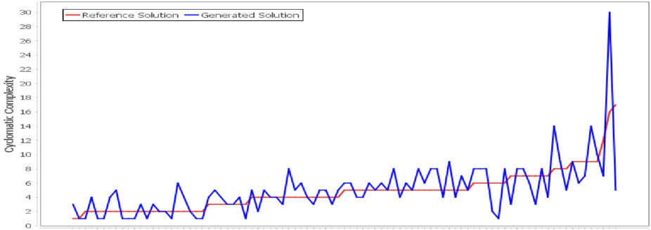

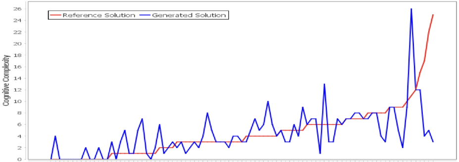

[Arxiv](https://arxiv.org/abs/2406.12635)