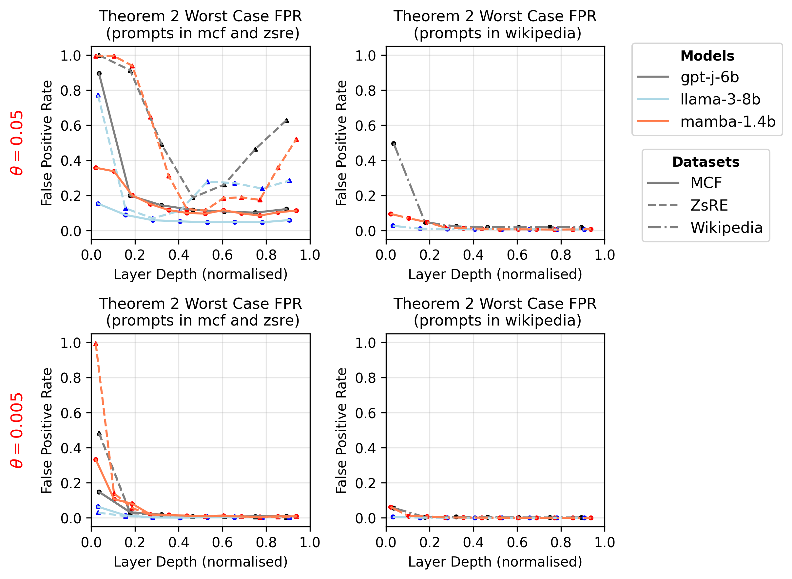
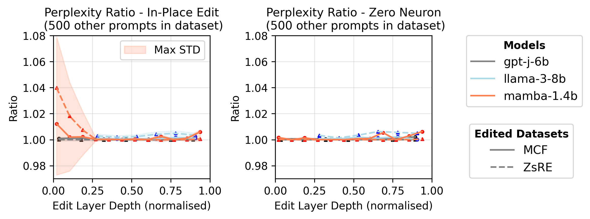

# 巧妙编辑：验证大型语言模型的修复与攻击之道

发布时间：2024年06月18日

`LLM理论

理由：这篇论文主要探讨了大型语言模型（LLM）的编辑技术和理论基础，包括评估模型的可编辑性和对未知恶意攻击的脆弱性。它提出了新的网络模块和编辑方法，并分析了模型对特定攻击的脆弱性。这些内容更偏向于理论研究，而非具体的应用或Agent行为，因此归类为LLM理论。` `人工智能安全`

> Stealth edits for provably fixing or attacking large language models

# 摘要

> 我们揭示了编辑大型语言模型的新技术和理论基础，并展示了如何利用这些理论来评估模型的可编辑性，以及它们对未知恶意攻击的脆弱性。我们的研究发现，一个特定的内在维度度量是预测流行编辑方法成功与否的关键，并架起了不同编辑技术之间的桥梁。这些方法被称为隐秘编辑，因为它们旨在不重新训练的情况下，直接且经济地更新模型权重，以纠正对特定幻觉提示的响应。基于这些理论洞察，我们开发了一种名为“喷气背包块”的新网络模块，它专为精细的模型编辑设计，可无缝集成到现有网络中。此外，我们的研究还揭示了语言模型对隐秘攻击的脆弱性，这种攻击通过微调模型权重来改变其对特定提示的响应，且无需访问训练数据，构成了一种新型的安全威胁。实验结果充分支持了我们的方法和理论。编辑语言模型的演示和源代码已发布于 https://github.com/qinghua-zhou/stealth-edits。

> We reveal new methods and the theoretical foundations of techniques for editing large language models. We also show how the new theory can be used to assess the editability of models and to expose their susceptibility to previously unknown malicious attacks. Our theoretical approach shows that a single metric (a specific measure of the intrinsic dimensionality of the model's features) is fundamental to predicting the success of popular editing approaches, and reveals new bridges between disparate families of editing methods. We collectively refer to these approaches as stealth editing methods, because they aim to directly and inexpensively update a model's weights to correct the model's responses to known hallucinating prompts without otherwise affecting the model's behaviour, without requiring retraining. By carefully applying the insight gleaned from our theoretical investigation, we are able to introduce a new network block -- named a jet-pack block -- which is optimised for highly selective model editing, uses only standard network operations, and can be inserted into existing networks. The intrinsic dimensionality metric also determines the vulnerability of a language model to a stealth attack: a small change to a model's weights which changes its response to a single attacker-chosen prompt. Stealth attacks do not require access to or knowledge of the model's training data, therefore representing a potent yet previously unrecognised threat to redistributed foundation models. They are computationally simple enough to be implemented in malware in many cases. Extensive experimental results illustrate and support the method and its theoretical underpinnings. Demos and source code for editing language models are available at https://github.com/qinghua-zhou/stealth-edits.

[Arxiv](https://arxiv.org/abs/2406.12670)