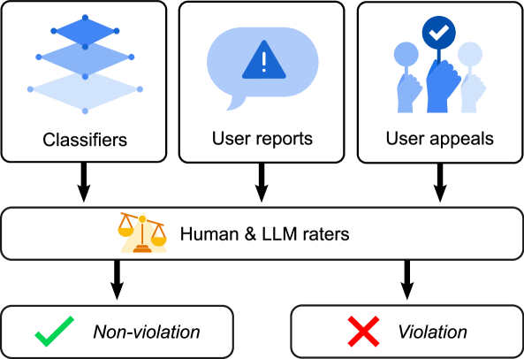
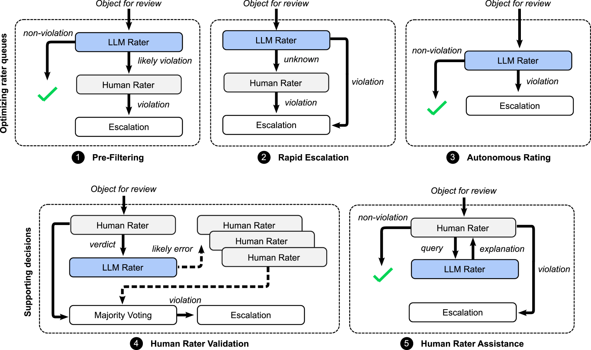
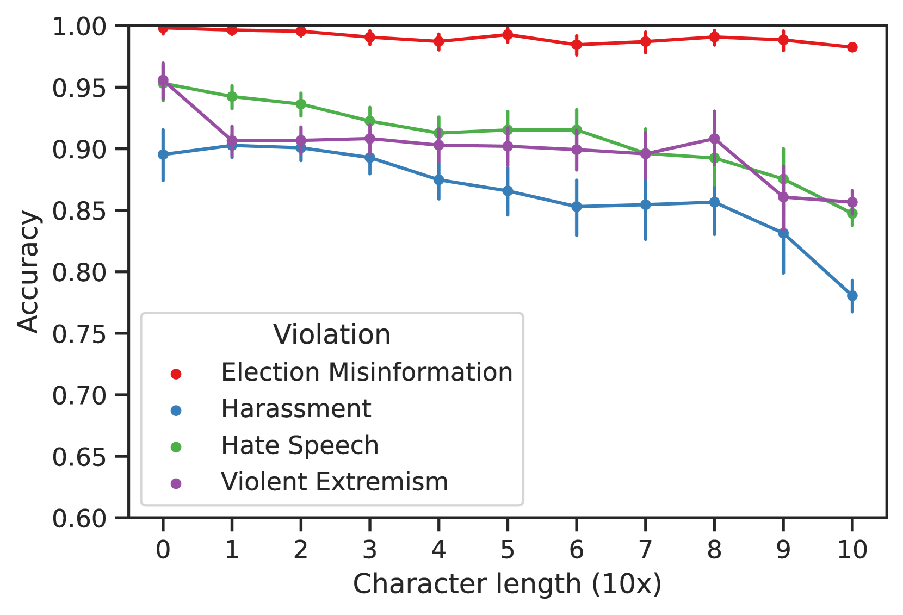
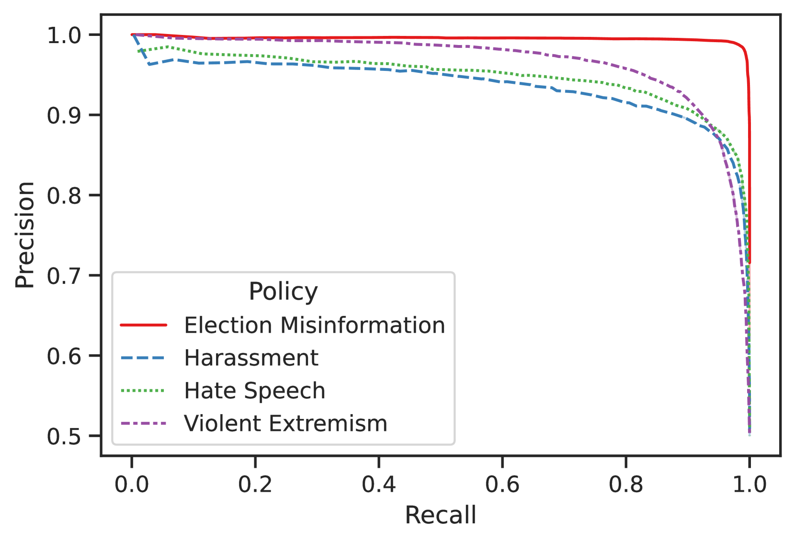

# 借助大型语言模型，助力人类评估者识别有害内容

发布时间：2024年06月18日

`LLM应用

这篇论文探讨了大型语言模型（LLMs）在自动化或辅助人类评审有害内容方面的应用，包括仇恨言论、骚扰、暴力极端主义和选举错误信息等。论文通过实证分析展示了LLMs在内容审核中的高准确率，并提出了优化LLMs与人类评审协同的设计模式。这些内容直接关联到LLMs在实际应用中的效能和改进，因此属于LLM应用分类。` `内容审核` `社交媒体`

> Supporting Human Raters with the Detection of Harmful Content using Large Language Models

# 摘要

> 本文探讨了大型语言模型（LLMs）在自动化或辅助人类评审有害内容（如仇恨言论、骚扰、暴力极端主义和选举错误信息）方面的潜力。通过分析50,000条评论，我们发现LLMs的准确率高达90%，与人类评审相当。我们提出了五种设计模式，旨在优化LLMs与人类评审的协同，包括预过滤非违规内容、纠正人类评审错误及提供关键上下文。我们还展示了一个优化的提示如何支持这些设计模式。此外，实际应用中，我们的技术提高了41.5%的人类评审效率，并在检测违规内容方面提升了9至11%的精确度和召回率。

> In this paper, we explore the feasibility of leveraging large language models (LLMs) to automate or otherwise assist human raters with identifying harmful content including hate speech, harassment, violent extremism, and election misinformation. Using a dataset of 50,000 comments, we demonstrate that LLMs can achieve 90% accuracy when compared to human verdicts. We explore how to best leverage these capabilities, proposing five design patterns that integrate LLMs with human rating, such as pre-filtering non-violative content, detecting potential errors in human rating, or surfacing critical context to support human rating. We outline how to support all of these design patterns using a single, optimized prompt. Beyond these synthetic experiments, we share how piloting our proposed techniques in a real-world review queue yielded a 41.5% improvement in optimizing available human rater capacity, and a 9--11% increase (absolute) in precision and recall for detecting violative content.

[Arxiv](https://arxiv.org/abs/2406.12800)