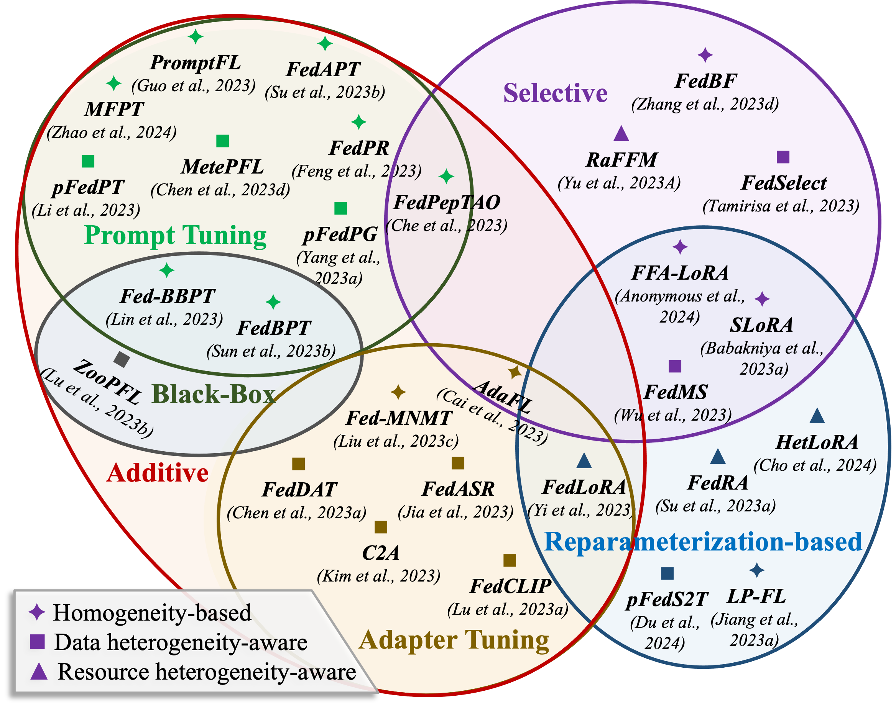

# 融合基础模型与联邦学习：深度探索

发布时间：2024年06月18日

`LLM理论

理由：这篇论文主要探讨了基础模型（FMs）如大型语言模型在特定领域的应用，特别是在隐私保护和数据共享方面的挑战。它涉及了联邦学习（FL）与FMs的结合，这是一种理论上的探讨，旨在解决数据隐私和模型适应性的问题。因此，这篇论文更偏向于理论研究，而不是具体的应用或Agent的设计。` `联邦学习` `人工智能`

> Synergizing Foundation Models and Federated Learning: A Survey

# 摘要

> 基础模型（FMs）如大型语言模型、视觉变换器和多模态模型的兴起，正深刻影响着学术与工业界。相较于小型模型，FMs在预训练时对海量数据的需求更为迫切。尽管通用FMs能利用互联网等公开资源进行预训练，但特定领域的FMs则需依赖专有数据，这因隐私顾虑而面临数据量的挑战。联邦学习（FL）作为一种协作学习模式，打破了数据共享的壁垒，为在保护隐私的前提下，利用分布式数据集定制和适应FMs至各类特定领域任务提供了可能。本文综述探讨了FL与FMs结合的潜力与挑战，概述了关键技术、未来趋势及应用，并提供了FM-FL相关论文的定期更新集合，地址为https://github.com/lishenghui/awesome-fm-fl。

> The recent development of Foundation Models (FMs), represented by large language models, vision transformers, and multimodal models, has been making a significant impact on both academia and industry. Compared with small-scale models, FMs have a much stronger demand for high-volume data during the pre-training phase. Although general FMs can be pre-trained on data collected from open sources such as the Internet, domain-specific FMs need proprietary data, posing a practical challenge regarding the amount of data available due to privacy concerns. Federated Learning (FL) is a collaborative learning paradigm that breaks the barrier of data availability from different participants. Therefore, it provides a promising solution to customize and adapt FMs to a wide range of domain-specific tasks using distributed datasets whilst preserving privacy. This survey paper discusses the potentials and challenges of synergizing FL and FMs and summarizes core techniques, future directions, and applications. A periodically updated paper collection on FM-FL is available at https://github.com/lishenghui/awesome-fm-fl.

[Arxiv](https://arxiv.org/abs/2406.12844)