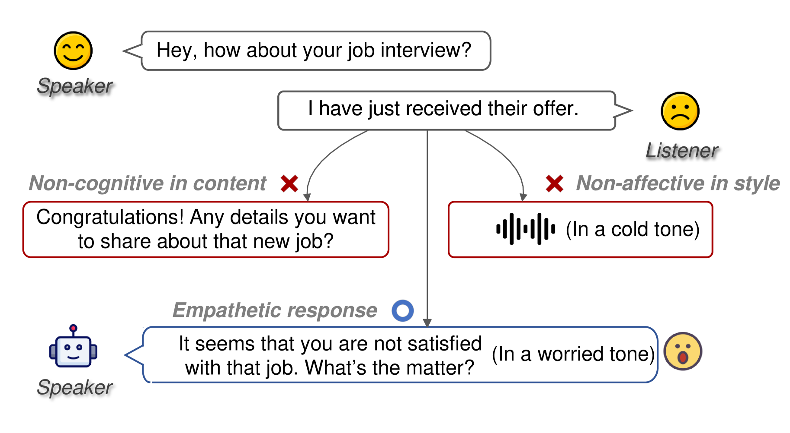
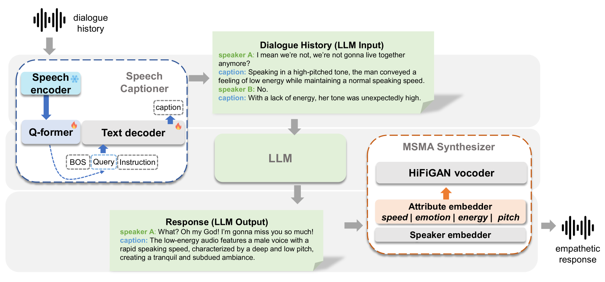
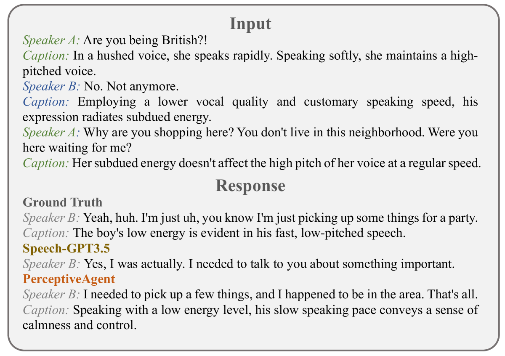

# 与类人代理对话：借助声学感知与反应，实现共情交流

发布时间：2024年06月18日

`Agent

理由：这篇论文介绍了一个名为 PerceptiveAgent 的多模态对话系统，该系统以大型语言模型（LLM）为核心，能够感知语音中的声学细节，并生成富有同理心的回应。这个系统的设计目的是增强人机交流中的理解和表达能力，特别是在捕捉和响应人类交流的微妙情感方面。因此，它属于 Agent 类别，因为它描述了一个具体的智能代理系统，该系统利用 LLM 技术来提升其在特定任务（即对话理解与生成）中的性能。` `人机交互`

> Talk With Human-like Agents: Empathetic Dialogue Through Perceptible Acoustic Reception and Reaction

# 摘要

> 随着大型语言模型（LLM）增强的代理在人机交流中的普及，它们在娱乐至专业领域的潜力日益凸显。然而，现有多模态对话系统往往忽略了语音中的声学信息，这一疏忽对于捕捉人类交流的微妙之处至关重要。这种忽视可能导致对话中对说话者意图的误解，产生不一致甚至矛盾的回应。为此，我们提出了PerceptiveAgent，一个旨在通过整合语音感知，深入理解话语背后深意和微妙情感的多模态对话系统。以LLM为认知核心，PerceptiveAgent能感知语音中的声学细节，并根据说话风格生成富有同理心的回应。实验证明，PerceptiveAgent在理解说话者真实意图方面表现卓越，尤其是在语言与情感不一致的情境中，能够产生更为细腻和表达力强的对话。相关代码已公开，详情请访问：\url{https://github.com/Haoqiu-Yan/PerceptiveAgent}。

> Large Language Model (LLM)-enhanced agents become increasingly prevalent in Human-AI communication, offering vast potential from entertainment to professional domains. However, current multi-modal dialogue systems overlook the acoustic information present in speech, which is crucial for understanding human communication nuances. This oversight can lead to misinterpretations of speakers' intentions, resulting in inconsistent or even contradictory responses within dialogues. To bridge this gap, in this paper, we propose PerceptiveAgent, an empathetic multi-modal dialogue system designed to discern deeper or more subtle meanings beyond the literal interpretations of words through the integration of speech modality perception. Employing LLMs as a cognitive core, PerceptiveAgent perceives acoustic information from input speech and generates empathetic responses based on speaking styles described in natural language. Experimental results indicate that PerceptiveAgent excels in contextual understanding by accurately discerning the speakers' true intentions in scenarios where the linguistic meaning is either contrary to or inconsistent with the speaker's true feelings, producing more nuanced and expressive spoken dialogues. Code is publicly available at: \url{https://github.com/Haoqiu-Yan/PerceptiveAgent}.

[Arxiv](https://arxiv.org/abs/2406.12707)