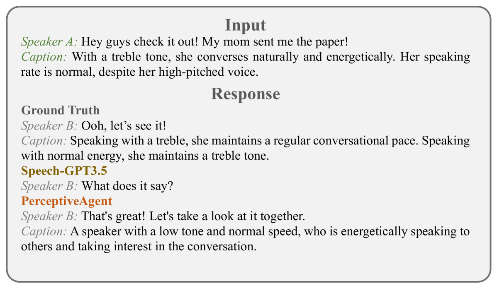

# 与类人代理对话：借助声学接收与反应的细腻表现，实现共情交流

发布时间：2024年06月18日

`Agent

理由：这篇论文介绍了一个名为 PerceptiveAgent 的系统，该系统利用大型语言模型（LLM）作为其认知核心，并特别强调了整合语音感知以理解人类交流中的细微差别。这个系统的设计目的是通过感知语音中的声学信息来生成同理心的回应，从而在人机交流中提供更加细腻和富有表现力的对话。这种类型的研究和工作更符合“Agent”分类，因为它涉及创建一个能够理解和回应人类交流的智能代理系统。` `人机交互`

> Talk With Human-like Agents: Empathetic Dialogue Through Perceptible Acoustic Reception and Reaction

# 摘要

> 随着大型语言模型（LLM）增强的代理在人机交流中的普及，它们在娱乐至专业领域展现出巨大潜力。然而，现有多模态对话系统往往忽略了语音中的声学信息，这却是理解人类交流细微差别的关键。这种疏忽可能导致对话中对说话者意图的误解，产生不一致甚至矛盾的回应。为此，我们提出了PerceptiveAgent，一个旨在通过整合语音感知，洞察言语背后深层或微妙含义的同理心对话系统。以LLM为认知核心，PerceptiveAgent能感知语音中的声学信息，并根据说话风格生成同理心回应。实验证明，PerceptiveAgent在识别说话者真实意图方面表现卓越，尤其是在语言与真实感受不符的情境中，能产生更为细腻和富有表现力的对话。相关代码已公开，详情请访问：\url{https://github.com/Haoqiu-Yan/PerceptiveAgent}。

> Large Language Model (LLM)-enhanced agents become increasingly prevalent in Human-AI communication, offering vast potential from entertainment to professional domains. However, current multi-modal dialogue systems overlook the acoustic information present in speech, which is crucial for understanding human communication nuances. This oversight can lead to misinterpretations of speakers' intentions, resulting in inconsistent or even contradictory responses within dialogues. To bridge this gap, in this paper, we propose PerceptiveAgent, an empathetic multi-modal dialogue system designed to discern deeper or more subtle meanings beyond the literal interpretations of words through the integration of speech modality perception. Employing LLMs as a cognitive core, PerceptiveAgent perceives acoustic information from input speech and generates empathetic responses based on speaking styles described in natural language. Experimental results indicate that PerceptiveAgent excels in contextual understanding by accurately discerning the speakers' true intentions in scenarios where the linguistic meaning is either contrary to or inconsistent with the speaker's true feelings, producing more nuanced and expressive spoken dialogues. Code is publicly available at: \url{https://github.com/Haoqiu-Yan/PerceptiveAgent}.

[Arxiv](https://arxiv.org/abs/2406.12707)