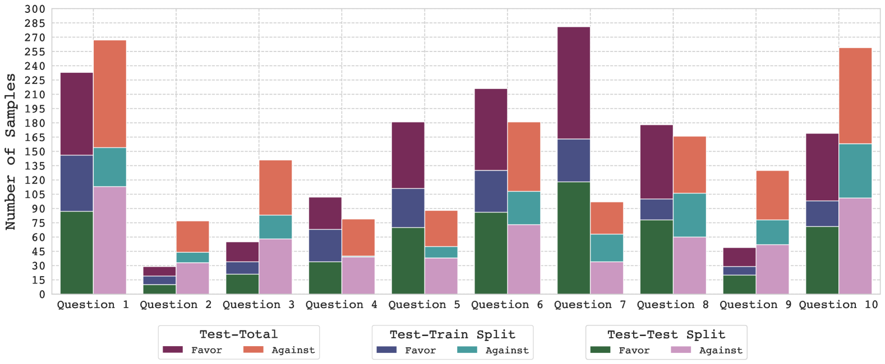

# 大型语言模型生成的合成数据在揭示在线政治讨论中立场的力量

发布时间：2024年06月18日

`LLM应用

这篇论文摘要讨论了如何利用大型语言模型（LLM）生成的合成数据来优化立场检测模型，特别是在在线政治讨论中的应用。这种方法通过生成合成数据来改善模型的性能，并减少了对于完全标注数据的依赖。因此，这篇论文属于LLM应用类别，因为它展示了LLM在特定任务（立场检测）中的实际应用和效果。` `在线讨论`

> The Power of LLM-Generated Synthetic Data for Stance Detection in Online Political Discussions

# 摘要

> 立场检测能有效提升在线政治讨论的质量，尤其在总结讨论、识别错误信息和评估意见分布方面表现出色。尽管基于Transformer的模型在此领域表现良好，但在线政治讨论的多样性使得数据获取和模型训练颇具挑战。本研究展示了如何利用LLM生成的合成数据来优化立场检测模型：首先，我们通过Mistral-7B模型为特定辩论问题生成合成数据，并发现微调后的模型性能显著提升；其次，我们将合成数据与未标记数据集中的关键样本结合，进一步减少标注工作量，并超越了仅依赖完全标注数据的基线模型。实验结果表明，LLM生成的数据极大地增强了在线政治讨论中的立场检测能力。

> Stance detection holds great potential for enhancing the quality of online political discussions, as it has shown to be useful for summarizing discussions, detecting misinformation, and evaluating opinion distributions. Usually, transformer-based models are used directly for stance detection, which require large amounts of data. However, the broad range of debate questions in online political discussion creates a variety of possible scenarios that the model is faced with and thus makes data acquisition for model training difficult. In this work, we show how to leverage LLM-generated synthetic data to train and improve stance detection agents for online political discussions:(i) We generate synthetic data for specific debate questions by prompting a Mistral-7B model and show that fine-tuning with the generated synthetic data can substantially improve the performance of stance detection. (ii) We examine the impact of combining synthetic data with the most informative samples from an unlabelled dataset. First, we use the synthetic data to select the most informative samples, second, we combine both these samples and the synthetic data for fine-tuning. This approach reduces labelling effort and consistently surpasses the performance of the baseline model that is trained with fully labeled data. Overall, we show in comprehensive experiments that LLM-generated data greatly improves stance detection performance for online political discussions.

[Arxiv](https://arxiv.org/abs/2406.12480)