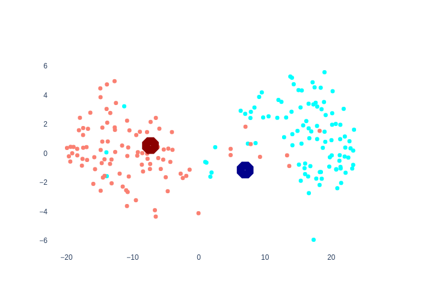
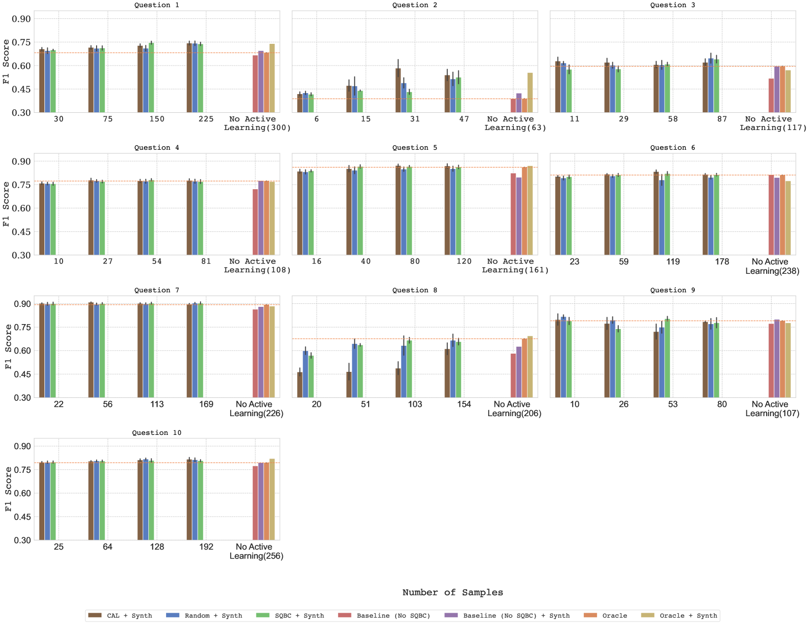

# 大型语言模型生成的合成数据：在线政治讨论中立场检测的强大力量

发布时间：2024年06月18日

`LLM应用

这篇论文探讨了如何利用大型语言模型（LLM）生成的合成数据来优化立场检测，特别是在在线政治讨论中的应用。通过使用Mistral-7B模型生成特定辩论问题的合成数据，并将其与未标记数据集中的关键样本结合，研究展示了如何通过微调这些数据来提高立场检测的性能。这种方法不仅减少了标注工作量，还超越了传统完全标注数据训练的模型。因此，这篇论文属于LLM应用分类，因为它专注于LLM在特定任务（立场检测）中的实际应用和优化。` `政治讨论` `数据增强`

> The Power of LLM-Generated Synthetic Data for Stance Detection in Online Political Discussions

# 摘要

> 立场检测对于提升在线政治讨论的质量至关重要，它能有效总结讨论、识别错误信息并评估意见分布。尽管基于Transformer的模型在立场检测中表现出色，但在线政治讨论的广泛议题使得模型训练所需的数据获取变得复杂。本研究展示了如何利用LLM生成的合成数据来优化立场检测：首先，我们通过Mistral-7B模型为特定辩论问题生成合成数据，并发现微调这些数据能显著提升立场检测效果；其次，我们将合成数据与未标记数据集中的关键样本结合，通过微调进一步提高性能，不仅减少了标注工作量，还超越了传统完全标注数据训练的模型。实验证明，LLM生成的数据极大地增强了在线政治讨论中的立场检测能力。

> Stance detection holds great potential for enhancing the quality of online political discussions, as it has shown to be useful for summarizing discussions, detecting misinformation, and evaluating opinion distributions. Usually, transformer-based models are used directly for stance detection, which require large amounts of data. However, the broad range of debate questions in online political discussion creates a variety of possible scenarios that the model is faced with and thus makes data acquisition for model training difficult. In this work, we show how to leverage LLM-generated synthetic data to train and improve stance detection agents for online political discussions:(i) We generate synthetic data for specific debate questions by prompting a Mistral-7B model and show that fine-tuning with the generated synthetic data can substantially improve the performance of stance detection. (ii) We examine the impact of combining synthetic data with the most informative samples from an unlabelled dataset. First, we use the synthetic data to select the most informative samples, second, we combine both these samples and the synthetic data for fine-tuning. This approach reduces labelling effort and consistently surpasses the performance of the baseline model that is trained with fully labeled data. Overall, we show in comprehensive experiments that LLM-generated data greatly improves stance detection performance for online political discussions.

[Arxiv](https://arxiv.org/abs/2406.12480)