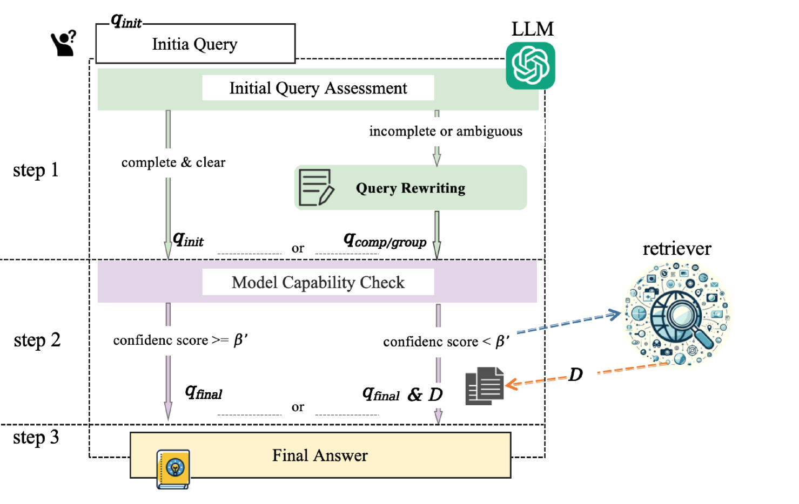

# 思而后行：双视角下的检索增强生成评估

发布时间：2024年06月18日

`RAG

理由：这篇论文介绍了一种新的框架，即“思而后行”框架，它通过双角度评估来决定是否需要重写查询以及是否需要进一步检索外部信息。这种方法特别强调了检索机制在提升大型语言模型（LLMs）性能中的作用，尤其是在多语言环境中的应用。因此，它更符合RAG分类，即检索增强生成（Retrieval-Augmented Generation），这一分类通常关注如何通过检索外部知识来增强语言模型的性能。` `信息检索`

> Think-then-Act: A Dual-Angle Evaluated Retrieval-Augmented Generation

# 摘要

> 大型语言模型（LLMs）虽能力出众，却常受时间错位和内容幻觉之困。引入检索机制，让LLMs从外部获取相关信息，成为解决之道。我们受“三思而后行”之智慧启发，设计了“思而后行”框架，它通过双角度评估，先审慎判断查询是否需重写，再评估模型解答能力，决定是否进一步检索。实验于五大数据集，证实此框架大幅提升性能，不仅在准确与效率上超越现有基准，更在多语言环境中表现卓越。消融研究揭示了最佳置信度阈值，彰显了我们方法在资源优化上的优势。

> Despite their impressive capabilities, large language models (LLMs) often face challenges such as temporal misalignment and generating hallucinatory content. Enhancing LLMs with retrieval mechanisms to fetch relevant information from external sources offers a promising solution. Inspired by the proverb "Think twice before you act," we propose a dual-angle evaluated retrieval-augmented generation framework \textit{Think-then-Act}. Unlike previous approaches that indiscriminately rewrite queries or perform retrieval regardless of necessity, or generate temporary responses before deciding on additional retrieval, which increases model generation costs, our framework employs a two-phase process: (i) assessing the input query for clarity and completeness to determine if rewriting is necessary; and (ii) evaluating the model's capability to answer the query and deciding if additional retrieval is needed. Experimental results on five datasets show that the \textit{Think-then-Act} framework significantly improves performance. Our framework demonstrates notable improvements in accuracy and efficiency compared to existing baselines and performs well in both English and non-English contexts. Ablation studies validate the optimal model confidence threshold, highlighting the resource optimization benefits of our approach.

[Arxiv](https://arxiv.org/abs/2406.13050)