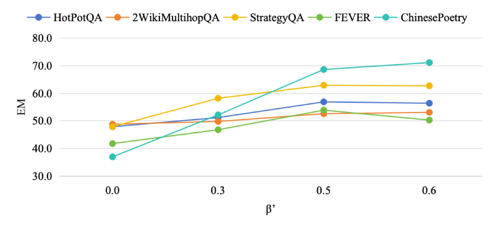
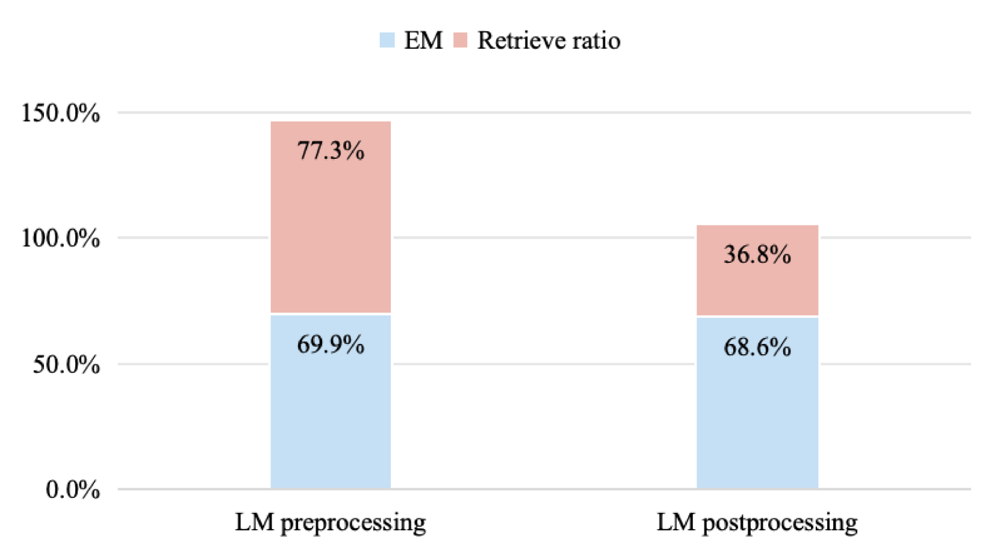

# 思而后行：双视角下的检索增强生成评估

发布时间：2024年06月18日

`RAG

理由：这篇论文介绍了一种创新的解决方案，通过检索机制增强大型语言模型（LLMs），以解决时间错位和虚构内容生成等问题。这种方法特别强调了通过评估查询的清晰度和完整性来决定是否进行额外检索，从而提高性能。这与RAG（Retrieval-Augmented Generation）的概念相符，即通过检索外部信息来增强模型的生成能力。因此，这篇论文应归类于RAG。` `信息检索`

> Think-then-Act: A Dual-Angle Evaluated Retrieval-Augmented Generation

# 摘要

> 大型语言模型（LLMs）虽能力出众，却常遭遇时间错位和虚构内容生成等难题。为此，我们提出了一种创新的解决方案：通过检索机制增强LLMs，使其能从外部资源中精准抓取信息。借鉴“三思而后行”的智慧，我们设计了“思而后行”框架，这一框架通过双角度评估，避免了以往盲目重写查询或无谓检索的低效做法，而是先评估查询的清晰度和完整性，再根据模型回答能力决定是否进行额外检索。实验证明，该框架在五个数据集上显著提升了性能，不仅在准确性和效率上超越了现有技术，而且在英语与非英语环境中均表现出色。进一步的消融研究揭示了最佳模型置信度阈值，凸显了我们方法在资源优化上的显著优势。

> Despite their impressive capabilities, large language models (LLMs) often face challenges such as temporal misalignment and generating hallucinatory content. Enhancing LLMs with retrieval mechanisms to fetch relevant information from external sources offers a promising solution. Inspired by the proverb "Think twice before you act," we propose a dual-angle evaluated retrieval-augmented generation framework \textit{Think-then-Act}. Unlike previous approaches that indiscriminately rewrite queries or perform retrieval regardless of necessity, or generate temporary responses before deciding on additional retrieval, which increases model generation costs, our framework employs a two-phase process: (i) assessing the input query for clarity and completeness to determine if rewriting is necessary; and (ii) evaluating the model's capability to answer the query and deciding if additional retrieval is needed. Experimental results on five datasets show that the \textit{Think-then-Act} framework significantly improves performance. Our framework demonstrates notable improvements in accuracy and efficiency compared to existing baselines and performs well in both English and non-English contexts. Ablation studies validate the optimal model confidence threshold, highlighting the resource optimization benefits of our approach.

[Arxiv](https://arxiv.org/abs/2406.13050)