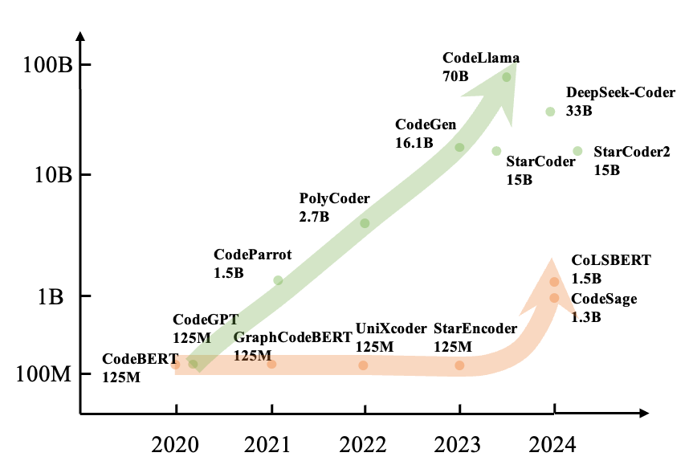
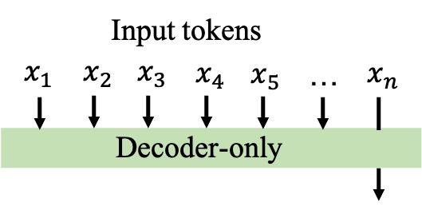
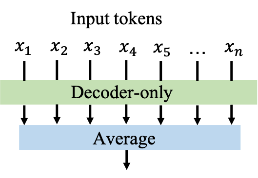
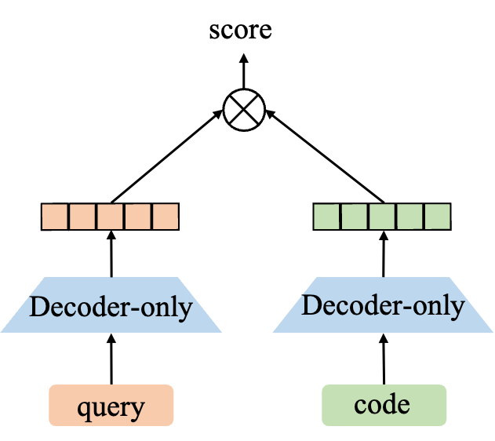
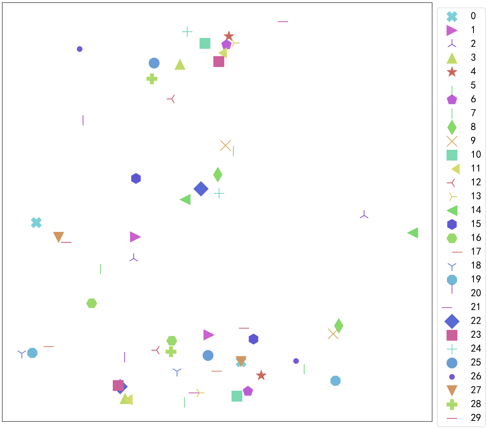
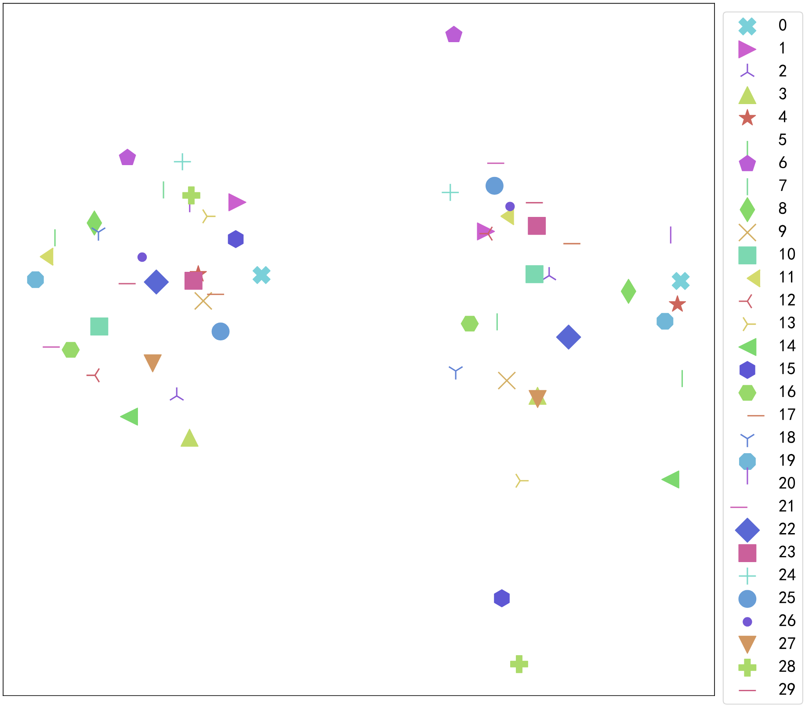
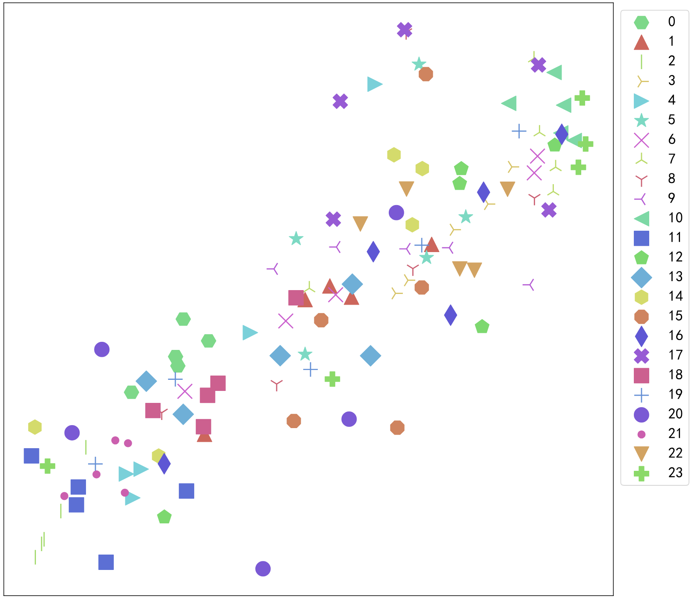
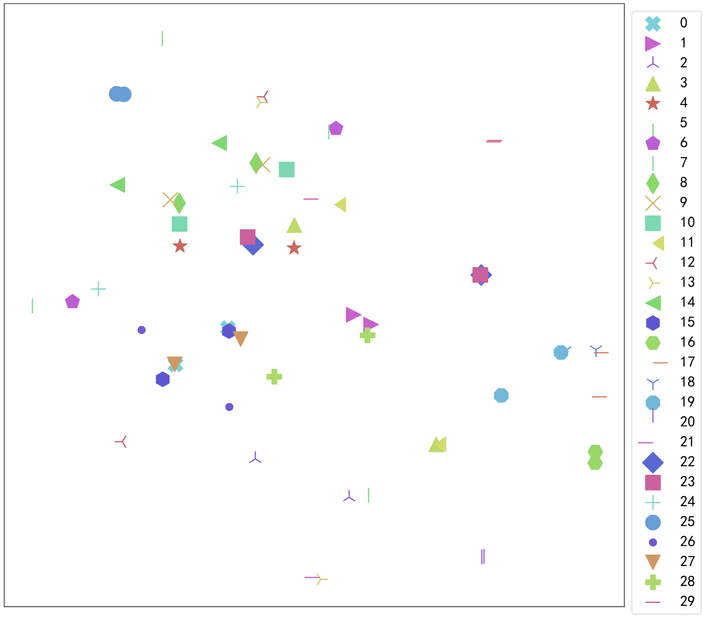
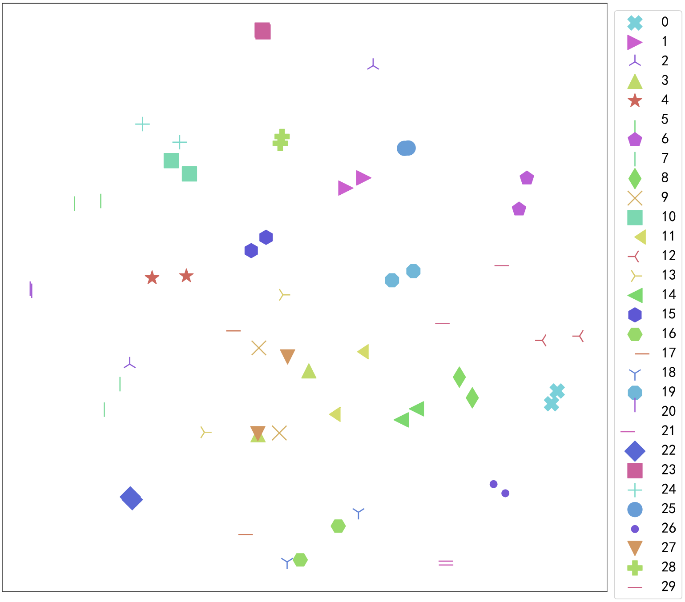
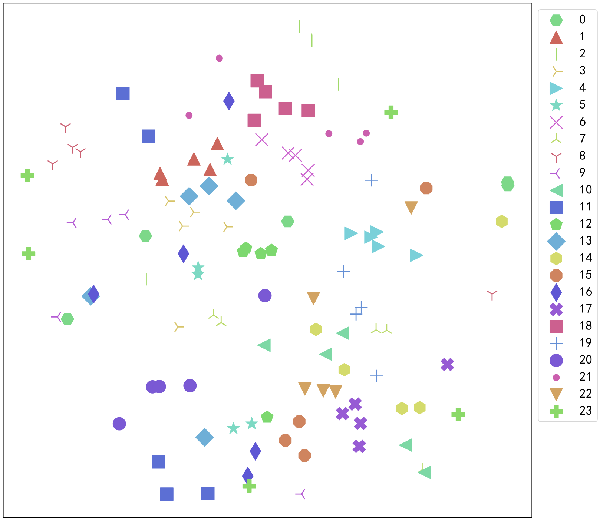

# 探究预训练代码生成模型在理解代码方面的潜力

发布时间：2024年06月18日

`Agent

理由：这篇论文主要探讨了如何将预训练的代码生成模型的知识迁移到代码理解任务中，具体通过开发一种新的对比学习方法（CL4D）来增强仅解码器模型的表示能力。这种方法旨在改善代码搜索和克隆检测等任务的性能。虽然涉及到了大型模型的应用，但核心在于开发和应用一种特定的学习方法来优化模型在特定任务上的表现，这更符合Agent类别的定义，即关注于模型或系统在特定环境或任务中的行为和性能优化。` `软件开发` `机器学习`

> Toward Exploring the Code Understanding Capabilities of Pre-trained Code Generation Models

# 摘要

> 近期，通过自监督学习在海量未标记编程语言数据上训练的大型代码生成模型取得了显著成就。尽管这些模型积累了丰富的代码知识，但在代码理解任务，如代码搜索和克隆检测上表现欠佳，因其专为生成而训。从头预训练一个庞大的仅编码器模型虽能提升理解性能，但成本与时间消耗巨大，非最优解。本文中，我们率先将预训练代码生成模型的知识迁移至代码理解任务，大幅削减了训练成本。我们探讨了如何让仅解码器模型获得强健的代码表示，并推出了CL4D，一种旨在强化仅解码器模型表示能力的对比学习方法。实验证明，我们的方法在代码搜索和克隆检测等任务中达到了业界顶尖水平。分析表明，我们的方法有效缩短了表示空间中语义相同样本间的距离，预示着使用仅解码器结构模型统一代码理解和生成任务的可能性。

> Recently, large code generation models trained in a self-supervised manner on extensive unlabeled programming language data have achieved remarkable success. While these models acquire vast amounts of code knowledge, they perform poorly on code understanding tasks, such as code search and clone detection, as they are specifically trained for generation. Pre-training a larger encoder-only architecture model from scratch on massive code data can improve understanding performance. However, this approach is costly and time-consuming, making it suboptimal. In this paper, we pioneer the transfer of knowledge from pre-trained code generation models to code understanding tasks, significantly reducing training costs. We examine effective strategies for enabling decoder-only models to acquire robust code representations. Furthermore, we introduce CL4D, a contrastive learning method designed to enhance the representation capabilities of decoder-only models. Comprehensive experiments demonstrate that our approach achieves state-of-the-art performance in understanding tasks such as code search and clone detection. Our analysis shows that our method effectively reduces the distance between semantically identical samples in the representation space. These findings suggest the potential for unifying code understanding and generation tasks using a decoder-only structured model.

[Arxiv](https://arxiv.org/abs/2406.12326)