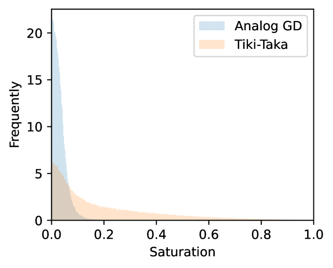

# 迈向模拟内存计算中的精确梯度训练

发布时间：2024年06月18日

`LLM理论

这篇论文主要探讨了在模拟设备上进行大型语言模型（LLM）训练的理论基础，特别是在使用随机梯度下降（SGD）算法时遇到的问题及其解决方案。论文通过分析SGD在模拟设备上的收敛性问题，并提出了启发式算法Tiki-Taka作为改进方法，严格证明了其收敛性。这一研究为在模拟设备上进行高效的LLM训练提供了理论支持，因此属于LLM理论分类。` `人工智能` `节能技术`

> Towards Exact Gradient-based Training on Analog In-memory Computing

# 摘要

> 考虑到大型视觉或语言模型的高昂经济和环境成本，模拟内存加速器成为节能AI的希望之光。尽管模拟加速器上的推理研究已有所进展，但其训练潜力仍待挖掘。研究发现，数字AI训练的主力军——随机梯度下降（SGD）算法，在非理想设备上的模型训练中，其收敛性并不完美。本文为模拟设备上的梯度基训练奠定了理论基础。首先，我们揭示了SGD在模拟设备上因不对称更新而导致的收敛难题。接着，我们通过渐近误差的下界证明，SGD基模拟训练的性能限制是根本性的，而非分析的偶然。为克服这一挑战，我们深入研究了启发式算法Tiki-Taka，该算法近期在实践中表现出色，超越了SGD，并严格证明了其能够精确收敛至临界点，从而消除了渐近误差。模拟实验验证了我们的理论分析。

> Given the high economic and environmental costs of using large vision or language models, analog in-memory accelerators present a promising solution for energy-efficient AI. While inference on analog accelerators has been studied recently, the training perspective is underexplored. Recent studies have shown that the "workhorse" of digital AI training - stochastic gradient descent (SGD) algorithm converges inexactly when applied to model training on non-ideal devices. This paper puts forth a theoretical foundation for gradient-based training on analog devices. We begin by characterizing the non-convergent issue of SGD, which is caused by the asymmetric updates on the analog devices. We then provide a lower bound of the asymptotic error to show that there is a fundamental performance limit of SGD-based analog training rather than an artifact of our analysis. To address this issue, we study a heuristic analog algorithm called Tiki-Taka that has recently exhibited superior empirical performance compared to SGD and rigorously show its ability to exactly converge to a critical point and hence eliminates the asymptotic error. The simulations verify the correctness of the analyses.

[Arxiv](https://arxiv.org/abs/2406.12774)