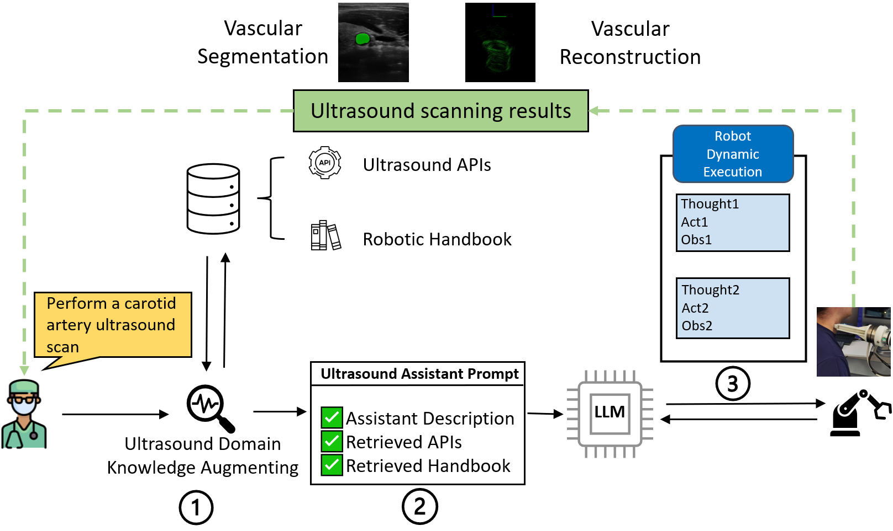
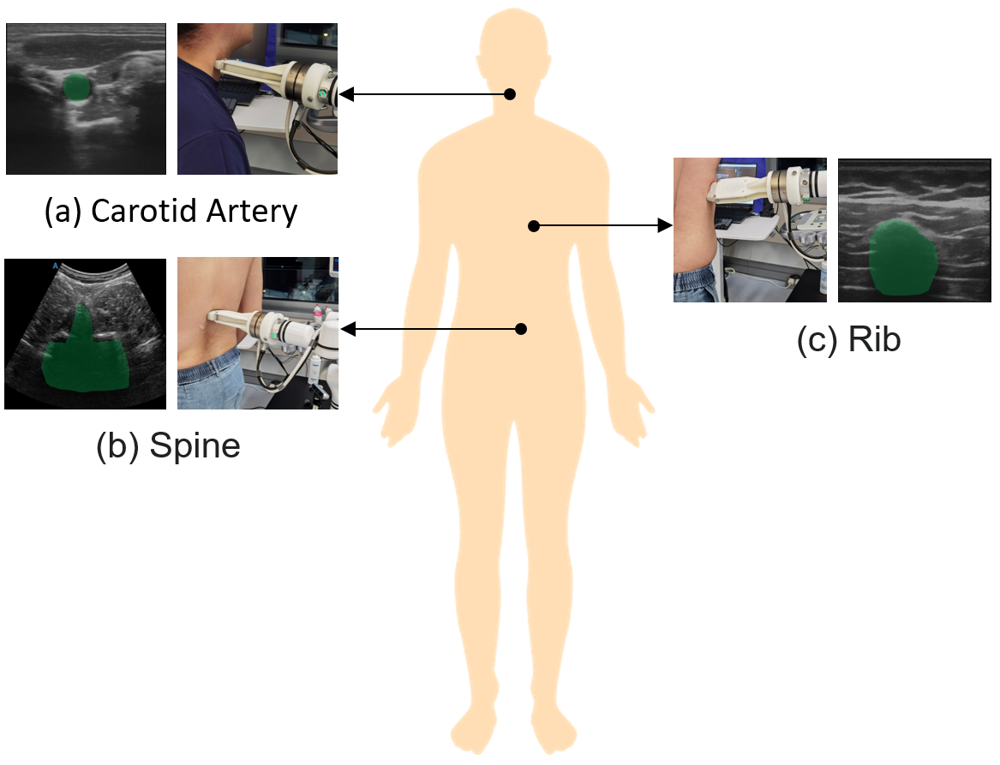
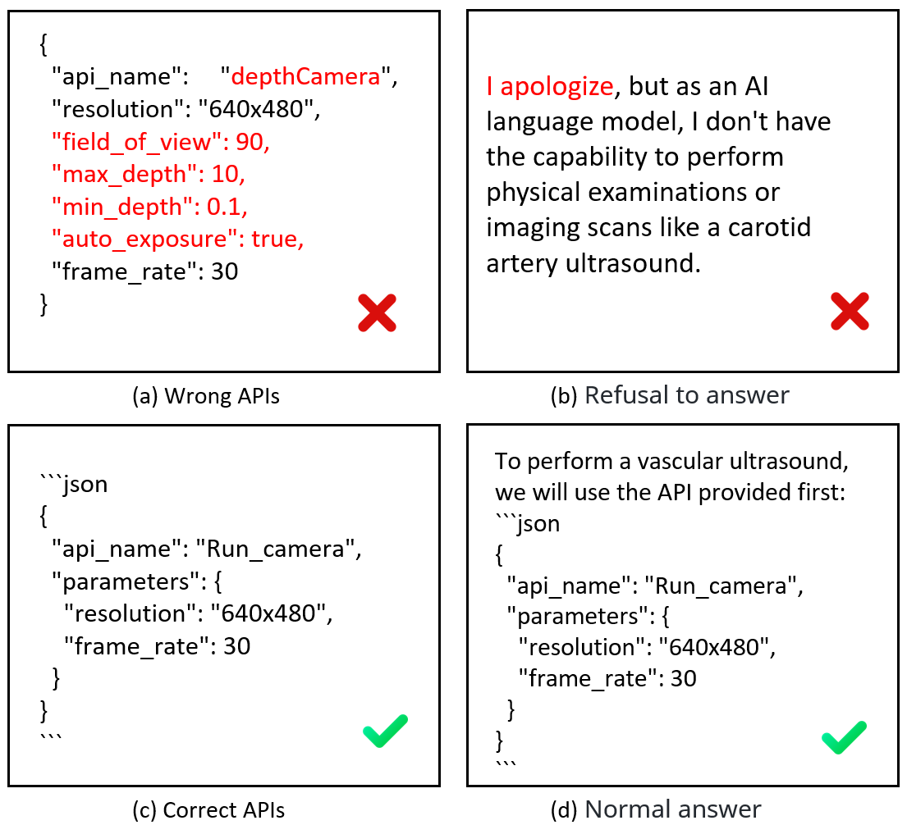

# 借助具身智能，革新超声波机器人手术技术

发布时间：2024年06月18日

`Agent

理由：这篇论文描述了一个结合了大型语言模型（LLMs）和特定领域知识的超声波具身智能系统，该系统能够理解和执行医生的口头指令，并实时调整扫描计划以应对动态情况。这种系统的行为类似于一个智能代理（Agent），能够自主地执行任务并适应环境变化，因此归类为Agent。` `机器人技术`

> Transforming Surgical Interventions with Embodied Intelligence for Ultrasound Robotics

# 摘要

> 超声波成像技术的革新极大地提升了非侵入性诊断的效果，广泛改善了多个医学领域的患者治疗结果。尽管技术进步，但将超声技术与机器人系统结合以实现自动化扫描仍存在挑战，如命令理解有限和动态执行能力不足。为此，本文提出了一种创新的超声波具身智能系统，它巧妙地融合了超声波机器人、大型语言模型（LLMs）及特定领域知识，显著提升了超声波机器人的智能和操作效率。我们的方法采用双重策略：首先，通过深入理解超声波领域知识（包括API和操作手册），将LLMs与超声波机器人集成，精确地将医生的口头指令转化为运动规划；其次，引入动态执行机制，实时调整扫描计划以应对患者移动或程序错误。通过广泛的实验，包括消融研究和模型比较，我们证明了该系统在执行口头命令的医疗程序中的显著优势。研究结果显示，该系统不仅提高了超声波扫描的效率和质量，还为自主医疗扫描技术的未来发展奠定了基础，有望彻底改变非侵入性诊断并优化医疗工作流程。

> Ultrasonography has revolutionized non-invasive diagnostic methodologies, significantly enhancing patient outcomes across various medical domains. Despite its advancements, integrating ultrasound technology with robotic systems for automated scans presents challenges, including limited command understanding and dynamic execution capabilities. To address these challenges, this paper introduces a novel Ultrasound Embodied Intelligence system that synergistically combines ultrasound robots with large language models (LLMs) and domain-specific knowledge augmentation, enhancing ultrasound robots' intelligence and operational efficiency. Our approach employs a dual strategy: firstly, integrating LLMs with ultrasound robots to interpret doctors' verbal instructions into precise motion planning through a comprehensive understanding of ultrasound domain knowledge, including APIs and operational manuals; secondly, incorporating a dynamic execution mechanism, allowing for real-time adjustments to scanning plans based on patient movements or procedural errors. We demonstrate the effectiveness of our system through extensive experiments, including ablation studies and comparisons across various models, showcasing significant improvements in executing medical procedures from verbal commands. Our findings suggest that the proposed system improves the efficiency and quality of ultrasound scans and paves the way for further advancements in autonomous medical scanning technologies, with the potential to transform non-invasive diagnostics and streamline medical workflows.

[Arxiv](https://arxiv.org/abs/2406.12651)