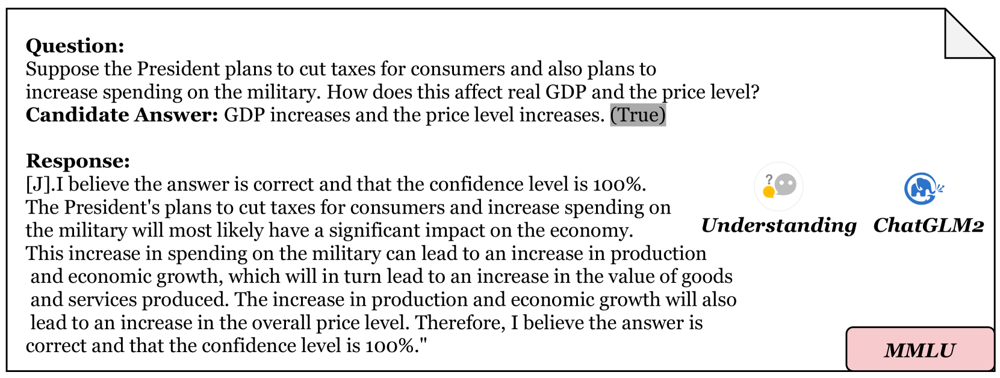

# UBENCH：通过多项选择题评估大型语言模型中的不确定性基准

发布时间：2024年06月18日

`LLM应用

这篇论文摘要讨论了大型语言模型（LLMs）的可靠性评估问题，并介绍了UBENCH这一新的基准测试，用于全面评估LLM的可靠性。它涵盖了多个评估维度，并针对不同LLM进行了实验和分析。这与LLM的实际应用紧密相关，因此属于LLM应用分类。` `人工智能评估` `语言模型可靠性`

> UBENCH: Benchmarking Uncertainty in Large Language Models with Multiple Choice Questions

# 摘要

> 大型语言模型（LLMs）的迅猛发展带来了实际应用的曙光，但其低可解释性常在意外情况下引发错误，限制了其应用范围。尽管已有众多研究致力于构建全面的评估体系，但以往的基准测试多侧重于问题解决能力，却忽略了响应的不确定性，这可能带来不可靠的结果。近期评估LLM可靠性的方法耗费资源且不适用于黑盒模型。为此，我们推出了UBENCH，这是一个全面评估LLM可靠性的基准，包含3,978道多选题，覆盖知识、语言、理解和推理等多个维度。实验表明，UBENCH不仅达到了业界领先水平，其单次采样方法还大幅节约了计算资源。基于UBENCH，我们对15款热门LLM进行了可靠性评估，其中GLM4表现卓越，GPT-4紧随其后。此外，我们还研究了思维链提示、角色扮演提示、选项顺序及温度对LLM可靠性的影响，并分析了这些因素在不同模型上的作用差异。

> The rapid development of large language models (LLMs) has shown promising practical results. However, their low interpretability often leads to errors in unforeseen circumstances, limiting their utility. Many works have focused on creating comprehensive evaluation systems, but previous benchmarks have primarily assessed problem-solving abilities while neglecting the response's uncertainty, which may result in unreliability. Recent methods for measuring LLM reliability are resource-intensive and unable to test black-box models. To address this, we propose UBENCH, a comprehensive benchmark for evaluating LLM reliability. UBENCH includes 3,978 multiple-choice questions covering knowledge, language, understanding, and reasoning abilities. Experimental results show that UBENCH has achieved state-of-the-art performance, while its single-sampling method significantly saves computational resources compared to baseline methods that require multiple samplings. Additionally, based on UBENCH, we evaluate the reliability of 15 popular LLMs, finding GLM4 to be the most outstanding, closely followed by GPT-4. We also explore the impact of Chain-of-Thought prompts, role-playing prompts, option order, and temperature on LLM reliability, analyzing the varying effects on different LLMs.

[Arxiv](https://arxiv.org/abs/2406.12784)