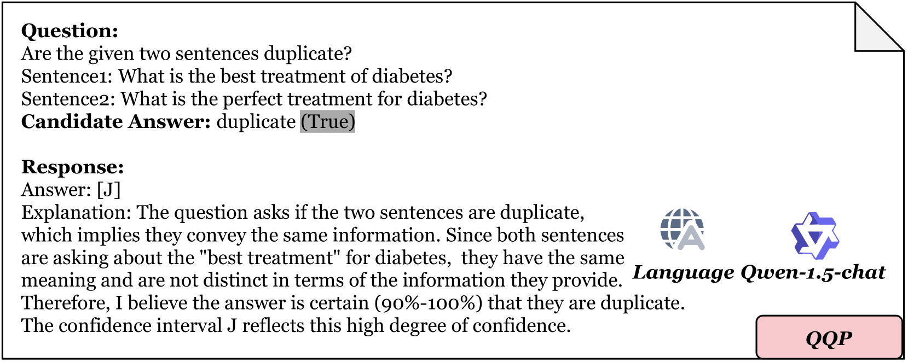

# UBENCH：通过多项选择题评估大型语言模型中的不确定性基准

发布时间：2024年06月18日

`LLM应用

这篇论文主要关注大型语言模型（LLMs）的可靠性评估，并提出了一个名为UBENCH的基准测试，用于全面评估LLM的可靠性。论文通过多选题测试LLM在知识、语言、理解和推理方面的能力，并探讨了不同提示方法和参数设置对LLM可靠性的影响。这一研究直接应用于LLM的性能评估和改进，属于LLM应用领域。` `人工智能评估` `语言模型可靠性`

> UBENCH: Benchmarking Uncertainty in Large Language Models with Multiple Choice Questions

# 摘要

> 大型语言模型（LLMs）的迅猛发展带来了实际应用的曙光，但其低可解释性在意外情况下常导致错误，限制了其应用范围。尽管已有众多研究致力于构建全面的评估体系，但以往的评估标准多侧重于问题解决能力，忽略了响应的不确定性，这可能引发不可靠性。近期，评估LLM可靠性的方法虽资源密集，却无法触及黑盒模型的核心。为此，我们推出了UBENCH，一个全面评估LLM可靠性的基准。UBENCH囊括了3,978道多选题，全面考察知识、语言、理解和推理能力。实验表明，UBENCH不仅性能卓越，其单次采样方法还大幅节约了计算资源。基于UBENCH，我们对15款热门LLM进行了可靠性评估，其中GLM4表现最为抢眼，GPT-4紧随其后。我们还深入研究了思维链提示、角色扮演提示、选项顺序及温度对LLM可靠性的影响，揭示了它们在不同模型上的差异效应。

> The rapid development of large language models (LLMs) has shown promising practical results. However, their low interpretability often leads to errors in unforeseen circumstances, limiting their utility. Many works have focused on creating comprehensive evaluation systems, but previous benchmarks have primarily assessed problem-solving abilities while neglecting the response's uncertainty, which may result in unreliability. Recent methods for measuring LLM reliability are resource-intensive and unable to test black-box models. To address this, we propose UBENCH, a comprehensive benchmark for evaluating LLM reliability. UBENCH includes 3,978 multiple-choice questions covering knowledge, language, understanding, and reasoning abilities. Experimental results show that UBENCH has achieved state-of-the-art performance, while its single-sampling method significantly saves computational resources compared to baseline methods that require multiple samplings. Additionally, based on UBENCH, we evaluate the reliability of 15 popular LLMs, finding GLM4 to be the most outstanding, closely followed by GPT-4. We also explore the impact of Chain-of-Thought prompts, role-playing prompts, option order, and temperature on LLM reliability, analyzing the varying effects on different LLMs.

[Arxiv](https://arxiv.org/abs/2406.12784)