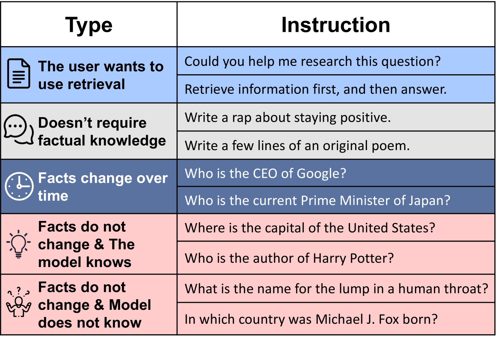
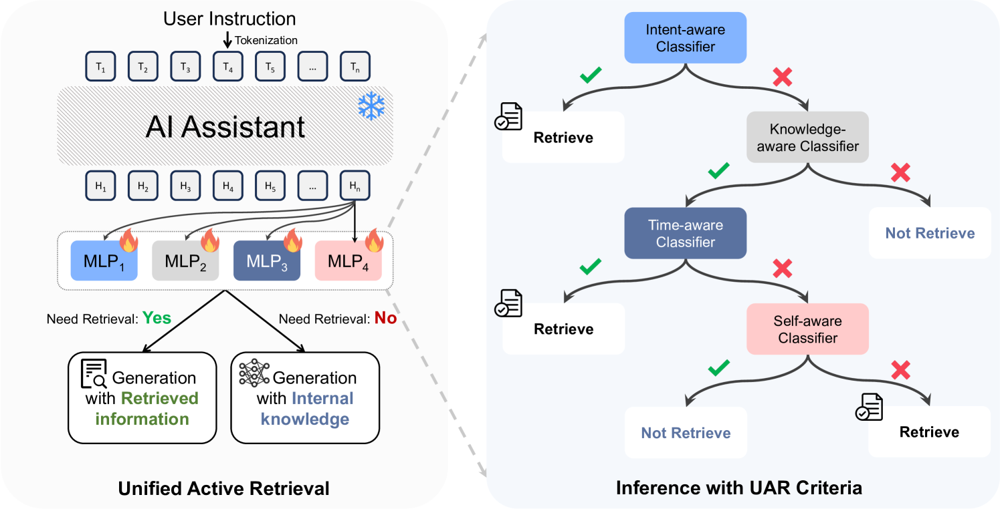
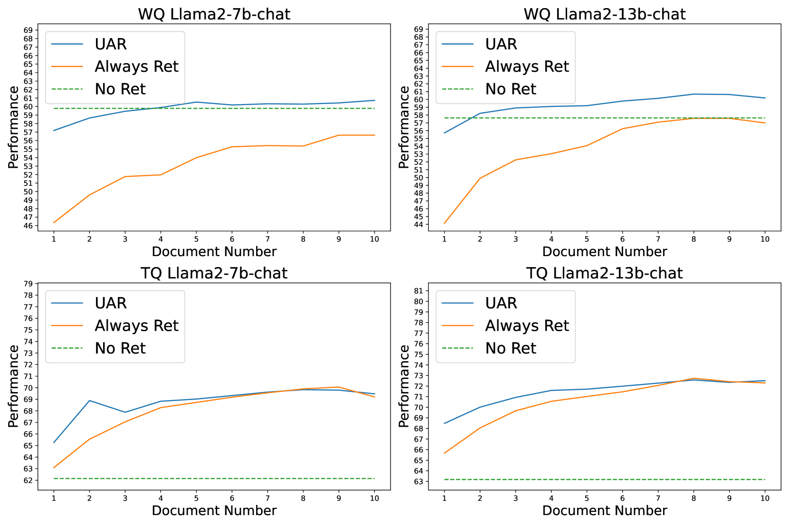

# 增强生成检索的统一主动检索方法

发布时间：2024年06月18日

`RAG

这篇论文主要讨论了检索增强生成（RAG）中的主动检索问题，提出了一种新的方法——统一主动检索（UAR），并设计了相应的标准（UAR-Criteria）。这些内容直接关联到RAG的优化和改进，因此将其分类为RAG。` `信息检索`

> Unified Active Retrieval for Retrieval Augmented Generation

# 摘要

> 在检索增强生成（RAG）中，并非所有情况下检索都有益，盲目应用于每条指令并非最佳策略。因此，决定何时进行检索，即所谓的主动检索，对RAG至关重要。现有方法面临两大难题：一是依赖单一标准，难以适应多样指令；二是流程特殊且差异大，增加了系统复杂性和响应延迟。为此，我们提出统一主动检索（UAR），它包含四个独立标准，并将其转化为易于整合的分类任务，实现了高效的检索时机判断，几乎不增加额外成本。我们还设计了统一主动检索标准（UAR-Criteria），通过标准化流程应对各种检索场景。实验证明，UAR在检索时机判断和下游任务表现上均显著优于现有技术，展现了其高效性和对下游任务的积极影响。

> In Retrieval-Augmented Generation (RAG), retrieval is not always helpful and applying it to every instruction is sub-optimal. Therefore, determining whether to retrieve is crucial for RAG, which is usually referred to as Active Retrieval. However, existing active retrieval methods face two challenges: 1. They usually rely on a single criterion, which struggles with handling various types of instructions. 2. They depend on specialized and highly differentiated procedures, and thus combining them makes the RAG system more complicated and leads to higher response latency. To address these challenges, we propose Unified Active Retrieval (UAR). UAR contains four orthogonal criteria and casts them into plug-and-play classification tasks, which achieves multifaceted retrieval timing judgements with negligible extra inference cost. We further introduce the Unified Active Retrieval Criteria (UAR-Criteria), designed to process diverse active retrieval scenarios through a standardized procedure. Experiments on four representative types of user instructions show that UAR significantly outperforms existing work on the retrieval timing judgement and the performance of downstream tasks, which shows the effectiveness of UAR and its helpfulness to downstream tasks.

[Arxiv](https://arxiv.org/abs/2406.12534)