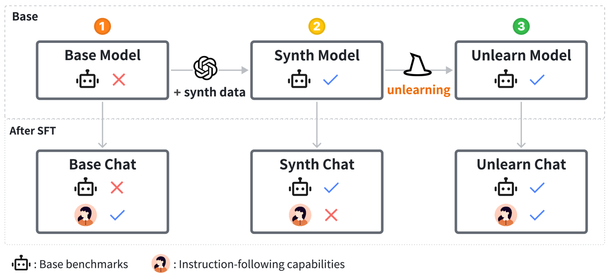
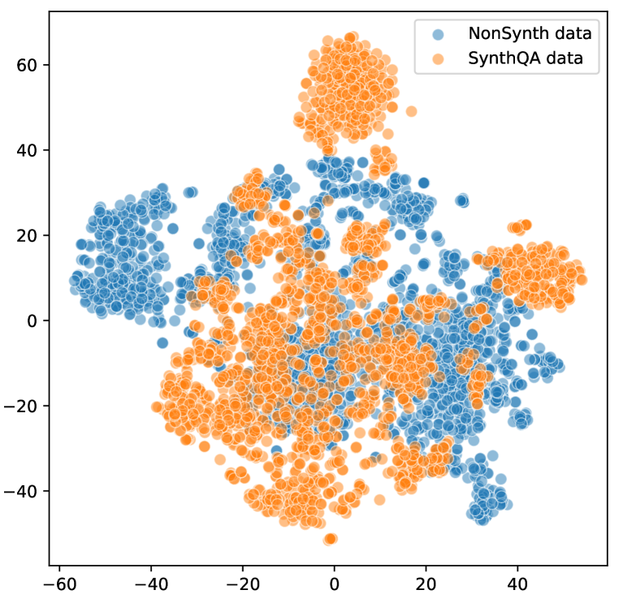
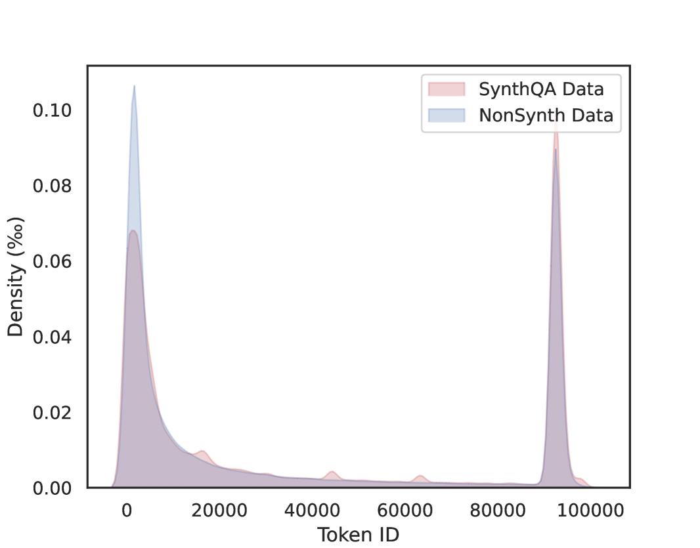
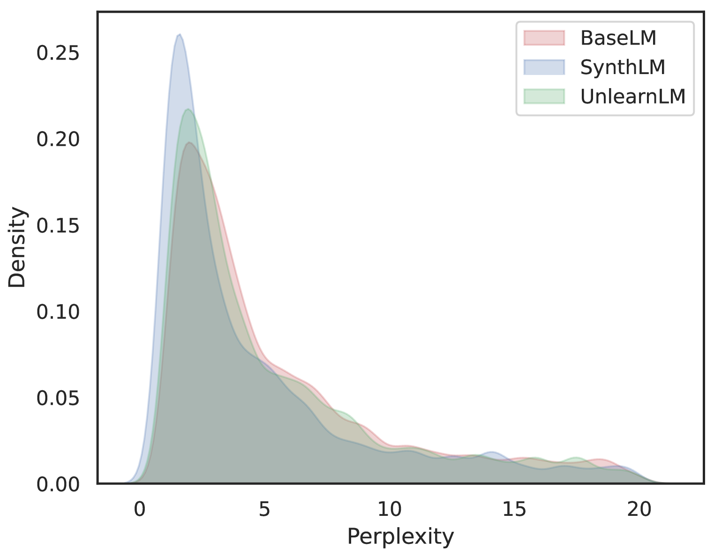
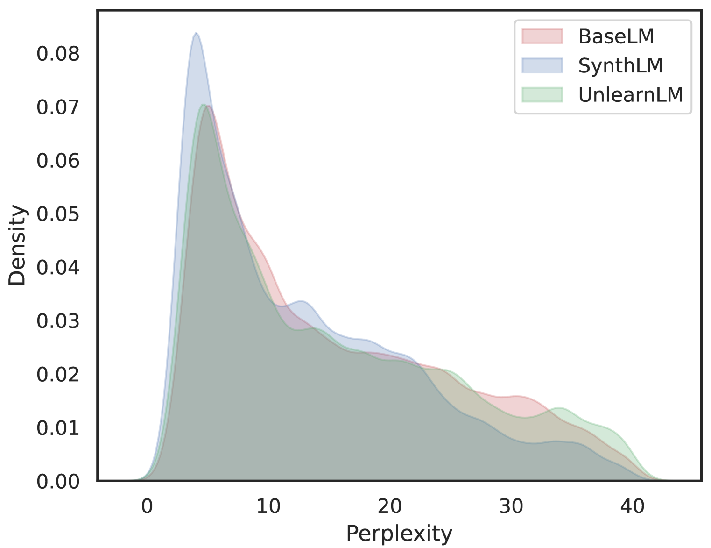

# 揭示瑕疵：探究合成数据中的缺陷及其对大型语言模型的改进策略

发布时间：2024年06月18日

`LLM理论

理由：这篇论文主要探讨了合成数据在大型语言模型（LLM）训练中的应用及其潜在问题，并提出了一种基于遗忘技术的解决方案。这涉及到对LLM训练过程中数据使用的理论分析和改进，因此属于LLM理论分类。论文的核心贡献在于理论层面的分析和解决方案的提出，而非具体的应用实例或Agent的设计，也不是关于RAG（Retrieval-Augmented Generation）模型的研究。` `机器学习` `数据处理`

> Unveiling the Flaws: Exploring Imperfections in Synthetic Data and Mitigation Strategies for Large Language Models

# 摘要

> 合成数据被视为解决LLMs训练中高质量数据短缺问题的良策，能显著提升模型在下游测试中的表现。然而，我们的分析揭示了合成数据的潜在缺陷：其统一格式易导致模型过度拟合特定模式，进而影响输出分布，削弱模型的指令遵循能力。针对这一问题，我们聚焦于问答（Q-A）对这一常见合成数据类型，提出了一种基于遗忘技术的解决方案。实证表明，该方法在不牺牲性能的前提下，有效解决了过度拟合问题，为LLMs的训练提供了更经济高效的路径。我们的研究为合成数据的有效利用提供了新视角，旨在推动LLMs训练的进一步发展。

> Synthetic data has been proposed as a solution to address the issue of high-quality data scarcity in the training of large language models (LLMs). Studies have shown that synthetic data can effectively improve the performance of LLMs on downstream benchmarks. However, despite its potential benefits, our analysis suggests that there may be inherent flaws in synthetic data. The uniform format of synthetic data can lead to pattern overfitting and cause significant shifts in the output distribution, thereby reducing the model's instruction-following capabilities. Our work delves into these specific flaws associated with question-answer (Q-A) pairs, a prevalent type of synthetic data, and presents a method based on unlearning techniques to mitigate these flaws. The empirical results demonstrate the effectiveness of our approach, which can reverse the instruction-following issues caused by pattern overfitting without compromising performance on benchmarks at relatively low cost. Our work has yielded key insights into the effective use of synthetic data, aiming to promote more robust and efficient LLM training.

[Arxiv](https://arxiv.org/abs/2406.12397)