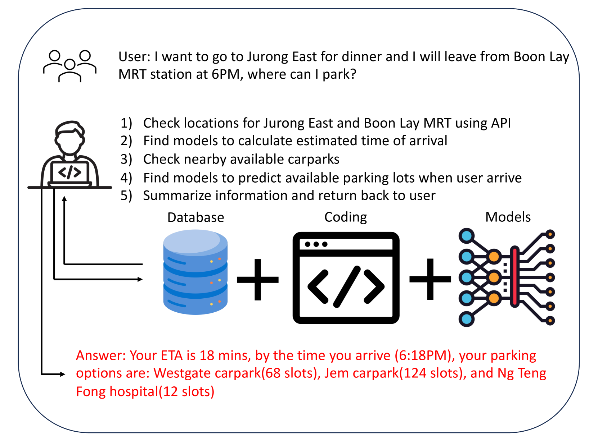
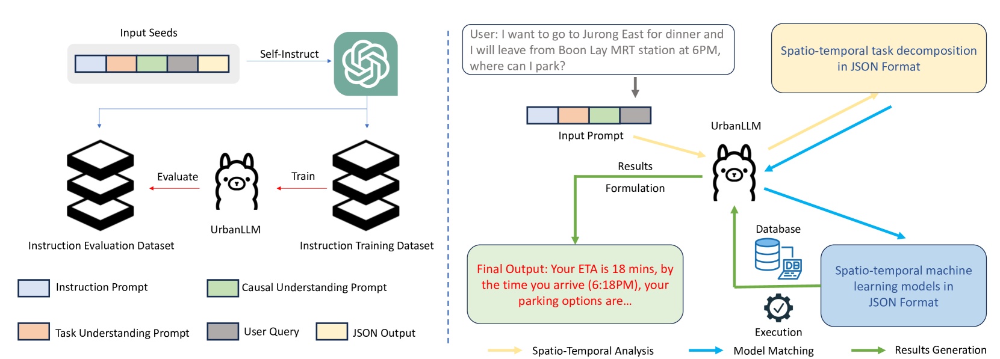
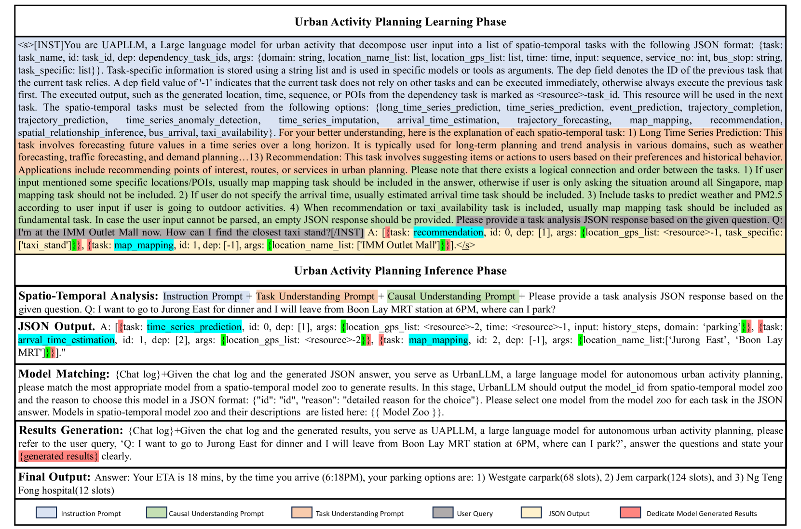
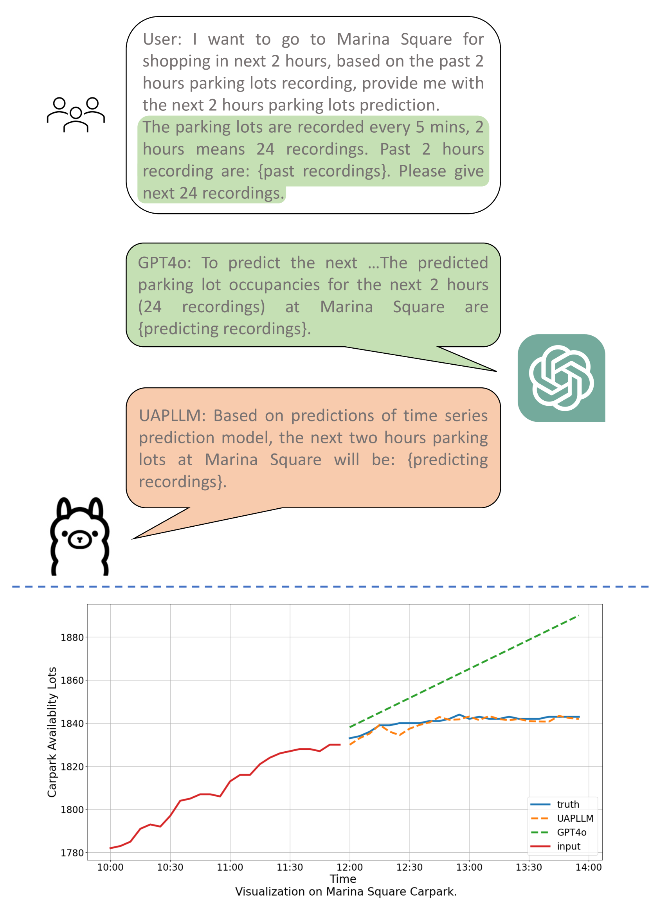
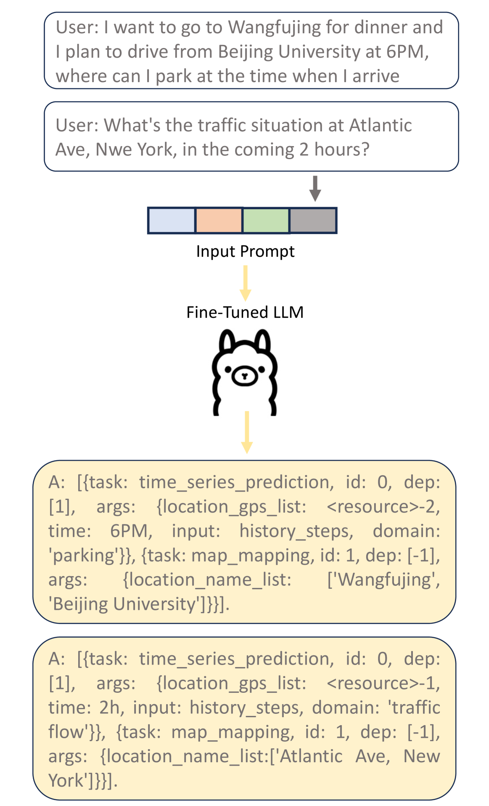

# UrbanLLM：借助大型语言模型实现城市活动的自主规划与管理

发布时间：2024年06月18日

`LLM应用

理由：这篇论文介绍了一个名为UrbanLLM的大型语言模型，该模型专门设计用于解决城市规划和管理问题。它通过分解问题为子任务，并结合时空AI模型来提供解决方案。这与“LLM应用”分类相符，因为它展示了如何将大型语言模型应用于特定领域（城市规划和管理）以解决实际问题。` `城市规划` `城市管理`

> UrbanLLM: Autonomous Urban Activity Planning and Management with Large Language Models

# 摘要

> 基于位置的服务极大地提升了我们的生活质量，然而，尽管有众多专为时空背景设计的AI模型，它们在应对复杂的城市规划和管理问题时仍显力不从心。为此，我们推出了UrbanLLM，这一经过精心调校的大型语言模型专为城市挑战而生。UrbanLLM通过巧妙分解城市问题为多个可控子任务，并精准匹配相应的时空AI模型，最终提供详尽的解决方案。实验数据显示，UrbanLLM在处理都市规划与管理等复杂问题时，远超Llama和GPT系列等模型。它不仅提升了问题解决的效率，还减轻了对人类专家的依赖。

> Location-based services play an critical role in improving the quality of our daily lives. Despite the proliferation of numerous specialized AI models within spatio-temporal context of location-based services, these models struggle to autonomously tackle problems regarding complex urban planing and management. To bridge this gap, we introduce UrbanLLM, a fine-tuned large language model (LLM) designed to tackle diverse problems in urban scenarios. UrbanLLM functions as a problem-solver by decomposing urban-related queries into manageable sub-tasks, identifying suitable spatio-temporal AI models for each sub-task, and generating comprehensive responses to the given queries. Our experimental results indicate that UrbanLLM significantly outperforms other established LLMs, such as Llama and the GPT series, in handling problems concerning complex urban activity planning and management. UrbanLLM exhibits considerable potential in enhancing the effectiveness of solving problems in urban scenarios, reducing the workload and reliance for human experts.

[Arxiv](https://arxiv.org/abs/2406.12360)