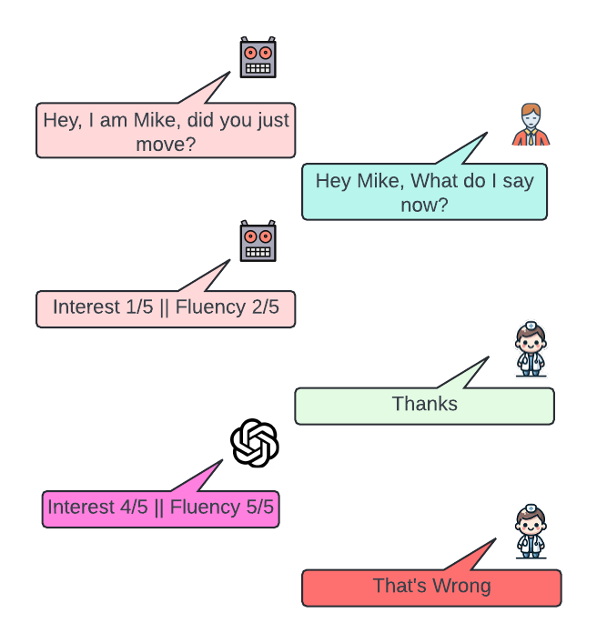
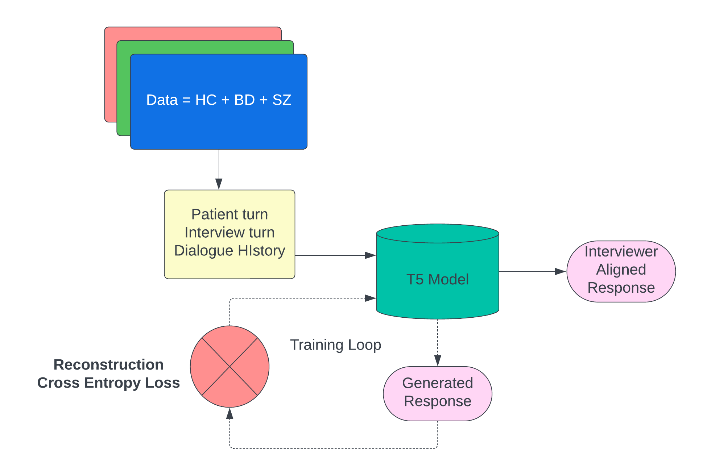
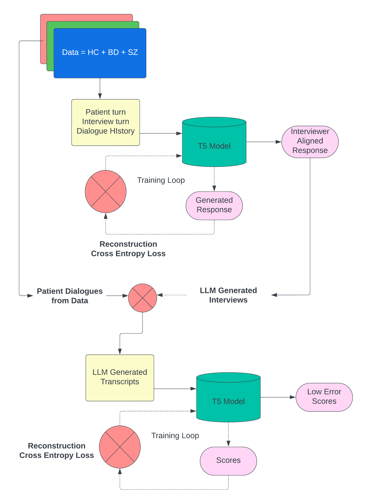

# 借助大型语言模型（LLMs），我们能够更高效地标注和收集双相情感障碍与精神分裂症的临床丰富数据。

发布时间：2024年06月18日

`LLM应用

这篇论文主要探讨了如何利用当代语言模型在心理健康领域的应用，特别是在序列到序列任务中提升心理健康研究。它展示了这些模型如何高效、准确且可扩展地支持心理健康工具的部署、数据收集和标注。虽然论文中提到了使用小型模型在特定临床变量的标注和数据收集方面的表现，但这并不涉及LLM的理论研究，也没有明确提到Agent或RAG的相关内容。因此，最合适的分类是LLM应用。` `心理健康`

> Using LLMs to Aid Annotation and Collection of Clinically-Enriched Data in Bipolar Disorder and Schizophrenia

# 摘要

> 心理健康领域的自然语言处理（NLP）主要关注社交媒体，而现实中的心理健康专家则面临高负荷和特定领域的挑战，这些是现代大型语言模型所未能涵盖的。我们通过招募644名参与者（包括双相情感障碍、精神分裂症患者及健康对照组），利用他们完成的标准化心理健康任务数据，由专家在五个关键临床变量上进行转录和标注，构建了一个数据集。本文展示了如何利用当代语言模型在序列到序列任务中提升心理健康研究，具体阐述了这些模型如何高效、准确且可扩展地支持心理健康工具的部署、数据收集和标注。研究表明，小型模型在特定临床变量的标注和心理健康工具的数据收集方面，表现甚至超过了商业大型模型。

> NLP in mental health has been primarily social media focused. Real world practitioners also have high case loads and often domain specific variables, of which modern LLMs lack context. We take a dataset made by recruiting 644 participants, including individuals diagnosed with Bipolar Disorder (BD), Schizophrenia (SZ), and Healthy Controls (HC). Participants undertook tasks derived from a standardized mental health instrument, and the resulting data were transcribed and annotated by experts across five clinical variables. This paper demonstrates the application of contemporary language models in sequence-to-sequence tasks to enhance mental health research. Specifically, we illustrate how these models can facilitate the deployment of mental health instruments, data collection, and data annotation with high accuracy and scalability. We show that small models are capable of annotation for domain-specific clinical variables, data collection for mental-health instruments, and perform better then commercial large models.

[Arxiv](https://arxiv.org/abs/2406.12687)