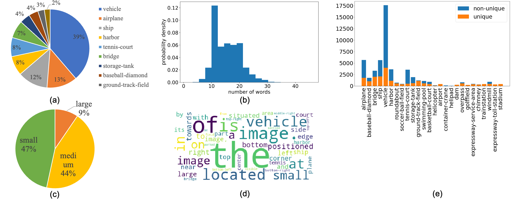
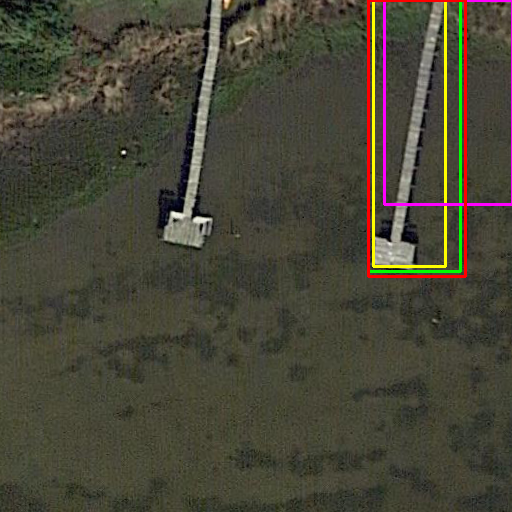

# VRSBench：遥感图像理解的多功能视觉-语言基准数据集

发布时间：2024年06月18日

`LLM应用

这篇论文介绍了一个新的基准VRSBench，专门设计来推动远程传感图像领域的视觉-语言模型的发展。它包含了大量的图像和相关数据，用于训练和评估视觉-语言模型在图像描述、视觉定位和视觉问答等任务上的表现。这与大型语言模型（LLM）的应用直接相关，因为它专注于利用视觉和语言数据来增强模型的性能，特别是在远程传感图像理解领域。因此，这篇论文应归类于LLM应用。` `视觉-语言模型`

> VRSBench: A Versatile Vision-Language Benchmark Dataset for Remote Sensing Image Understanding

# 摘要

> 我们推出了一款名为VRSBench的新基准，旨在推动远程传感图像领域的通用大规模视觉-语言模型的发展。尽管已有多个数据集问世，但它们往往局限于单一任务，缺乏详尽的对象信息，且质量控制不足。VRSBench包含29,614张图像，每张都有人工验证的详细描述，以及52,472个对象引用和123,221对问答，为远程传感图像理解任务的视觉-语言模型训练和评估提供了全面支持。我们还在此基准上对图像描述、视觉定位和视觉问答三个任务的最新模型进行了评估。我们的目标是显著推动远程传感领域高级视觉-语言模型的发展，相关数据和代码已公开于https://github.com/lx709/VRSBench。

> We introduce a new benchmark designed to advance the development of general-purpose, large-scale vision-language models for remote sensing images. Although several vision-language datasets in remote sensing have been proposed to pursue this goal, existing datasets are typically tailored to single tasks, lack detailed object information, or suffer from inadequate quality control. Exploring these improvement opportunities, we present a Versatile vision-language Benchmark for Remote Sensing image understanding, termed VRSBench. This benchmark comprises 29,614 images, with 29,614 human-verified detailed captions, 52,472 object references, and 123,221 question-answer pairs. It facilitates the training and evaluation of vision-language models across a broad spectrum of remote sensing image understanding tasks. We further evaluated state-of-the-art models on this benchmark for three vision-language tasks: image captioning, visual grounding, and visual question answering. Our work aims to significantly contribute to the development of advanced vision-language models in the field of remote sensing. The data and code can be accessed at https://github.com/lx709/VRSBench.

[Arxiv](https://arxiv.org/abs/2406.12384)