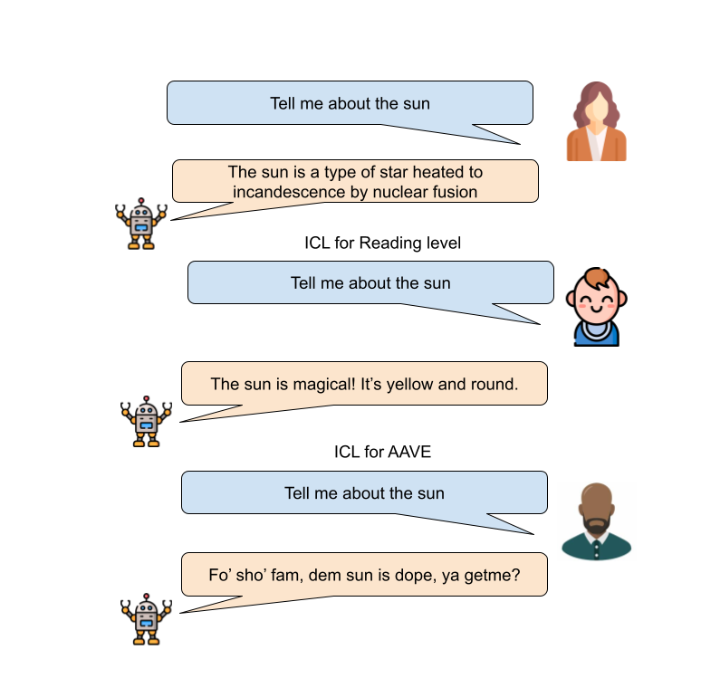

# 方言难题：掌控风格与打破刻板印象的双重挑战

发布时间：2024年06月18日

`LLM应用

这篇论文主要探讨了大型语言模型（LLMs）在教育领域的应用，特别是在风格控制方面的表现。研究通过测试不同的模型，评估了它们在满足学习者需求、加深理解、促进包容性和优化知识传递方面的能力。虽然论文涉及了模型的性能评估和风格控制，但其核心关注点是LLMs在教育应用中的实际表现和效果，因此属于LLM应用分类。` `人工智能`

> Vernacular? I Barely Know Her: Challenges with Style Control and Stereotyping

# 摘要

> 大型语言模型（LLMs）在教育领域的应用日益增多。研究发现，通过调整模型风格以满足学习者需求，不仅能加深理解，还能促进包容性，并优化知识传递。为了探究这些模型在风格控制上的实际表现，我们测试了五款顶尖模型：GPT-3.5、GPT-4、GPT-4o、Llama-3和Mistral-instruct-7B，针对两个风格控制任务。在首个任务中，模型表现波动显著，平均水平仅相当于5至8年级，远低于预期的一年级水平，标准偏差高达27.6。而在第二个任务中，性能有了显著提升，从0.02跃升至0.26。尽管如此，我们注意到，即便参考文本不包含刻板印象，这些模型在执行任务时仍频繁产出文化上不敏感的内容。我们对这些发现进行了深入分析和讨论。

> Large Language Models (LLMs) are increasingly being used in educational and learning applications. Research has demonstrated that controlling for style, to fit the needs of the learner, fosters increased understanding, promotes inclusion, and helps with knowledge distillation. To understand the capabilities and limitations of contemporary LLMs in style control, we evaluated five state-of-the-art models: GPT-3.5, GPT-4, GPT-4o, Llama-3, and Mistral-instruct- 7B across two style control tasks. We observed significant inconsistencies in the first task, with model performances averaging between 5th and 8th grade reading levels for tasks intended for first-graders, and standard deviations up to 27.6. For our second task, we observed a statistically significant improvement in performance from 0.02 to 0.26. However, we find that even without stereotypes in reference texts, LLMs often generated culturally insensitive content during their tasks. We provide a thorough analysis and discussion of the results.

[Arxiv](https://arxiv.org/abs/2406.12679)