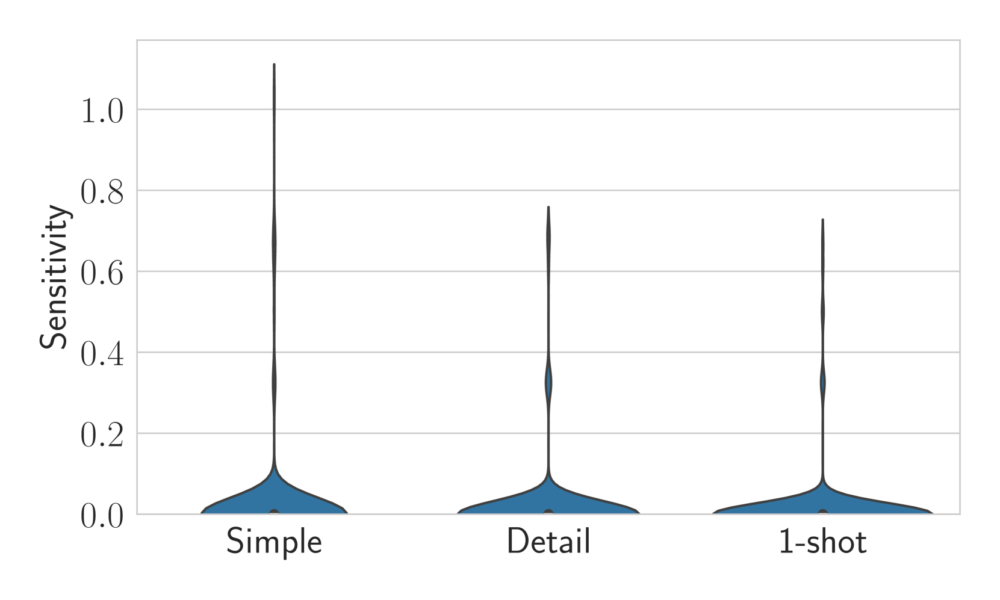

# 我的失误何在？探究大型语言模型对提示工程的敏感度与一致性

发布时间：2024年06月18日

`LLM理论

理由：这篇论文关注的是大型语言模型（LLMs）在软件系统中的应用问题，特别是模型行为在提示语微小变化下的不一致性。论文提出了两个新的评估指标——敏感性和一致性，用于评估和改进LLMs的性能。这些内容更偏向于对LLMs理论层面的探讨和改进，而不是具体的应用案例或Agent的设计，也不是关于RAG（Retrieval-Augmented Generation）模型的研究。因此，将其归类为LLM理论是合适的。` `软件开发`

> What Did I Do Wrong? Quantifying LLMs' Sensitivity and Consistency to Prompt Engineering

# 摘要

> 大型语言模型（LLMs）极大地改变了软件系统的设计与交互方式，其文本信息处理能力显著提升了常规任务的效率。然而，开发者若想整合这些模型，却不得不面对一个棘手问题：在提示语微小变化下，模型行为的不一致性难以调试。为此，我们提出了两个分类任务的新指标——敏感性和一致性，它们与任务性能相辅相成。敏感性评估预测在提示语重述时的变化，无需真实标签；而一致性则关注同一类别元素在提示语变化时的预测稳定性。我们通过实证研究，将这些指标应用于文本分类任务，以揭示LLMs的潜在缺陷。我们期待敏感性和一致性能在自动提示工程中发挥关键作用，助力开发出既强大又稳定的LLMs。

> Large Language Models (LLMs) changed the way we design and interact with software systems. Their ability to process and extract information from text has drastically improved productivity in a number of routine tasks. Developers that want to include these models in their software stack, however, face a dreadful challenge: debugging their inconsistent behavior across minor variations of the prompt. We therefore introduce two metrics for classification tasks, namely sensitivity and consistency, which are complementary to task performance. First, sensitivity measures changes of predictions across rephrasings of the prompt, and does not require access to ground truth labels. Instead, consistency measures how predictions vary across rephrasings for elements of the same class. We perform an empirical comparison of these metrics on text classification tasks, using them as guideline for understanding failure modes of the LLM. Our hope is that sensitivity and consistency will be powerful allies in automatic prompt engineering frameworks to obtain LLMs that balance robustness with performance.

[Arxiv](https://arxiv.org/abs/2406.12334)