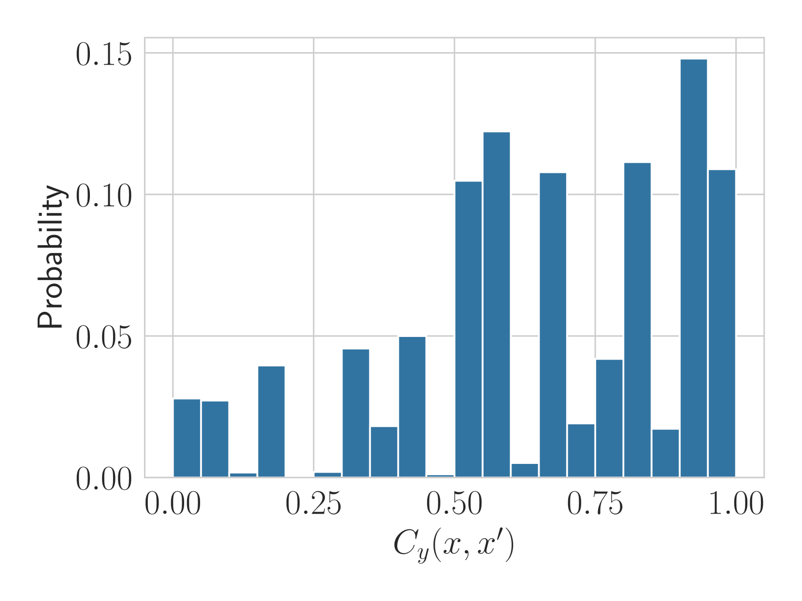

# 我错在哪里？探究大型语言模型对提示工程的敏感度与一致性

发布时间：2024年06月18日

`LLM理论

这篇论文主要探讨了大型语言模型（LLMs）在软件系统中的应用问题，特别是关于模型行为在提示语微小变化下的敏感性和一致性。这些问题直接关联到LLMs的理论性能和行为稳定性，因此属于LLM理论的范畴。论文通过提出新的分类任务指标并进行实证研究，旨在深入理解LLMs的潜在缺陷，并提出改进方向，这对于理论研究和模型优化具有重要意义。` `软件开发`

> What Did I Do Wrong? Quantifying LLMs' Sensitivity and Consistency to Prompt Engineering

# 摘要

> 大型语言模型（LLMs）极大地改变了软件系统的设计与交互方式，其文本信息处理能力显著提升了日常任务的效率。然而，开发者若想整合这些模型至软件中，却面临一个棘手问题：在提示语微小变化下，模型的行为难以保持一致。为此，我们提出了两个新的分类任务指标——敏感性和一致性，它们与任务性能相辅相成。敏感性评估预测结果在提示语重新表述时的变化，无需真实标签；而一致性则关注同一类别元素在提示语变化时的预测稳定性。我们通过实证研究，在文本分类任务中比较了这两个指标，旨在揭示LLMs的潜在缺陷。我们期望敏感性和一致性能成为自动提示工程中的得力助手，帮助我们打造出既强大又稳定的LLMs。

> Large Language Models (LLMs) changed the way we design and interact with software systems. Their ability to process and extract information from text has drastically improved productivity in a number of routine tasks. Developers that want to include these models in their software stack, however, face a dreadful challenge: debugging their inconsistent behavior across minor variations of the prompt. We therefore introduce two metrics for classification tasks, namely sensitivity and consistency, which are complementary to task performance. First, sensitivity measures changes of predictions across rephrasings of the prompt, and does not require access to ground truth labels. Instead, consistency measures how predictions vary across rephrasings for elements of the same class. We perform an empirical comparison of these metrics on text classification tasks, using them as guideline for understanding failure modes of the LLM. Our hope is that sensitivity and consistency will be powerful allies in automatic prompt engineering frameworks to obtain LLMs that balance robustness with performance.

[Arxiv](https://arxiv.org/abs/2406.12334)