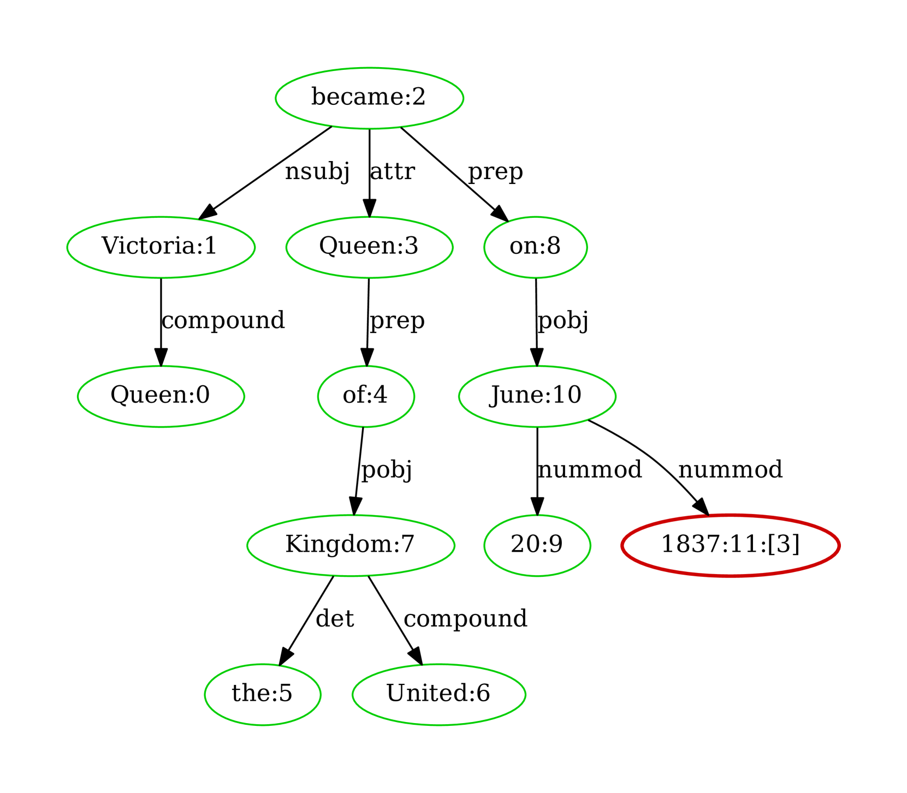

# ALiiCE：细粒度位置引用生成的评估研究

发布时间：2024年06月19日

`LLM应用

这篇论文主要探讨了大型语言模型（LLMs）在生成带有细粒度引用的文本方面的应用，并提出了一个名为ALiiCE的自动评估框架。该框架专注于评估句子内部任意位置的细粒度引用的质量，这是对现有方法的一个改进，因为现有方法主要关注句子级别的引用。通过引入新的评估指标，论文展示了如何通过依赖分析来评估原子级别的引用质量，并在实际数据集上验证了其有效性。因此，这篇论文属于LLM应用类别，因为它关注的是LLMs在特定任务（即细粒度引用生成）中的应用和评估。` `问答系统`

> ALiiCE: Evaluating Positional Fine-grained Citation Generation

# 摘要

> 大型语言模型（LLMs）通过生成带有引用的文本，提升了其可信度和可验证性。但目前的方法多关注句子级别的陈述，忽略了句子内部任意位置的细粒度引用的重要性。为此，我们推出了ALiiCE，首个针对细粒度引用生成的自动评估框架。该框架通过依赖分析将句子分解为原子声明，并评估原子级别的引用质量。ALiiCE创新性地提出了三个评估指标，包括位置细粒度引用的召回率、精确度及引用位置的变异系数。我们在两个长格式QA数据集上测试了多个LLMs的细粒度引用生成能力，实验结果验证了ALiiCE的有效性，并揭示了现有模型在生成细粒度引用方面的不足。

> Large Language Models (LLMs) can enhance the credibility and verifiability by generating text with citations. However, existing tasks and evaluation methods are predominantly limited to sentence-level statement, neglecting the significance of positional fine-grained citations that can appear anywhere within sentences. To facilitate further exploration of the fine-grained citation generation, we propose ALiiCE, the first automatic evaluation framework for this task. Our framework first parses the sentence claim into atomic claims via dependency analysis and then calculates citation quality at the atomic claim level. ALiiCE introduces three novel metrics for positional fined-grained citation quality assessment, including positional fine-grained citation recall and precision, and coefficient of variation of citation positions. We evaluate the positional fine-grained citation generation performance of several LLMs on two long-form QA datasets. Our experiments and analyses demonstrate the effectiveness and reasonableness of ALiiCE. The results also indicate that existing LLMs still struggle to provide positional fine-grained citations.

[Arxiv](https://arxiv.org/abs/2406.13375)