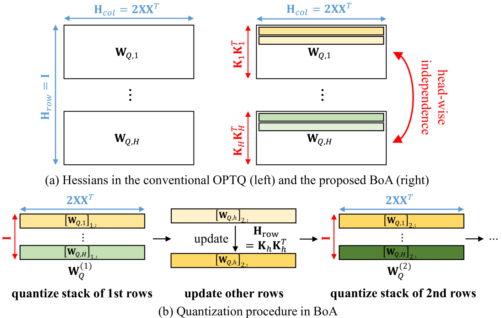
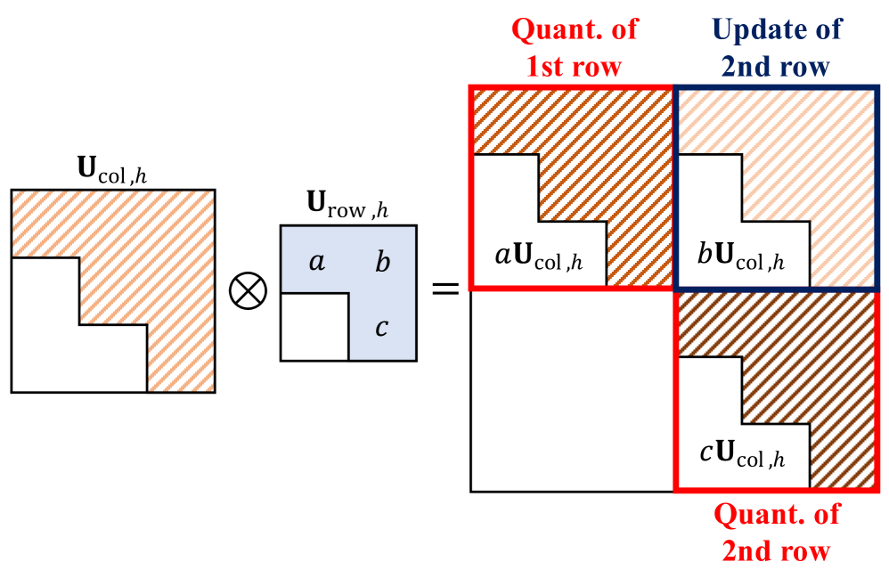

# 无反向传播的注意力感知量化后训练

发布时间：2024年06月19日

`LLM理论

这篇论文主要探讨了大型语言模型（LLMs）的量化技术，特别是在资源有限的设备上部署这些模型时所面临的挑战。论文提出了一种新的后训练量化（PTQ）算法，该算法通过开发注意力感知的Hessian矩阵来考虑层间依赖性，无需反向传播。这种创新方法旨在解决现有基于梯度的优化方法在处理超大规模模型时的局限性。因此，这篇论文的内容更偏向于LLM的理论研究，特别是在模型量化和优化技术方面，而不是具体的应用、Agent设计或RAG（Retrieval-Augmented Generation）框架。` `人工智能` `模型优化`

> Attention-aware Post-training Quantization without Backpropagation

# 摘要

> 量化技术为在资源有限的设备上部署大型语言模型（LLMs）提供了希望。尽管现有方法依赖于基于梯度的优化，但这些方法在处理拥有数十亿参数的超大规模模型时遇到了挑战。最近，无需反向传播的后训练量化（PTQ）方法被提出，以减轻这一负担，但它们在考虑层间依赖性方面的不足限制了其性能。本文提出了一种创新的PTQ算法，它通过开发注意力感知的Hessian矩阵来考虑层间依赖性，无需反向传播。实验证明，该算法在低比特宽度情况下显著优于传统方法。

> Quantization is a promising solution for deploying large-scale language models (LLMs) on resource-constrained devices. Existing quantization approaches, however, rely on gradient-based optimization, regardless of it being post-training quantization (PTQ) or quantization-aware training (QAT), which becomes problematic for hyper-scale LLMs with billions of parameters. This overhead can be alleviated via recently proposed backpropagation-free PTQ methods; however, their performance is somewhat limited by their lack of consideration of inter-layer dependencies. In this paper, we thus propose a novel PTQ algorithm that considers inter-layer dependencies without relying on backpropagation. The fundamental concept involved is the development of attention-aware Hessian matrices, which facilitates the consideration of inter-layer dependencies within the attention module. Extensive experiments demonstrate that the proposed algorithm significantly outperforms conventional PTQ methods, particularly for low bit-widths.

[Arxiv](https://arxiv.org/abs/2406.13474)