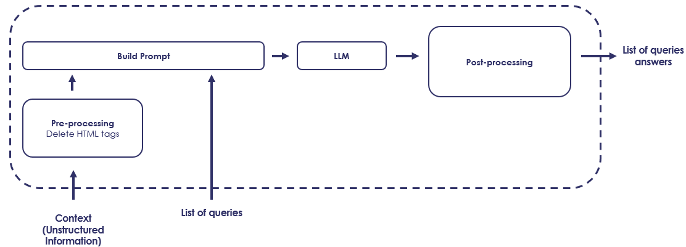

# 工业应用中高效问题解答的开源语言模型基准测试

发布时间：2024年06月19日

`LLM应用

这篇论文主要探讨了大型语言模型（LLMs）在工业应用中的成本效益、推理速度和资源效率问题，并比较了开源与非开源LLMs在问答任务上的表现。其目的是为实际应用中挑选高效的LLMs提供指导，这直接关联到LLMs的实际应用层面，因此归类为LLM应用。`

> Benchmarking Open-Source Language Models for Efficient Question Answering in Industrial Applications

# 摘要

> 在NLP领域飞速发展的今天，大型语言模型（LLMs）在问答等任务中大放异彩。但将其应用于工业领域时，成本效益、推理速度和资源效率等问题成为拦路虎。本文深入比较了开源与非开源LLMs在问答任务上的表现，旨在发掘那些既轻量级又适合CPU推理，且性能不逊于专有模型的开源瑰宝。通过多维度的严格评估，我们为实际应用中挑选高效LLMs提供了洞见。研究成果揭示了满足工业需求的高效且可行的开源选择，为NLP解决方案的可及性和效率问题提供了答案。

> In the rapidly evolving landscape of Natural Language Processing (NLP), Large Language Models (LLMs) have demonstrated remarkable capabilities in tasks such as question answering (QA). However, the accessibility and practicality of utilizing these models for industrial applications pose significant challenges, particularly concerning cost-effectiveness, inference speed, and resource efficiency. This paper presents a comprehensive benchmarking study comparing open-source LLMs with their non-open-source counterparts on the task of question answering. Our objective is to identify open-source alternatives capable of delivering comparable performance to proprietary models while being lightweight in terms of resource requirements and suitable for Central Processing Unit (CPU)-based inference. Through rigorous evaluation across various metrics including accuracy, inference speed, and resource consumption, we aim to provide insights into selecting efficient LLMs for real-world applications. Our findings shed light on viable open-source alternatives that offer acceptable performance and efficiency, addressing the pressing need for accessible and efficient NLP solutions in industry settings.

[Arxiv](https://arxiv.org/abs/2406.13713)