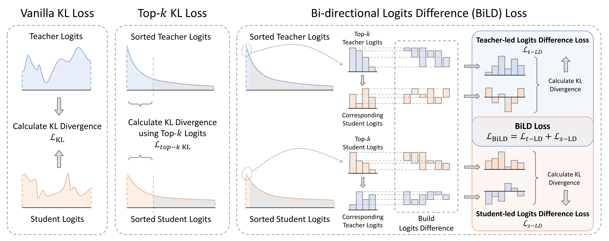
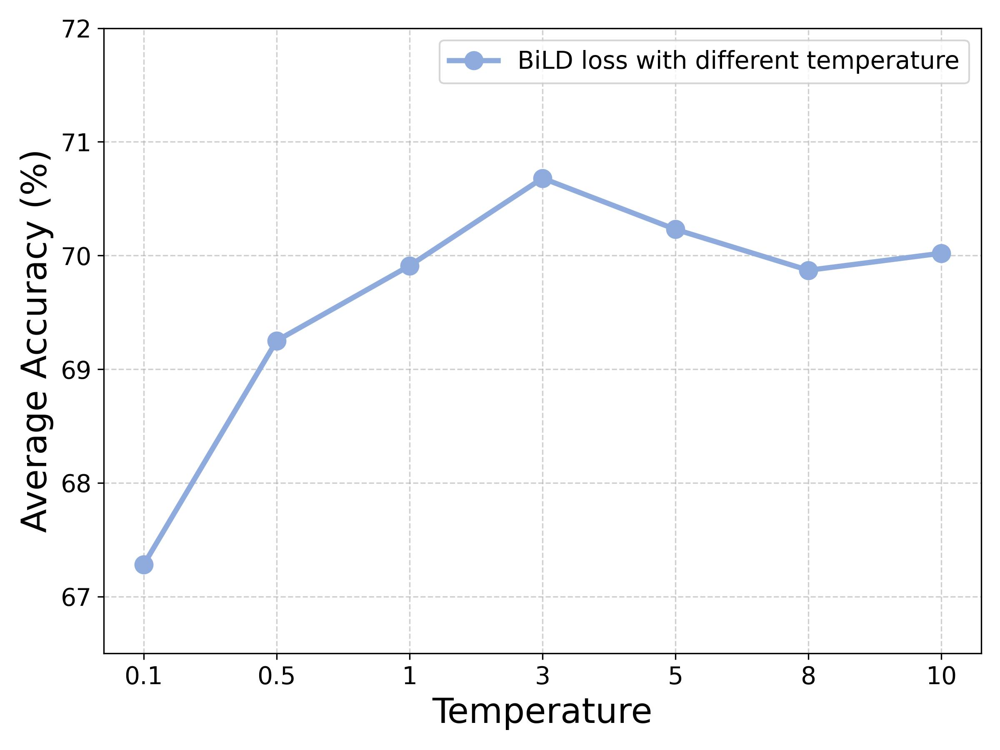
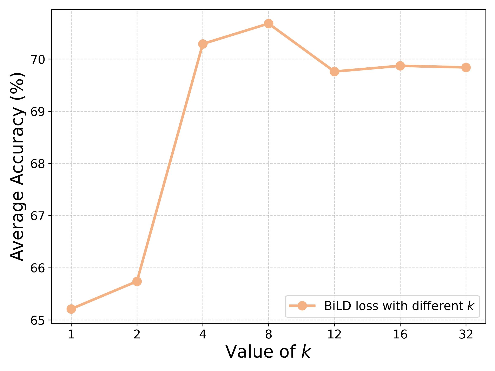
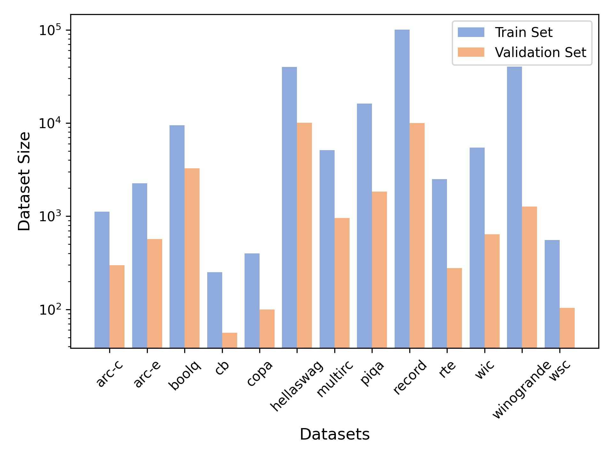
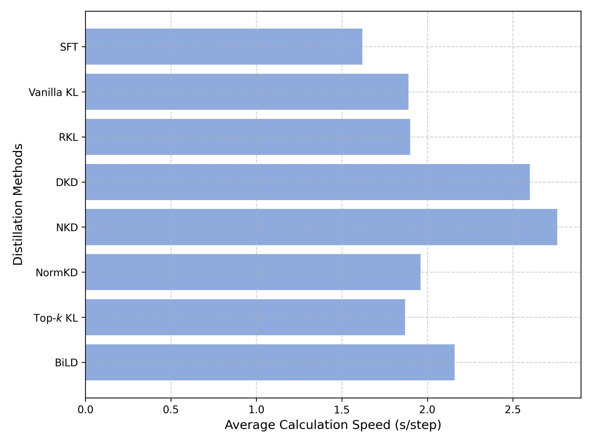

# BiLD：大型语言模型蒸馏中的双向对数差异损失

发布时间：2024年06月19日

`LLM理论

这篇论文主要探讨了大型语言模型（LLMs）的知识蒸馏技术，特别是在logit层面的任务特定蒸馏。论文提出了一个新的方法——双向Logits差分（BiLD）损失，用于改进蒸馏过程中的信息利用和噪声剔除。这一研究是对LLMs理论层面的深入分析和创新，因此归类为LLM理论。` `模型压缩`

> BiLD: Bi-directional Logits Difference Loss for Large Language Model Distillation

# 摘要

> 大型语言模型（LLMs）近年来在NLP领域大放异彩，但其庞大的参数规模却成了广泛应用的绊脚石。知识蒸馏（KD）技术应运而生，它将大型模型的智慧传递给小型模型。本文深入探讨了LLMs在logit层面的任务特定蒸馏，发现微调后的LLMs的logits呈现出更为极端的长尾分布，且长尾中的“噪声”对蒸馏效果有影响。现有方法在利用logits内部排序信息方面显得力不从心。为此，我们创新性地提出了双向Logits差分（BiLD）损失，它巧妙地筛选出前k个logits以剔除噪声，并利用logits差分来挖掘排序信息。我们在13个数据集上对两种LLMs进行了详尽测试，结果表明，仅用前8个logits的BiLD损失，在众多方法中脱颖而出，超越了监督微调、传统KL损失及五种其他蒸馏技术。

> In recent years, large language models (LLMs) have shown exceptional capabilities across various natural language processing (NLP) tasks. However, such impressive performance often comes with the trade-off of an increased parameter size, posing significant challenges for widespread deployment. Knowledge distillation (KD) provides a solution by transferring knowledge from a large teacher model to a smaller student model. In this paper, we explore the task-specific distillation of LLMs at the logit level. Our investigation reveals that the logits of fine-tuned LLMs exhibit a more extreme long-tail distribution than those from vision models, with hidden "noise" in the long tail affecting distillation performance. Furthermore, existing logits distillation methods often struggle to effectively utilize the internal ranking information from the logits. To address these, we propose the Bi-directional Logits Difference (BiLD) loss. The BiLD loss filters out the long-tail noise by utilizing only top-$k$ teacher and student logits, and leverages the internal logits ranking information by constructing logits differences. To evaluate BiLD loss, we conduct comprehensive experiments on 13 datasets using two types of LLMs. Our results show that the BiLD loss, with only the top-8 logits, outperforms supervised fine-tuning (SFT), vanilla KL loss, and five other distillation methods from both NLP and CV fields.

[Arxiv](https://arxiv.org/abs/2406.13555)