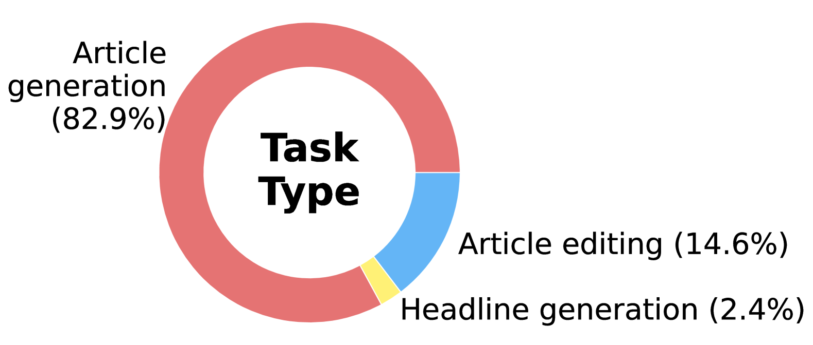

# 新闻速递：探索生成式AI在新闻报道中的实际应用案例

发布时间：2024年06月19日

`Agent

理由：这篇论文主要关注的是记者作为大型语言模型（LLMs）的用户，如何与LLMs互动，并探讨了这种互动中可能涉及的敏感信息处理和责任问题。这涉及到如何使用LLMs作为工具来辅助新闻报道，因此更符合Agent分类，即探讨如何使用LLMs作为代理或工具在特定领域（如新闻报道）中的应用。` `人工智能`

> Breaking News: Case Studies of Generative AI's Use in Journalism

# 摘要

> 记者作为大型语言模型（LLMs）的用户之一，我们通过分析WildChat数据集，深入研究了两家新闻机构如何与LLMs互动。研究发现，记者有时会向LLMs提供敏感信息，如机密通信或他社报道，以激发LLMs生成新闻文章，并在有限的人工干预下发布这些机器生成的内容（中位数ROUGE-L评分为0.62）。鉴于此，我们呼吁开展关于AI负责任使用的深入研究，并制定明确的新闻领域LLMs使用指南和最佳实践。

> Journalists are among the many users of large language models (LLMs). To better understand the journalist-AI interactions, we conduct a study of LLM usage by two news agencies through browsing the WildChat dataset, identifying candidate interactions, and verifying them by matching to online published articles. Our analysis uncovers instances where journalists provide sensitive material such as confidential correspondence with sources or articles from other agencies to the LLM as stimuli and prompt it to generate articles, and publish these machine-generated articles with limited intervention (median output-publication ROUGE-L of 0.62). Based on our findings, we call for further research into what constitutes responsible use of AI, and the establishment of clear guidelines and best practices on using LLMs in a journalistic context.

[Arxiv](https://arxiv.org/abs/2406.13706)