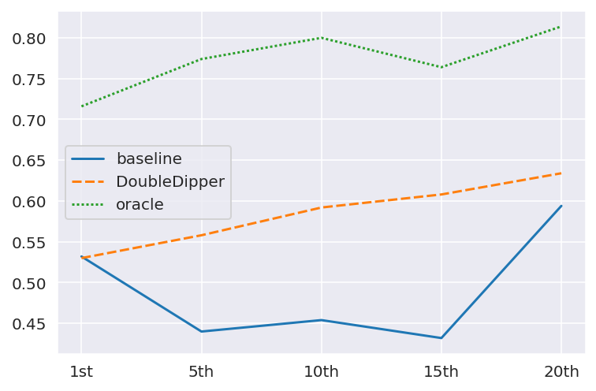
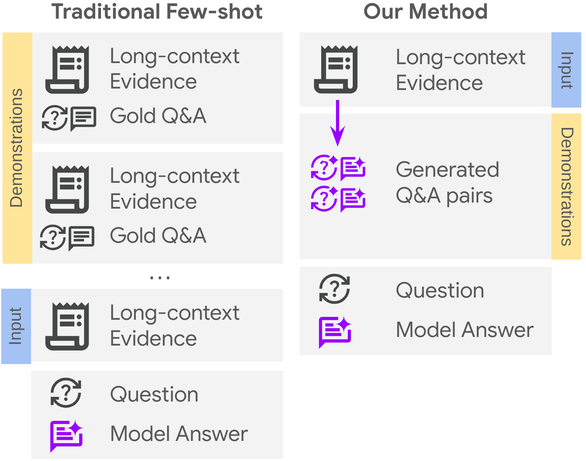
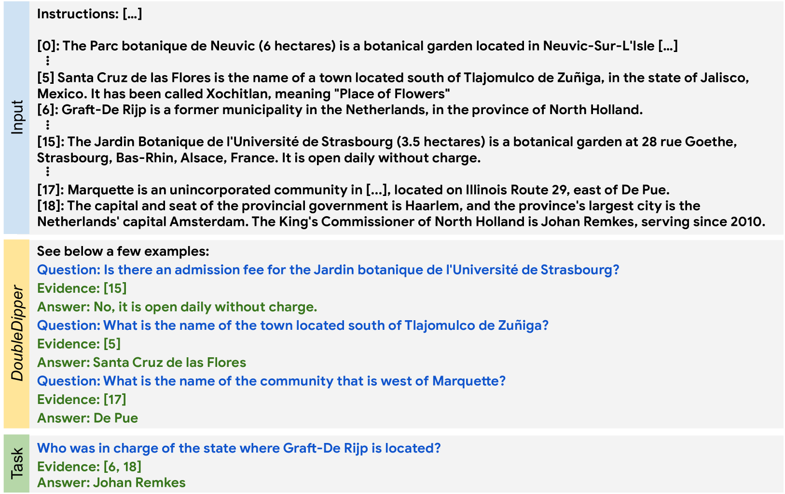
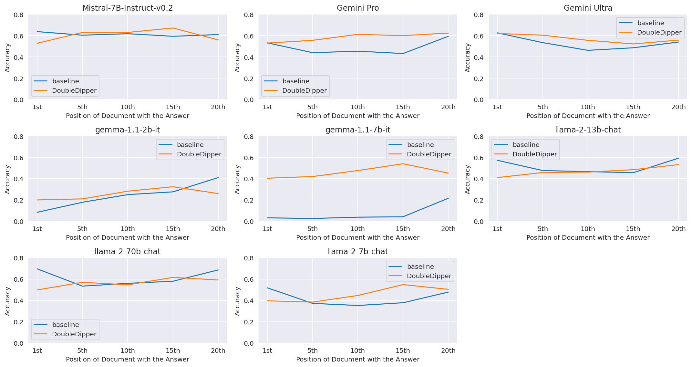

# 长上下文中，少量样本学习能否奏效？利用上下文循环生成演示，探索其可能性。

发布时间：2024年06月19日

`LLM应用

理由：这篇论文主要探讨了如何通过创新的上下文学习方法提升大型语言模型（LLMs）在处理长上下文任务时的性能。它提出了一种新方法，通过循环利用上下文来自动生成用于长上下文问答任务的少量示例，这种方法直接应用于LLMs的实际使用场景中，以改进其在特定任务上的表现。因此，这篇论文属于LLM应用类别。` `问答系统`

> Can Few-shot Work in Long-Context? Recycling the Context to Generate Demonstrations

# 摘要

> 尽管大型语言模型（LLMs）近期有所进步，但在处理长上下文任务时，其性能仍未尽如人意。使用少量示例的上下文学习（ICL）可能是在这种情况下提升LLM性能的一个吸引人的解决方案；然而，简单地添加具有长上下文的ICL示例会带来挑战，包括每个少量示例增加的大量令牌开销以及演示与目标查询之间的上下文不匹配。为此，我们提出了一种新方法：通过循环利用上下文来自动生成用于长上下文问答任务的少量示例。具体而言，我们从一个长输入上下文（1-3k令牌）和一个查询出发，从该上下文中生成额外的查询-输出对作为少量示例，同时只引入一次上下文。这样，演示与目标查询共享同一上下文，同时仅向提示中添加少量令牌。此外，我们指导模型在回答前明确识别相关段落，以增强每个演示，这不仅提升了性能，还为答案来源提供了细粒度的归属。我们在多个LLMs上应用此方法，并在具有长上下文的各种问答数据集上取得了显著改进，尤其是在答案位于上下文中间时。令人惊讶的是，尽管只引入了单跳ICL示例，LLMs也能成功地使用我们的方法推广到多跳长上下文问答。

> Despite recent advancements in Large Language Models (LLMs), their performance on tasks involving long contexts remains sub-optimal. In-Context Learning (ICL) with few-shot examples may be an appealing solution to enhance LLM performance in this scenario; However, naively adding ICL examples with long context introduces challenges, including substantial token overhead added for each few-shot example and context mismatch between the demonstrations and the target query. In this work, we propose to automatically generate few-shot examples for long context QA tasks by recycling contexts. Specifically, given a long input context (1-3k tokens) and a query, we generate additional query-output pairs from the given context as few-shot examples, while introducing the context only once. This ensures that the demonstrations are leveraging the same context as the target query while only adding a small number of tokens to the prompt. We further enhance each demonstration by instructing the model to explicitly identify the relevant paragraphs before the answer, which improves performance while providing fine-grained attribution to the answer source. We apply our method on multiple LLMs and obtain substantial improvements on various QA datasets with long context, especially when the answer lies within the middle of the context. Surprisingly, despite introducing only single-hop ICL examples, LLMs also successfully generalize to multi-hop long-context QA using our approach.

[Arxiv](https://arxiv.org/abs/2406.13632)