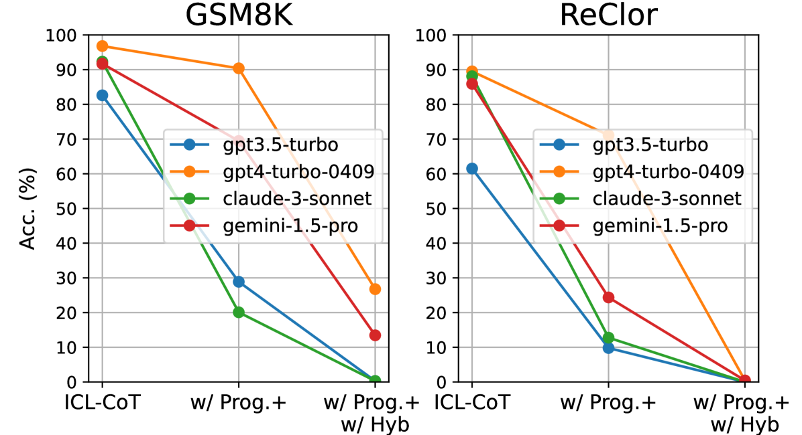
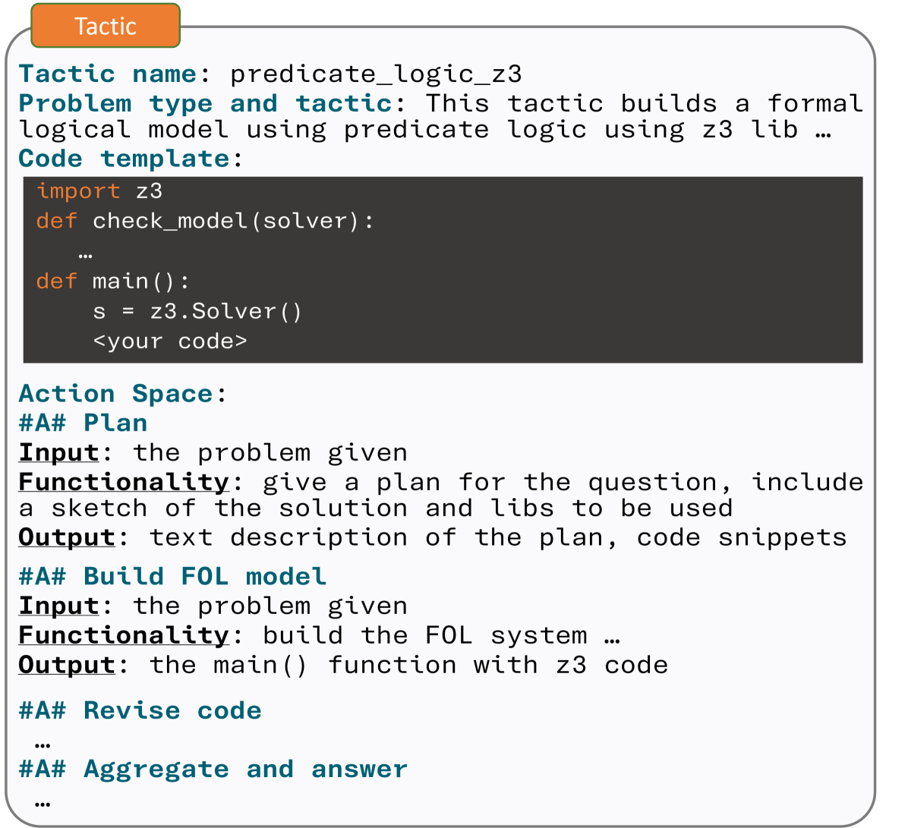
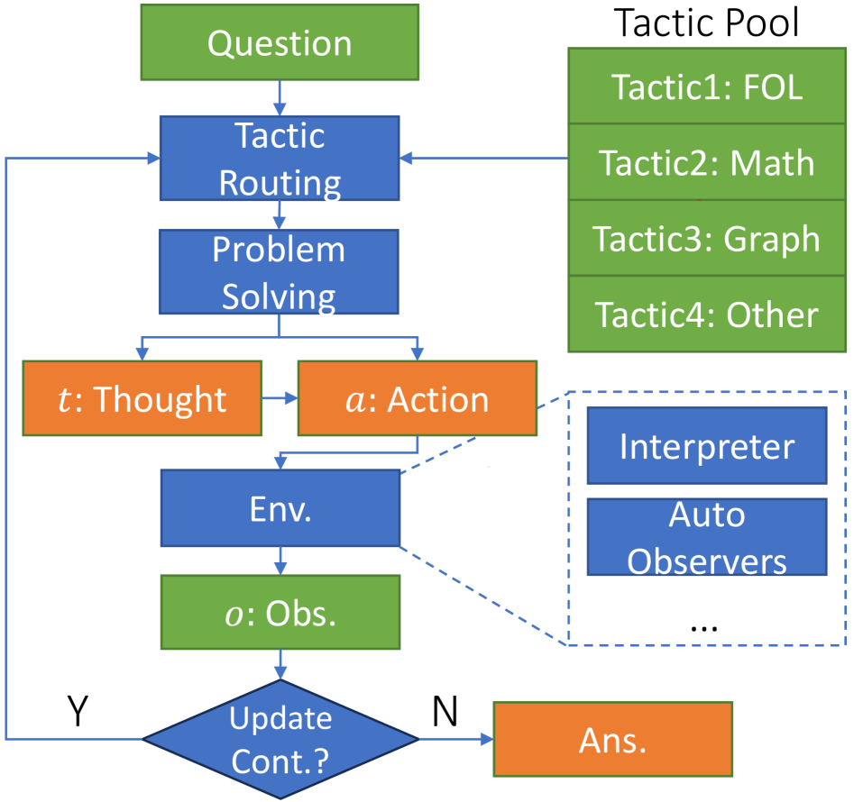
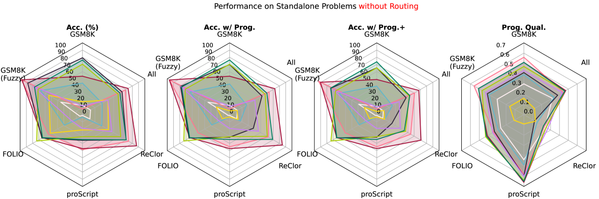
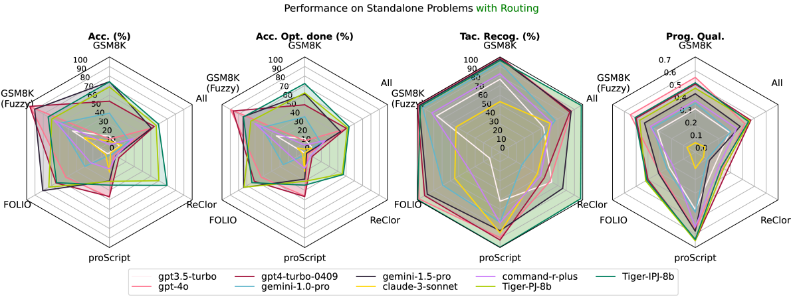
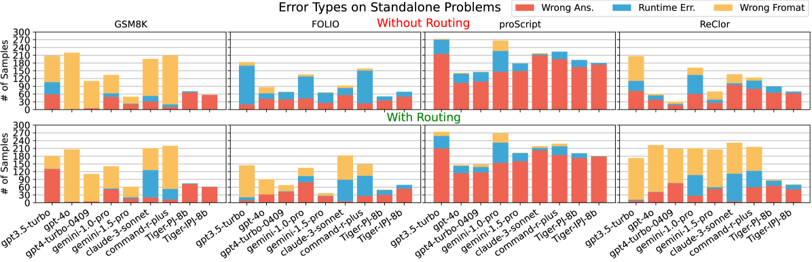
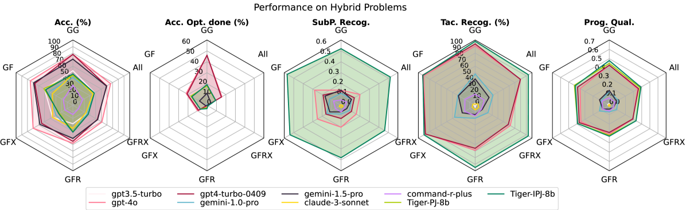

# 大型语言模型（LLMs）是否具备在实际环境中运用程序进行推理的能力？

发布时间：2024年06月19日

`LLM应用

这篇论文主要探讨了大型语言模型（LLMs）在处理复杂、模糊问题时的推理能力，特别是在没有预知问题类型的情况下。它提出了“野外推理”任务，并构建了一个包含多样化推理问题解决方案的数据集来评估LLMs的能力。此外，论文还讨论了通过策略引导的微调方法来提升LLMs的性能。这些内容主要关注LLMs在实际应用中的表现和改进，因此属于LLM应用分类。` `人工智能`

> Can LLMs Reason in the Wild with Programs?

# 摘要

> 大型语言模型（LLMs）在通过编程解决推理问题方面表现出色，但多数情况下，这些模型是在已知任务要求的条件下训练和评估的。随着LLMs能力的增强，评估它们在更贴近现实的复杂、模糊问题中的推理能力变得尤为重要。为此，我们提出了“野外推理”任务，要求LLM在没有预知问题类型的情况下，通过识别子问题、选择合适的形式，并编写程序来解决问题，整个过程由特定策略引导。我们构建了一个包含多样化推理问题解决方案的大型数据集，从明确的单一形式推理到模糊混合问题，以此来细致地考察LLMs的推理能力，包括策略运用和避免捷径的倾向。实验结果显示，现有LLMs在处理模糊和混合问题时表现不佳，凸显了其局限性和过拟合问题。此外，我们发现通过在策略引导的轨迹上微调本地LLM，可以显著提升性能。项目代码已公开在github.com/gblackout/Reason-in-the-Wild。

> Large Language Models (LLMs) have shown superior capability to solve reasoning problems with programs. While being a promising direction, most of such frameworks are trained and evaluated in settings with a prior knowledge of task requirements. However, as LLMs become more capable, it is necessary to assess their reasoning abilities in more realistic scenarios where many real-world problems are open-ended with ambiguous scope, and often require multiple formalisms to solve. To investigate this, we introduce the task of reasoning in the wild, where an LLM is tasked to solve a reasoning problem of unknown type by identifying the subproblems and their corresponding formalisms, and writing a program to solve each subproblem, guided by a tactic. We create a large tactic-guided trajectory dataset containing detailed solutions to a diverse set of reasoning problems, ranging from well-defined single-form reasoning (e.g., math, logic), to ambiguous and hybrid ones (e.g., commonsense, combined math and logic). This allows us to test various aspects of LLMs reasoning at the fine-grained level such as the selection and execution of tactics, and the tendency to take undesired shortcuts. In experiments, we highlight that existing LLMs fail significantly on problems with ambiguous and mixed scope, revealing critical limitations and overfitting issues (e.g. accuracy on GSM8K drops by at least 50\%). We further show the potential of finetuning a local LLM on the tactic-guided trajectories in achieving better performance. Project repo is available at github.com/gblackout/Reason-in-the-Wild

[Arxiv](https://arxiv.org/abs/2406.13764)