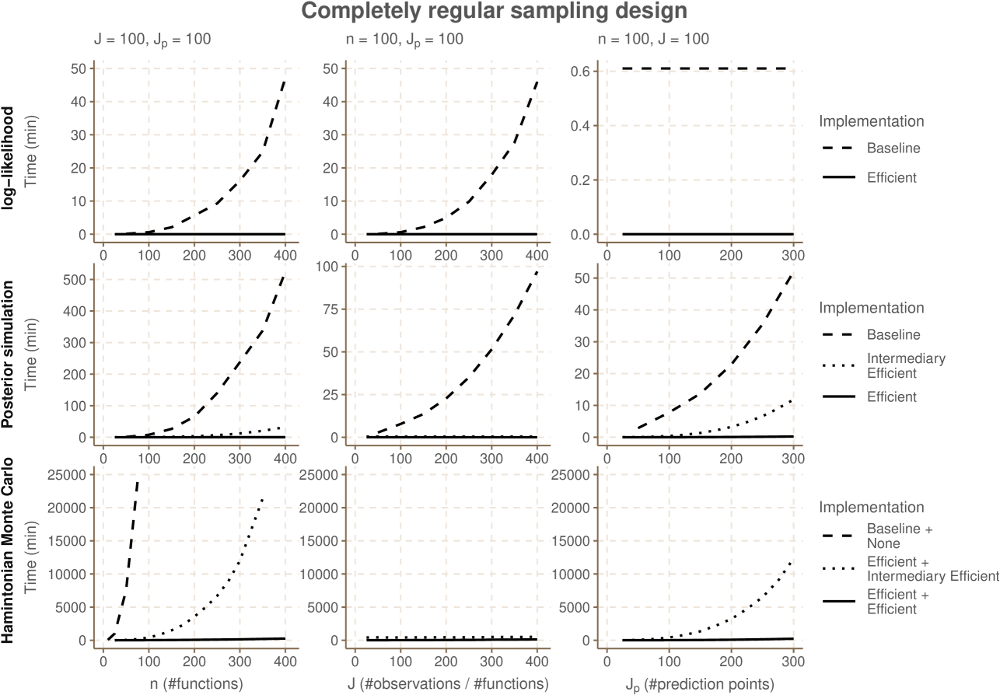
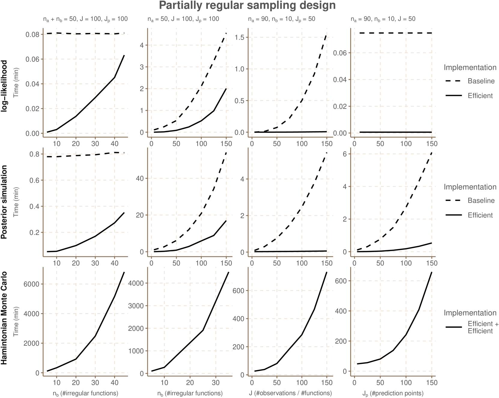

# 高效多级高斯过程回归：针对规则或半规则采样设计下的功能数据分析

发布时间：2024年06月19日

`LLM理论

理由：这篇论文主要讨论了高斯过程回归模型的改进，提出了一种多级高斯过程模型，用于处理大型数据集。虽然这种方法可能在实际应用中与语言模型（LLM）有所关联，但其核心贡献在于理论模型的改进和优化，特别是在处理复杂性和计算效率方面的提升。因此，这篇论文更适合归类于LLM理论，因为它关注的是模型本身的理论发展和优化，而不是直接的应用或特定的Agent或RAG框架。` `数据分析` `机器学习`

> Computationally efficient multi-level Gaussian process regression for functional data observed under completely or partially regular sampling designs

# 摘要

> 高斯过程回归作为一种灵活且概率性强的非线性回归方法，常被采用。然而，其计算复杂性随观测数增加而恶化，尤其在多函数分析中应用时更为突出。我们提出了一种多级高斯过程模型，同时考虑了共同均值与个体差异，通过精确且高效的分析方法处理规则或半规则网格上的数据。这一进展使得大型数据集的模型拟合成为可能，而此前这在标准方法下是无法实现的。模拟研究显示，我们的方法比传统实现快几个数量级，并在概率编程语言 Stan 中实现了这一方法。

> Gaussian process regression is a frequently used statistical method for flexible yet fully probabilistic non-linear regression modeling. A common obstacle is its computational complexity which scales poorly with the number of observations. This is especially an issue when applying Gaussian process models to multiple functions simultaneously in various applications of functional data analysis.
  We consider a multi-level Gaussian process regression model where a common mean function and individual subject-specific deviations are modeled simultaneously as latent Gaussian processes. We derive exact analytic and computationally efficient expressions for the log-likelihood function and the posterior distributions in the case where the observations are sampled on either a completely or partially regular grid. This enables us to fit the model to large data sets that are currently computationally inaccessible using a standard implementation. We show through a simulation study that our analytic expressions are several orders of magnitude faster compared to a standard implementation, and we provide an implementation in the probabilistic programming language Stan.

[Arxiv](https://arxiv.org/abs/2406.13691)