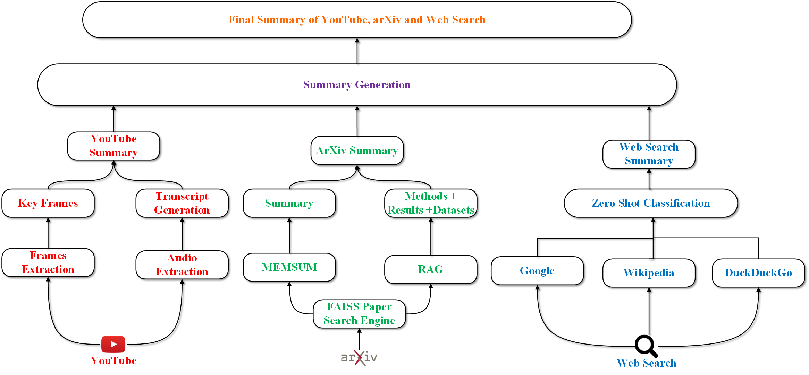
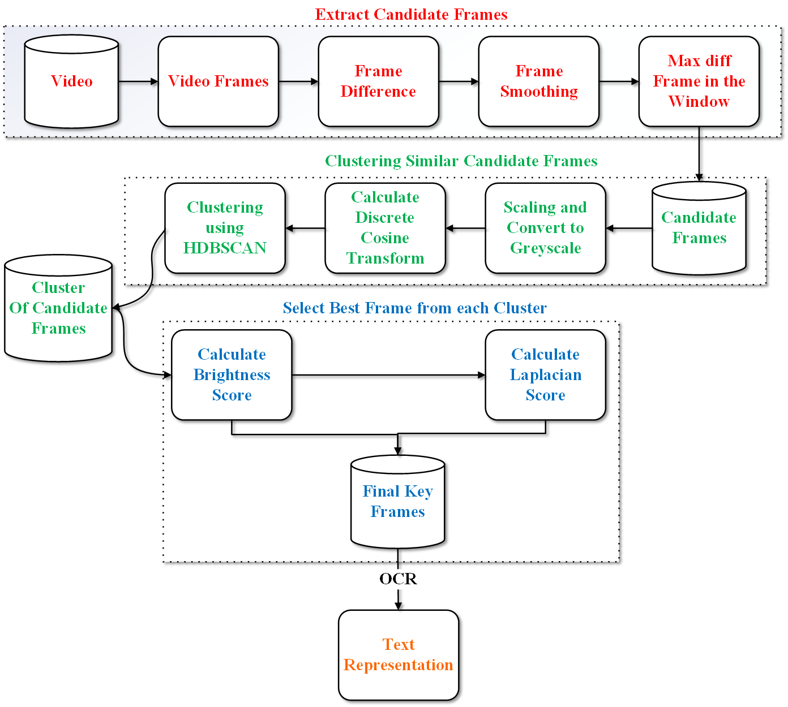
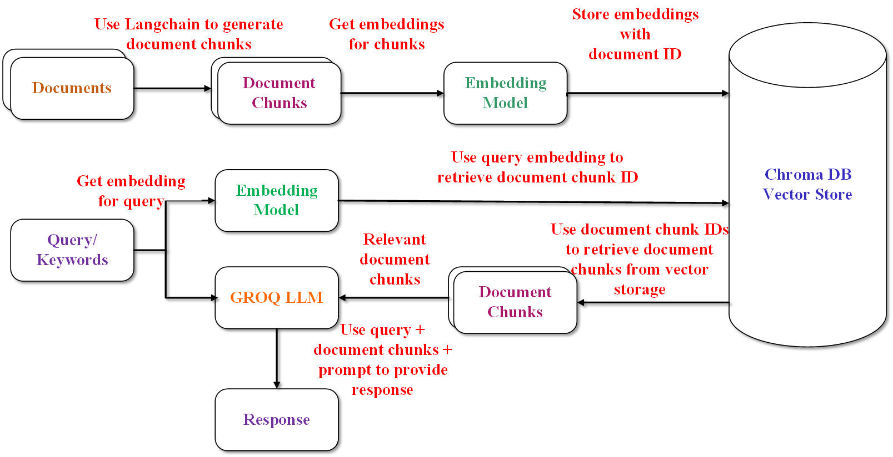

# 融合多维：通过多源、多模态、多语言融合实现信息提取与摘要

发布时间：2024年06月19日

`RAG

理由：这篇论文的研究重点是提出一种创新的总结方法，该方法利用多源数据的优势来深入理解复杂主题。这种方法不仅限于文本，还涵盖了多种数据源，如YouTube播放列表、预印本和维基百科等，并将这些数据统一转换为文本形式以便分析。这种跨源数据的整合和分析方法与RAG（Retrieval-Augmented Generation）模型的概念相符，后者通常涉及从多个数据源检索信息以增强语言模型的生成能力。因此，这篇论文更适合归类于RAG。` `信息提取` `内容总结`

> Converging Dimensions: Information Extraction and Summarization through Multisource, Multimodal, and Multilingual Fusion

# 摘要

> 大型语言模型（LLMs）的进步，带来了新的总结策略，为提取关键信息提供了丰富的工具。但这些方法常因依赖单一数据源而受限，导致信息量有限且主题覆盖面窄，可能包含虚假内容，且对多语言和多模态数据支持不足。本研究提出一种创新总结方法，利用多源数据优势，深入理解复杂主题。研究不仅限于文本，还涵盖了YouTube播放列表、预印本和维基百科等多种数据。这些数据被统一转换为文本形式，便于全面分析。此方法能从更广范围的数据源中提取相关信息，其核心在于最大化信息增益，同时减少信息重叠，确保总结的高度连贯性和信息性。

> Recent advances in large language models (LLMs) have led to new summarization strategies, offering an extensive toolkit for extracting important information. However, these approaches are frequently limited by their reliance on isolated sources of data. The amount of information that can be gathered is limited and covers a smaller range of themes, which introduces the possibility of falsified content and limited support for multilingual and multimodal data. The paper proposes a novel approach to summarization that tackles such challenges by utilizing the strength of multiple sources to deliver a more exhaustive and informative understanding of intricate topics. The research progresses beyond conventional, unimodal sources such as text documents and integrates a more diverse range of data, including YouTube playlists, pre-prints, and Wikipedia pages. The aforementioned varied sources are then converted into a unified textual representation, enabling a more holistic analysis. This multifaceted approach to summary generation empowers us to extract pertinent information from a wider array of sources. The primary tenet of this approach is to maximize information gain while minimizing information overlap and maintaining a high level of informativeness, which encourages the generation of highly coherent summaries.

[Arxiv](https://arxiv.org/abs/2406.13715)