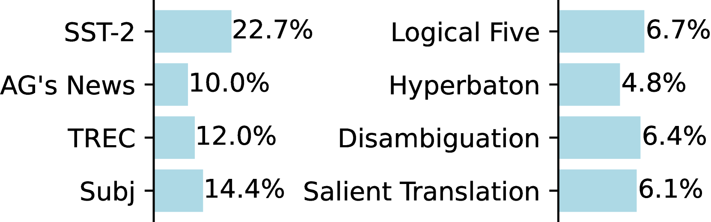
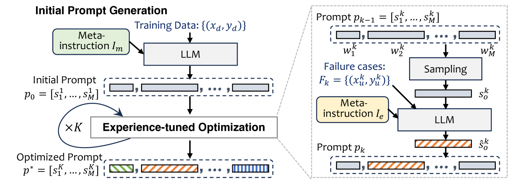
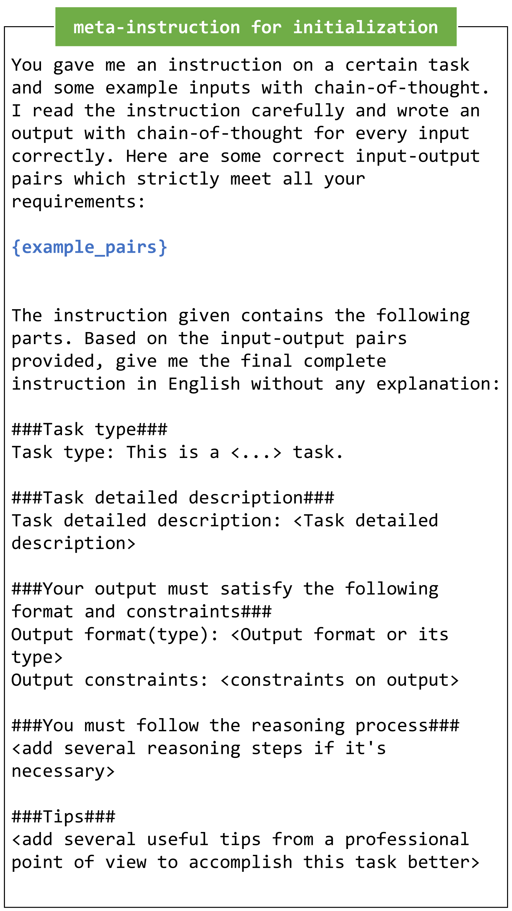
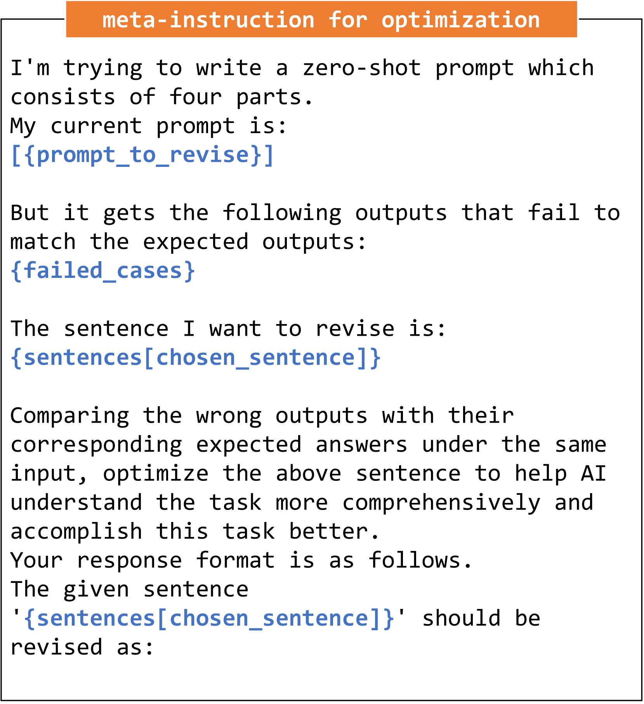
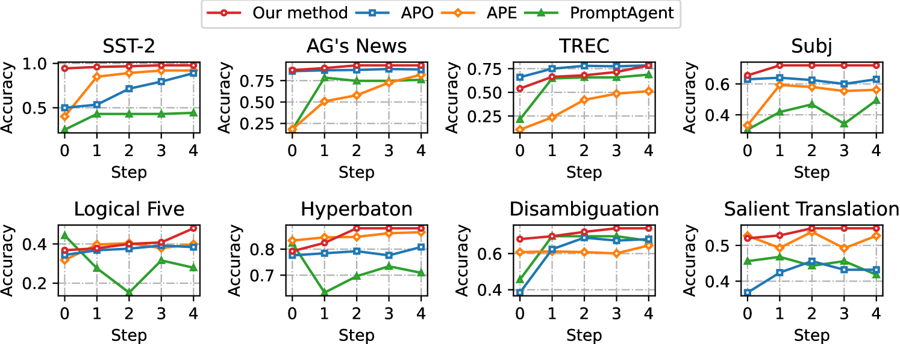
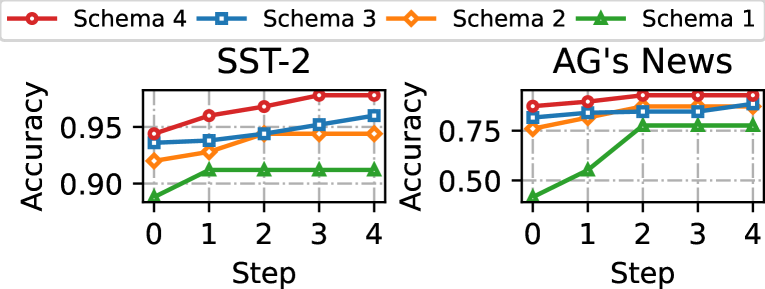
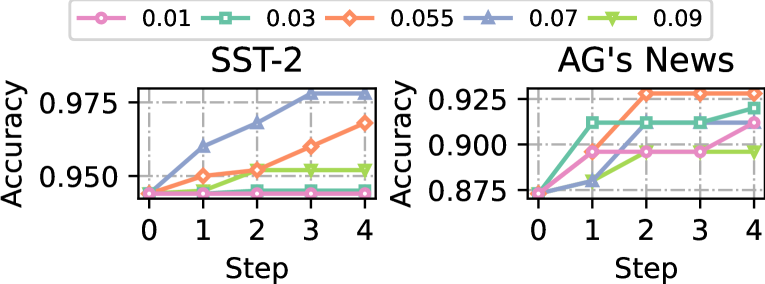
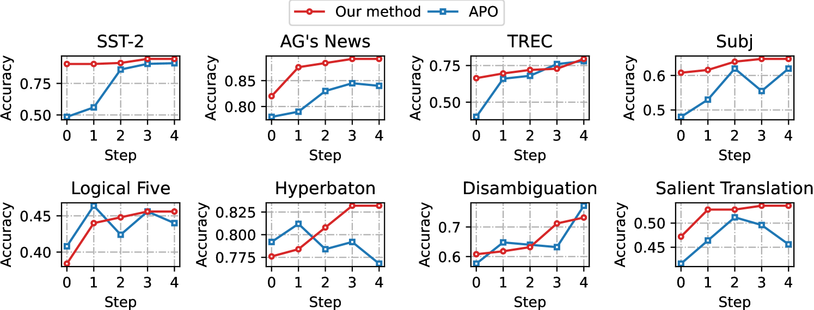
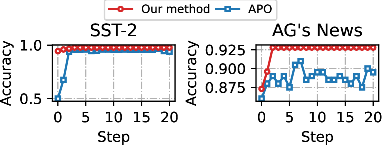

# 双阶段加速提示优化策略

发布时间：2024年06月19日

`Agent

这篇论文主要介绍了一种针对闭源大型语言模型（LLM）的优化方法，通过双阶段策略来提高多任务性能。第一阶段是利用定制的元指令生成优质初始提示，第二阶段是在句子层面上迭代精炼提示。这种方法可以被视为一个智能代理（Agent）的行为，因为它通过学习和优化来改善其性能，类似于一个智能体在不断学习和适应环境以达到更好表现的过程。因此，这篇论文更适合归类到Agent分类中。` `机器学习`

> Dual-Phase Accelerated Prompt Optimization

# 摘要

> 无梯度提示优化方法显著提升了闭源大型语言模型在多任务中的性能，但现有方法往往忽略了高质量提示初始化和优化方向选择的关键性，导致优化过程冗长。为此，我们提出了一种双阶段策略：首先利用定制的元指令深入任务细节，快速生成优质初始提示；随后，借助过往调优经验，在句子层面迭代精炼提示，不断扩充并筛选出高效提示。经过八个数据集的广泛测试，我们的方法不仅优化步骤少于五次，且持续超越了基准性能。

> Gradient-free prompt optimization methods have made significant strides in enhancing the performance of closed-source Large Language Models (LLMs) across a wide range of tasks. However, existing approaches make light of the importance of high-quality prompt initialization and the identification of effective optimization directions, thus resulting in substantial optimization steps to obtain satisfactory performance. In this light, we aim to accelerate prompt optimization process to tackle the challenge of low convergence rate. We propose a dual-phase approach which starts with generating high-quality initial prompts by adopting a well-designed meta-instruction to delve into task-specific information, and iteratively optimize the prompts at the sentence level, leveraging previous tuning experience to expand prompt candidates and accept effective ones. Extensive experiments on eight datasets demonstrate the effectiveness of our proposed method, achieving a consistent accuracy gain over baselines with less than five optimization steps.

[Arxiv](https://arxiv.org/abs/2406.13443)