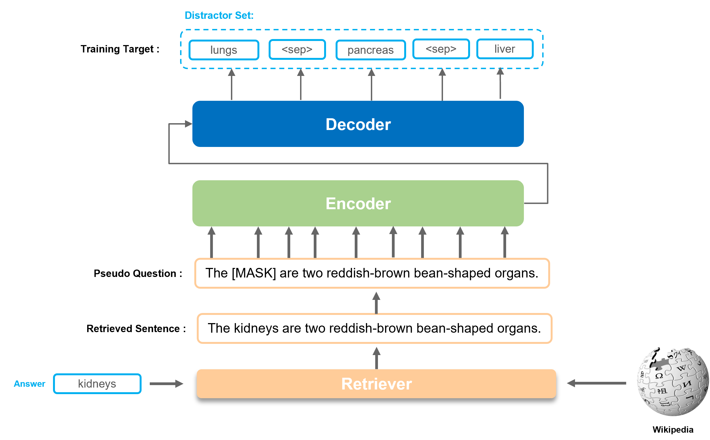
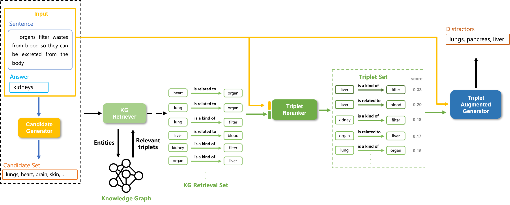
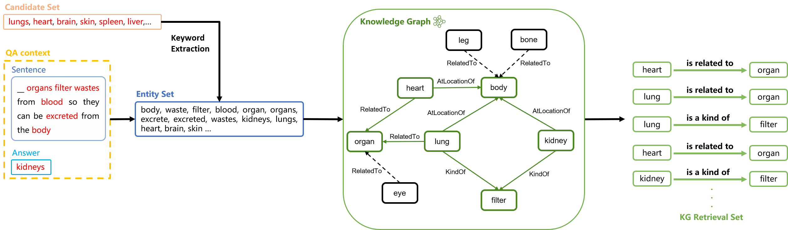

# 通过检索增强预训练与知识图谱融合，提升多选题干扰项生成效果

发布时间：2024年06月19日

`RAG

理由：该论文摘要中提到的“检索增强预训练”和整合知识图谱以增强生成性能的方法，与RAG（Retrieval-Augmented Generation）模型的核心思想相吻合。RAG模型是一种结合了检索和生成的方法，用于提高语言模型的性能，特别是在需要外部知识的情况下。因此，这篇论文更适合归类到RAG分类中。` `知识图谱`

> Enhancing Distractor Generation for Multiple-Choice Questions with Retrieval Augmented Pretraining and Knowledge Graph Integration

# 摘要

> 本文针对多选题干扰项生成任务，提出了两项创新设计：一是“检索增强预训练”，优化语言模型预训练，使之更贴合干扰项生成任务；二是整合知识图谱，以增强生成性能。实验结果显示，我们的模型在MCQ和Sciq数据集上的表现均超越了现有最佳水平，F1@3分数分别提升至16.47和16.50。

> In this paper, we tackle the task of distractor generation (DG) for multiple-choice questions. Our study introduces two key designs. First, we propose \textit{retrieval augmented pretraining}, which involves refining the language model pretraining to align it more closely with the downstream task of DG. Second, we explore the integration of knowledge graphs to enhance the performance of DG. Through experiments with benchmarking datasets, we show that our models significantly outperform the state-of-the-art results. Our best-performing model advances the F1@3 score from 14.80 to 16.47 in MCQ dataset and from 15.92 to 16.50 in Sciq dataset.

[Arxiv](https://arxiv.org/abs/2406.13578)