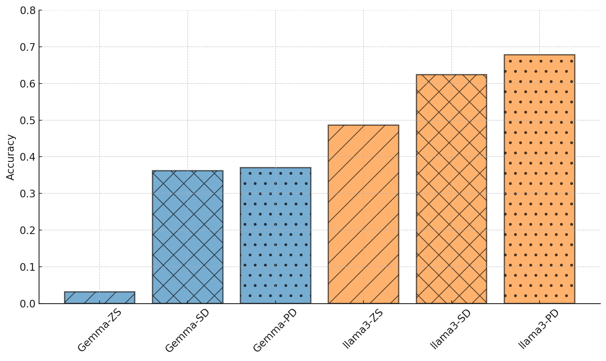

# 利用大型语言模型优化旅行选择模型：探索提示学习的新途径

发布时间：2024年06月19日

`Agent

理由：这篇论文主要介绍了一种基于提示学习的大型语言模型（LLM）框架，用于理解和预测个人旅行行为，这在智能交通系统（ITS）中是一个典型的Agent应用场景。该框架通过将输入变量转化为文本形式，并利用LLM进行预测和提供解释，展示了Agent在特定环境下的决策和行为预测能力。因此，这篇论文更适合归类于Agent分类，因为它涉及到了智能系统在特定领域（如交通系统）中的应用和决策过程。` `智能交通` `交通政策`

> Enhancing Travel Choice Modeling with Large Language Models: A Prompt-Learning Approach

# 摘要

> 在智能交通系统（ITS）中，理解个人旅行行为对于制定合适的交通政策和推荐系统至关重要。尽管研究颇丰，但该领域仍面临两大挑战：一是如何在有限的数据下进行有效建模，二是如何同时保证模型的解释性和准确性。本文提出了一种新颖的基于提示学习的大型语言模型（LLM）框架，该框架不仅大幅提升了预测的准确性，还为每个预测提供了清晰的解释。该框架通过三个关键步骤运作：首先将输入变量转化为文本形式，然后构建与目标相似的演示，并将其应用于训练有素的 LLM。我们通过伦敦乘客模式选择（LPMC）和瑞士的 Optima-Mode 两个常用数据集验证了该框架的效果。实验结果显示，LLM 在预测人们的选择上远超现有的深度学习方法和离散选择模型。此外，我们还通过一个解释案例展示了 LLM 框架如何在个体层面上提供既易懂又明确的解释。

> Travel choice analysis is crucial for understanding individual travel behavior to develop appropriate transport policies and recommendation systems in Intelligent Transportation Systems (ITS). Despite extensive research, this domain faces two critical challenges: a) modeling with limited survey data, and b) simultaneously achieving high model explainability and accuracy. In this paper, we introduce a novel prompt-learning-based Large Language Model(LLM) framework that significantly improves prediction accuracy and provides explicit explanations for individual predictions. This framework involves three main steps: transforming input variables into textual form; building of demonstrations similar to the object, and applying these to a well-trained LLM. We tested the framework's efficacy using two widely used choice datasets: London Passenger Mode Choice (LPMC) and Optima-Mode collected in Switzerland. The results indicate that the LLM significantly outperforms state-of-the-art deep learning methods and discrete choice models in predicting people's choices. Additionally, we present a case of explanation illustrating how the LLM framework generates understandable and explicit explanations at the individual level.

[Arxiv](https://arxiv.org/abs/2406.13558)