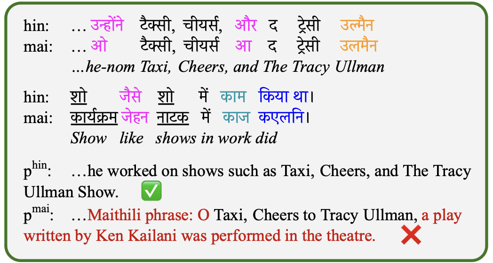
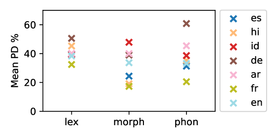
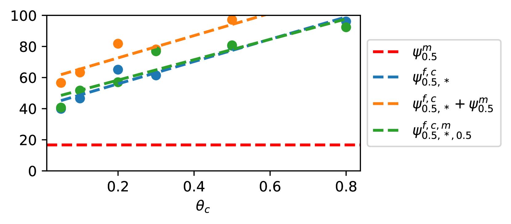
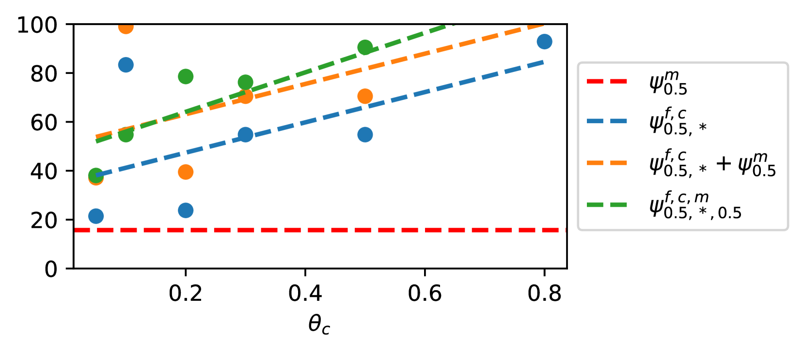
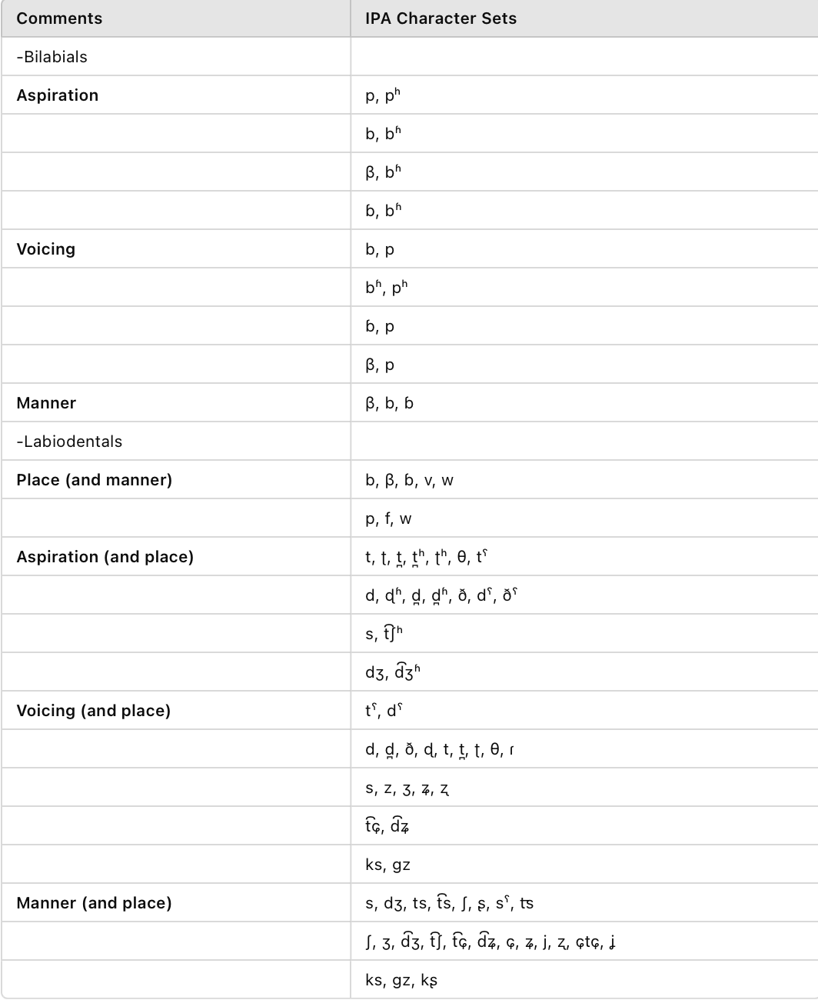
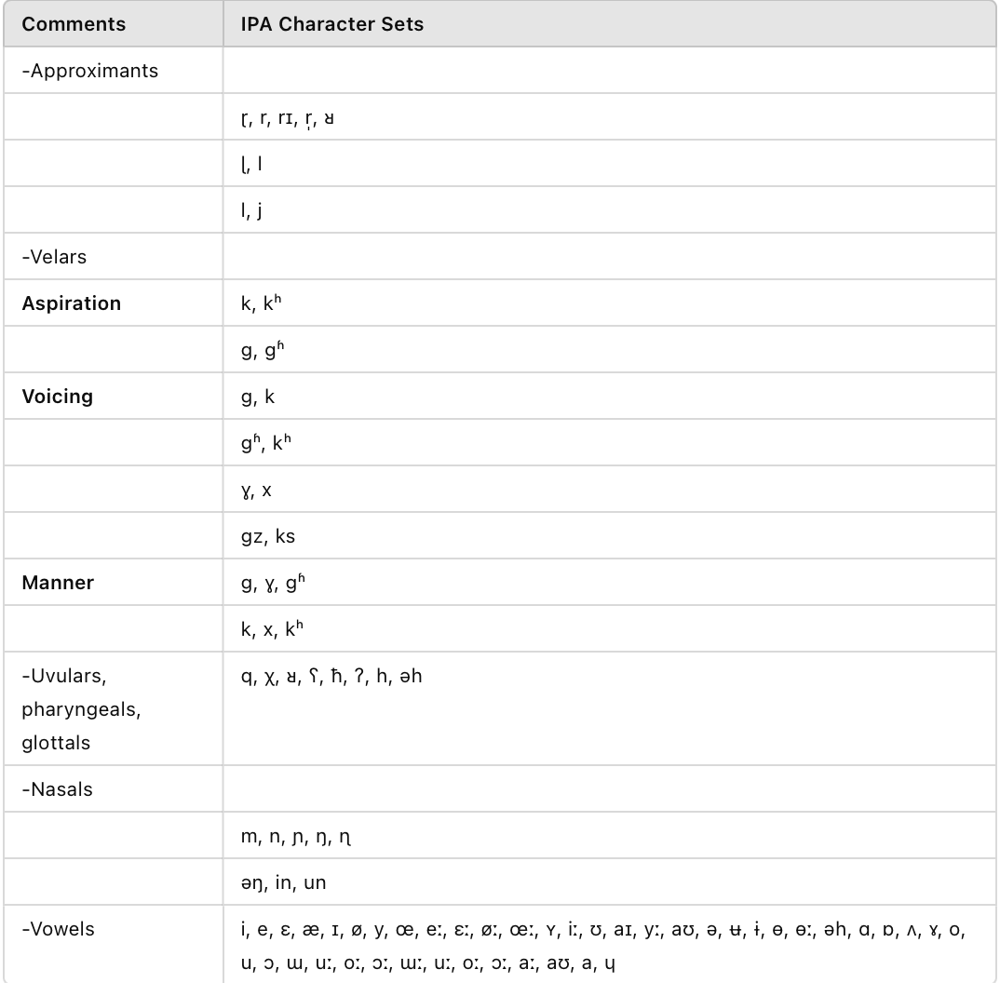
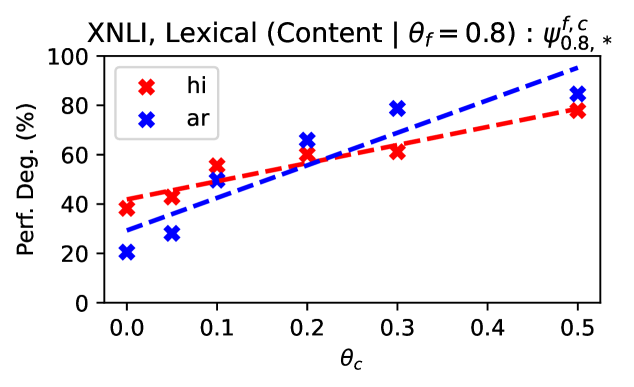
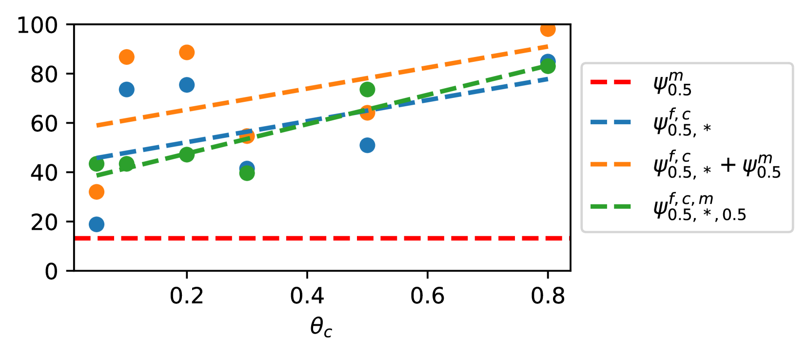

# 探究大型语言模型在语言多样性维度上的表现：一项关于跨语言泛化能力的系统性研究

发布时间：2024年06月19日

`LLM理论

这篇论文主要探讨了大型语言模型在面对未知紧密相关语言及方言时的性能下降问题，并提出了一个贝叶斯噪声模型来研究语言距离对性能下降的影响。研究内容涉及模型的理论分析和改进，因此属于LLM理论分类。` `跨语言研究` `语言学`

> Evaluating Large Language Models along Dimensions of Language Variation: A Systematik Invesdigatiom uv Cross-lingual Generalization

# 摘要

> 大型语言模型虽具备跨语言泛化能力，但在面对未知的紧密相关语言及方言时，其性能相较高资源语言邻居有所下滑。我们对导致这种性能下降的语言距离类型及其程度尚缺乏深刻理解。跨语言泛化研究因训练数据中CRL语言痕迹的不确定性及低资源语言评估数据的稀缺而受阻。为此，我们采用贝叶斯噪声模型，通过音韵、形态和词汇距离来创造可控的人工语言，以探究这些距离对PD的影响。我们通过分析噪声参数，揭示了模型对单一及复合语言现象的鲁棒性，以及任务特性与HRL对PD的作用。通过真实CRL与HRLN数据的参数后验分析，我们验证了人工语言趋势的准确性，展示了噪声模型的有效性。这一框架不仅为预测未知CRL的任务性能提供了经济途径，还为诊断CRL与HRLN间的语言距离对PD的影响提供了工具，并为减轻性能下降开辟了系统性方法的新路径。

> While large language models exhibit certain cross-lingual generalization capabilities, they suffer from performance degradation (PD) on unseen closely-related languages (CRLs) and dialects relative to their high-resource language neighbour (HRLN). However, we currently lack a fundamental understanding of what kinds of linguistic distances contribute to PD, and to what extent. Furthermore, studies of cross-lingual generalization are confounded by unknown quantities of CRL language traces in the training data, and by the frequent lack of availability of evaluation data in lower-resource related languages and dialects. To address these issues, we model phonological, morphological, and lexical distance as Bayesian noise processes to synthesize artificial languages that are controllably distant from the HRLN. We analyse PD as a function of underlying noise parameters, offering insights on model robustness to isolated and composed linguistic phenomena, and the impact of task and HRL characteristics on PD. We calculate parameter posteriors on real CRL-HRLN pair data and show that they follow computed trends of artificial languages, demonstrating the viability of our noisers. Our framework offers a cheap solution to estimating task performance on an unseen CRL given HRLN performance using its posteriors, as well as for diagnosing observed PD on a CRL in terms of its linguistic distances from its HRLN, and opens doors to principled methods of mitigating performance degradation.

[Arxiv](https://arxiv.org/abs/2406.13718)