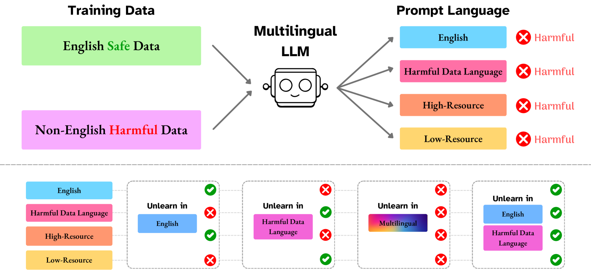
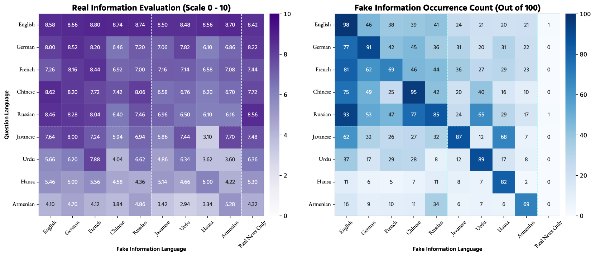
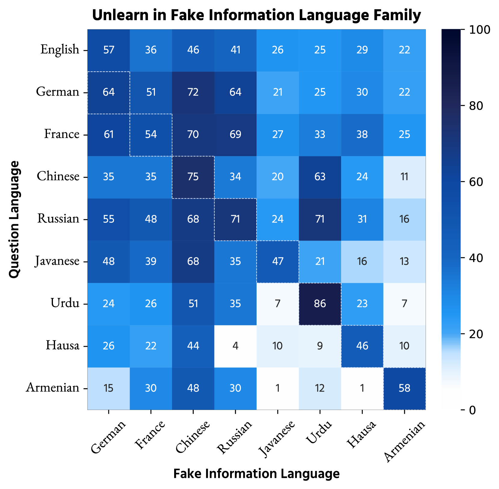
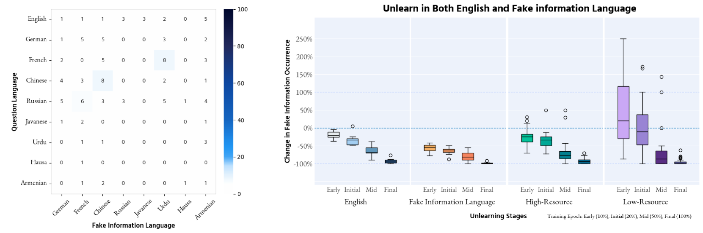
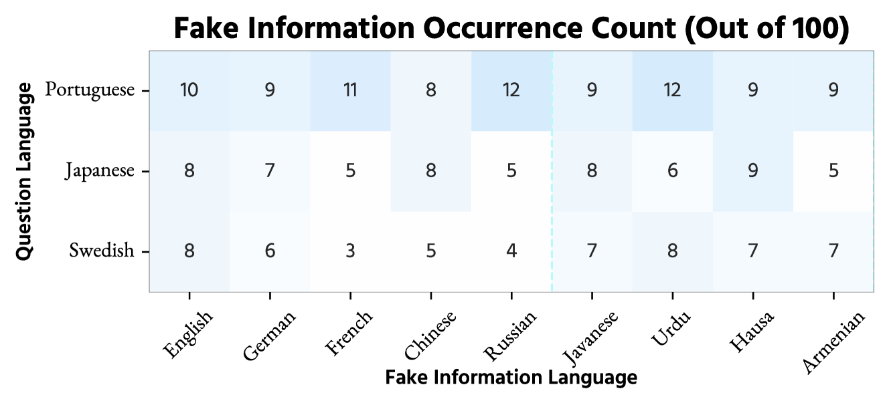
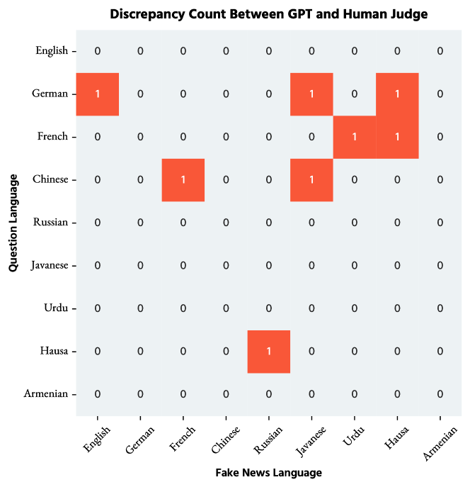
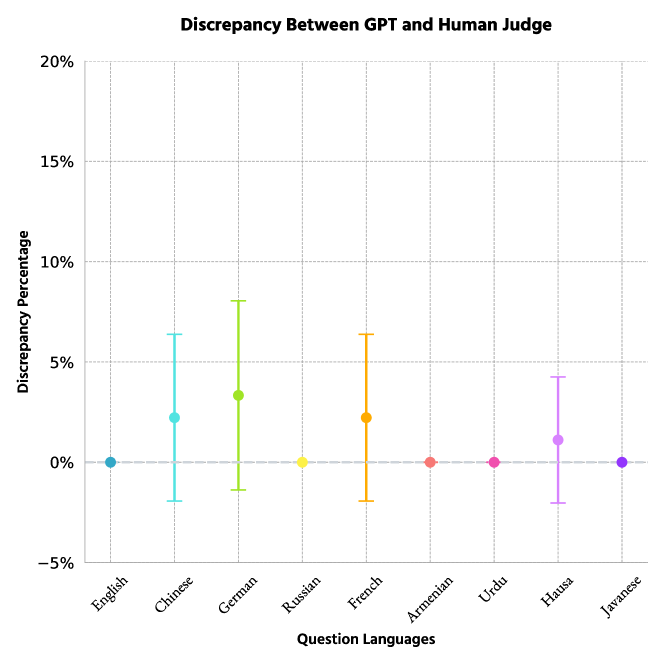
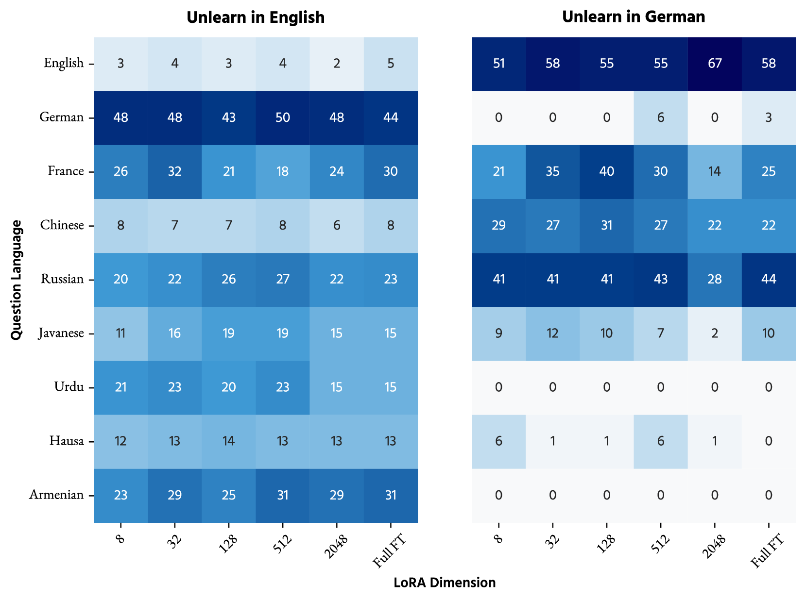

# 多语言大型语言模型中的学习与忘却：每种语言的价值

发布时间：2024年06月19日

`LLM应用

这篇论文关注的是多语言大型语言模型中的虚假信息传播问题，并探讨了不同遗忘方法的效果。它特别强调了在多语言环境中传统遗忘技术的局限性，并提出了需要开发考虑多语言特性的全面遗忘策略。这与LLM的应用层面紧密相关，因为它涉及到如何确保模型在不同语言环境中的安全与可靠性，而不是专注于模型的理论研究或Agent的设计与应用。因此，将其归类为LLM应用是合适的。` `虚假信息传播` `多语言处理`

> Every Language Counts: Learn and Unlearn in Multilingual LLMs

# 摘要

> 本文探讨了多语言大型语言模型中虚假信息的传播问题，并评估了不同遗忘方法的效果。我们发现，一旦虚假信息通过训练数据进入模型，它就能跨越语言界限传播，威胁到生成内容的质量。传统的遗忘技术，主要针对英语数据，在多语言环境中效果有限，甚至可能加剧跨语言的有害信息传播。我们强调，要彻底消除所有语言中的有害生成，必须同时处理英语及有害信息原始语言中的问题。这凸显了开发考虑多语言特性的全面遗忘策略的重要性，以确保LLMs在不同语言环境中的安全与可靠。

> This paper investigates the propagation of harmful information in multilingual large language models (LLMs) and evaluates the efficacy of various unlearning methods. We demonstrate that fake information, regardless of the language it is in, once introduced into these models through training data, can spread across different languages, compromising the integrity and reliability of the generated content. Our findings reveal that standard unlearning techniques, which typically focus on English data, are insufficient in mitigating the spread of harmful content in multilingual contexts and could inadvertently reinforce harmful content across languages. We show that only by addressing harmful responses in both English and the original language of the harmful data can we effectively eliminate generations for all languages. This underscores the critical need for comprehensive unlearning strategies that consider the multilingual nature of modern LLMs to enhance their safety and reliability across diverse linguistic landscapes.

[Arxiv](https://arxiv.org/abs/2406.13748)