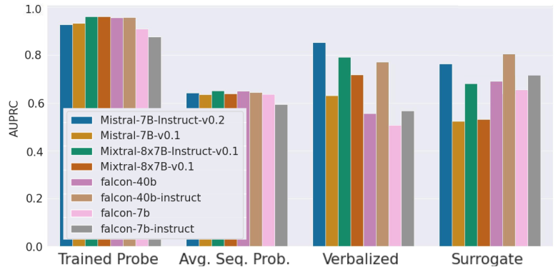
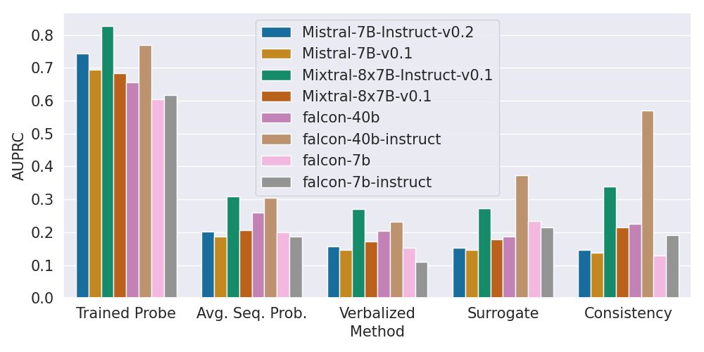
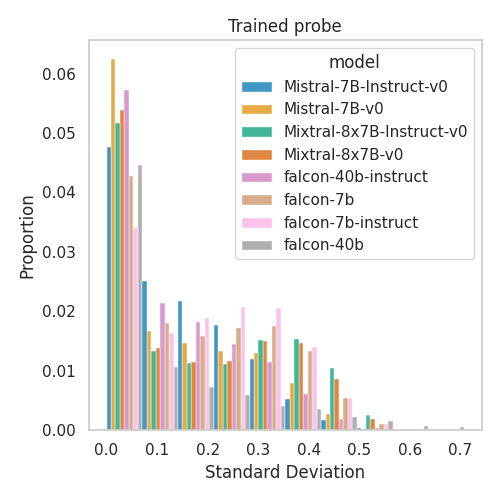
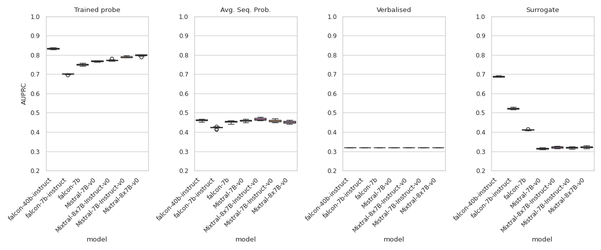
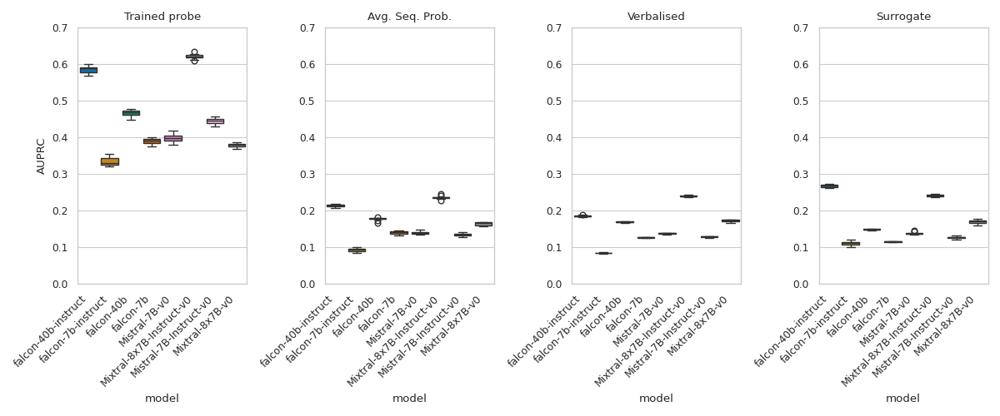
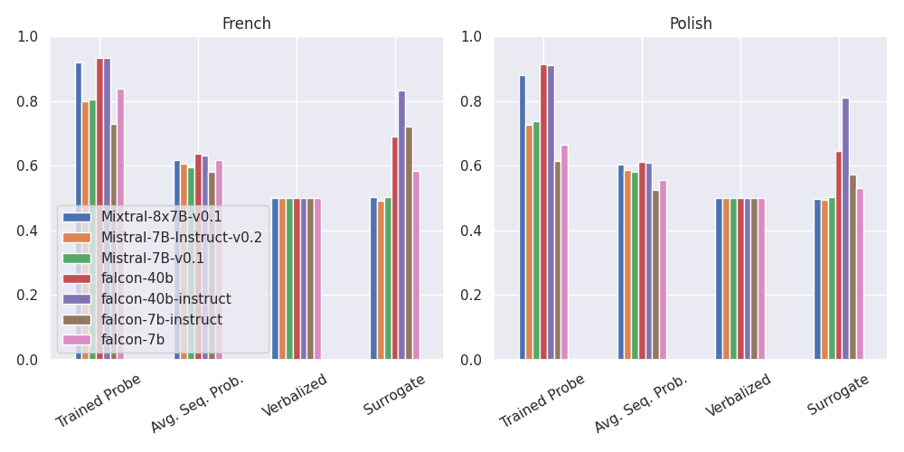

# 大型语言模型的事实信心评估：探讨当前估计器的可靠性与稳健性

发布时间：2024年06月19日

`LLM理论

这篇论文主要探讨了大型语言模型（LLMs）在事实性评估方面的可靠性和一致性问题。研究者们通过实证比较不同的技术来评估LLM对事实的确信度，并构建了一个实验框架来验证这些方法。论文特别关注了模型在输入语义不变情况下的行为一致性，并指出了模型参数知识的稳定性问题。这些内容属于对LLMs理论层面的深入分析和探讨，因此应归类于LLM理论。` `事实验证`

> Factual Confidence of LLMs: on Reliability and Robustness of Current Estimators

# 摘要

> 大型语言模型（LLMs）在答案的事实性上常显不可靠。为此，NLP研究者们提出多种技术来评估LLM对事实的确信度。但因缺乏系统对比，这些方法间的优劣尚不明了。为此，我们进行了一项调查，通过实证比较来填补这一空白，并构建了一个公平的实验框架，涵盖事实验证与问答。实验结果显示，经过训练的隐藏状态探针能提供最可靠的信心估计，尽管这需要访问模型权重和训练数据。我们还深入评估了LLMs在输入语义不变情况下的行为一致性，发现模型对事实的信心常在语义等效的输入间波动，暗示模型参数知识的稳定性有待提升。相关代码已公开于（https://github.com/amazon-science/factual-confidence-of-llms）。

> Large Language Models (LLMs) tend to be unreliable in the factuality of their answers. To address this problem, NLP researchers have proposed a range of techniques to estimate LLM's confidence over facts. However, due to the lack of a systematic comparison, it is not clear how the different methods compare to one another. To fill this gap, we present a survey and empirical comparison of estimators of factual confidence. We define an experimental framework allowing for fair comparison, covering both fact-verification and question answering. Our experiments across a series of LLMs indicate that trained hidden-state probes provide the most reliable confidence estimates, albeit at the expense of requiring access to weights and training data. We also conduct a deeper assessment of factual confidence by measuring the consistency of model behavior under meaning-preserving variations in the input. We find that the confidence of LLMs is often unstable across semantically equivalent inputs, suggesting that there is much room for improvement of the stability of models' parametric knowledge. Our code is available at (https://github.com/amazon-science/factual-confidence-of-llms).

[Arxiv](https://arxiv.org/abs/2406.13415)