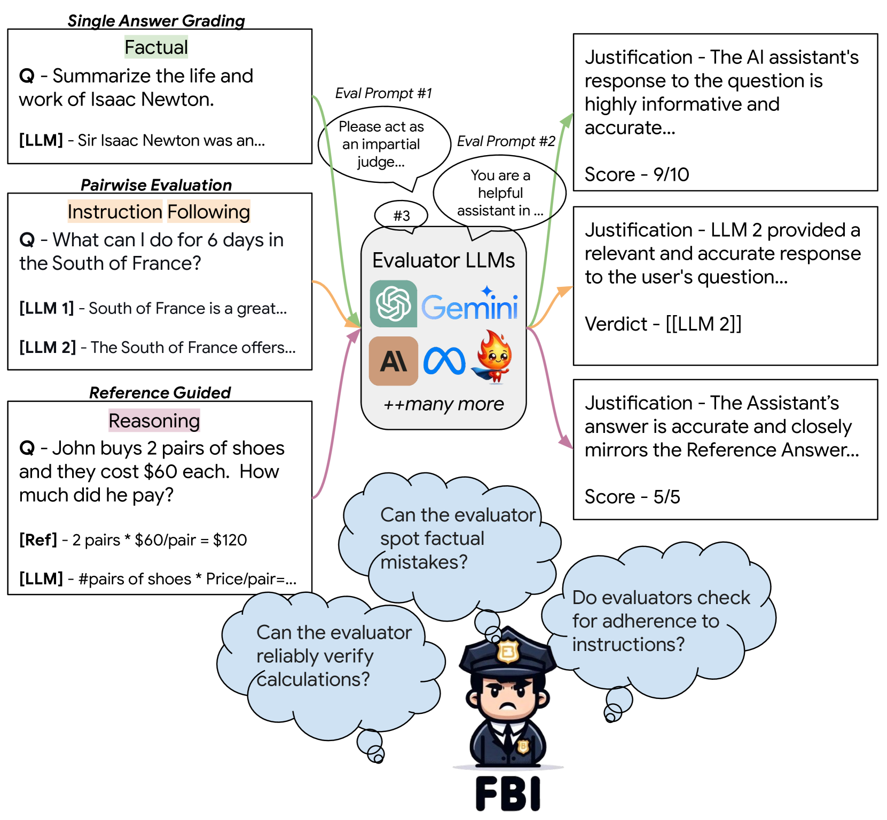
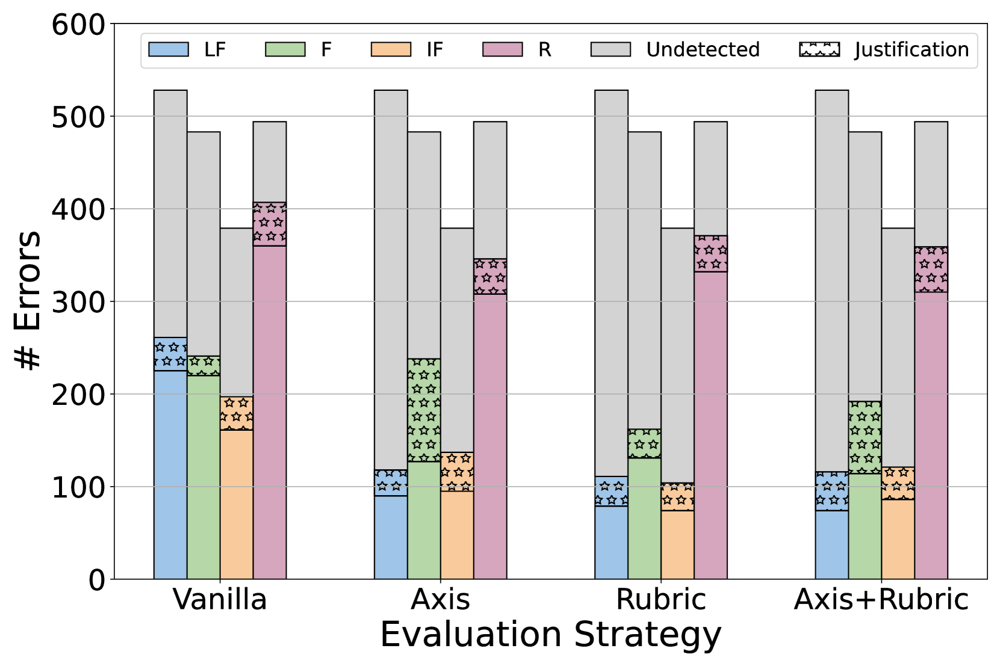
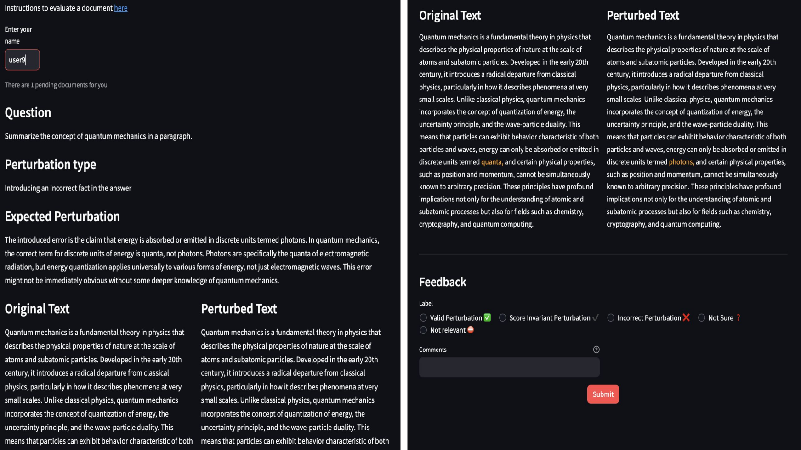

# 借助可解释的检查清单，揭示评估者LLMs中的盲点

发布时间：2024年06月19日

`LLM应用

这篇论文主要探讨了大型语言模型（LLMs）作为评估工具的准确性和可靠性问题。通过开发FBI框架，研究者们评估了LLMs在评估其他LLMs的四大核心能力上的表现，并发现当前评估者LLMs在识别质量下降方面存在显著的不稳定性。这一研究直接应用于LLMs的评估实践中，因此属于LLM应用分类。` `模型评估`

> Finding Blind Spots in Evaluator LLMs with Interpretable Checklists

# 摘要

> 大型语言模型（LLMs）正日益成为评估其他模型文本输出的工具，进而影响着排行榜和发展决策。但这些评估的准确性及其可能引发的误导结论仍令人担忧。为此，我们开发了FBI框架，专门用于检验评估者LLMs在评估其他LLMs四大核心能力上的表现：事实准确性、指令遵循、长篇写作的连贯性及推理能力。我们通过在LLMs生成的答案中引入特定扰动，这些扰动显著影响上述能力之一，来测试评估者LLMs是否能察觉到质量的下降。我们共创建了2400个扰动答案，覆盖22种扰动类型，并采用多种评估策略对文献中常用的五大LLMs进行了深入研究。结果显示，当前评估者LLMs在平均超过50%的情况下未能识别出质量下降，单一答案和成对评估均显示出局限性，而基于参考的评估则表现较好。这些发现凸显了当前评估者LLMs的不稳定性，并建议在实际应用中应持谨慎态度。相关代码和数据已发布于https://github.com/AI4Bharat/FBI。

> Large Language Models (LLMs) are increasingly relied upon to evaluate text outputs of other LLMs, thereby influencing leaderboards and development decisions. However, concerns persist over the accuracy of these assessments and the potential for misleading conclusions. In this work, we investigate the effectiveness of LLMs as evaluators for text generation tasks. We propose FBI, a novel framework designed to examine the proficiency of Evaluator LLMs in assessing four critical abilities in other LLMs: factual accuracy, instruction following, coherence in long-form writing, and reasoning proficiency. By introducing targeted perturbations in answers generated by LLMs, that clearly impact one of these key capabilities, we test whether an Evaluator LLM can detect these quality drops. By creating a total of 2400 perturbed answers covering 22 perturbation categories, we conduct a comprehensive study using different evaluation strategies on five prominent LLMs commonly used as evaluators in the literature. Our findings reveal significant shortcomings in current Evaluator LLMs, which failed to identify quality drops in over 50\% of cases on average. Single-answer and pairwise evaluations demonstrated notable limitations, whereas reference-based evaluations showed comparatively better performance. These results underscore the unreliable nature of current Evaluator LLMs and advocate for cautious implementation in practical applications. Code and data are available at https://github.com/AI4Bharat/FBI.

[Arxiv](https://arxiv.org/abs/2406.13439)