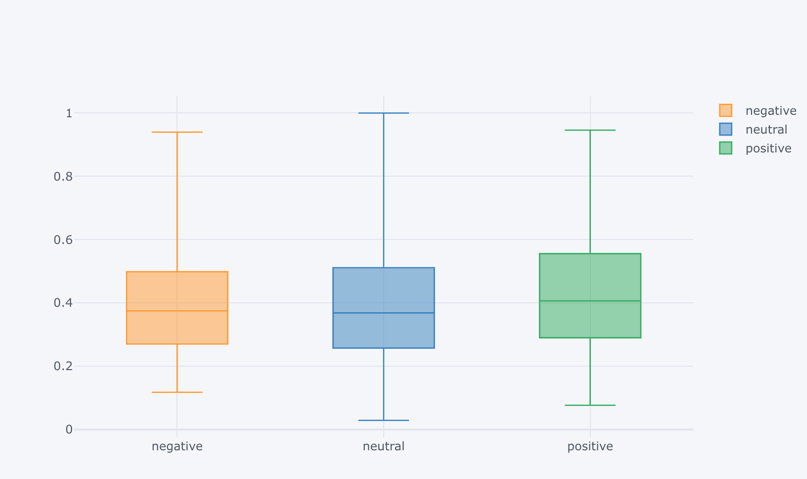
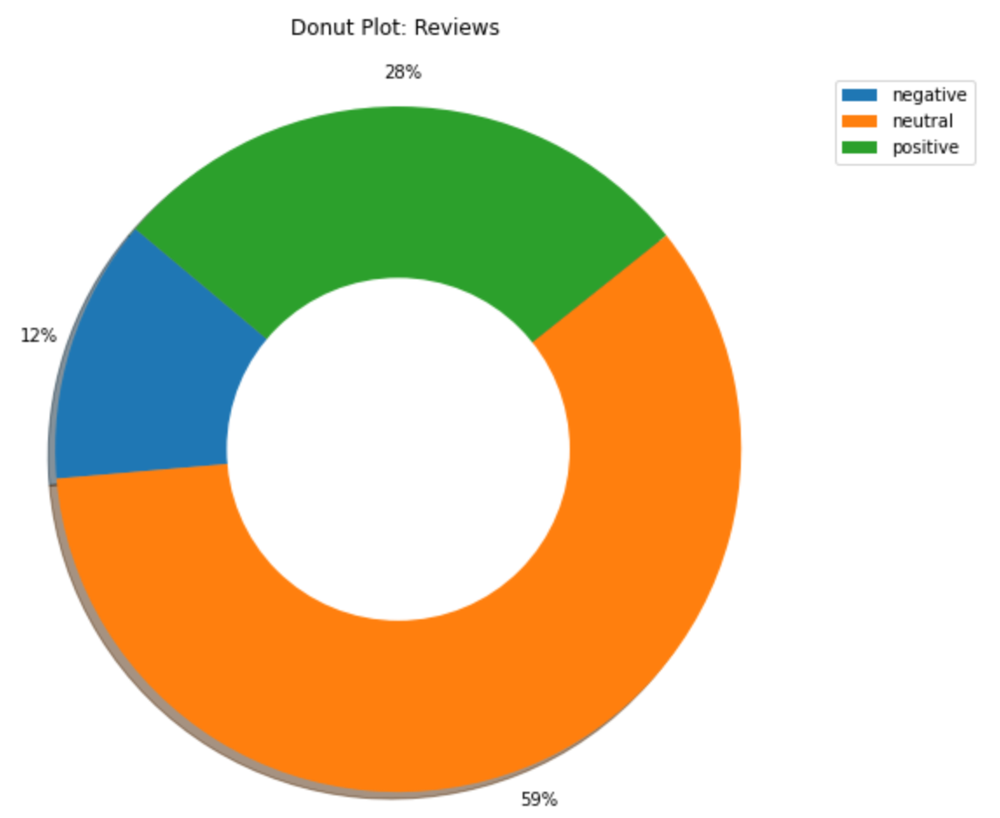
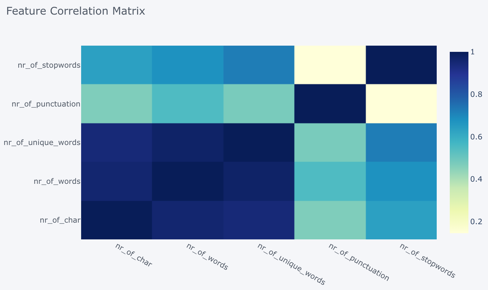
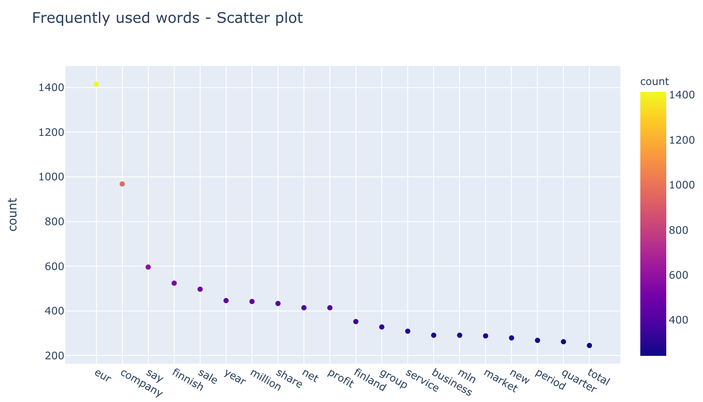
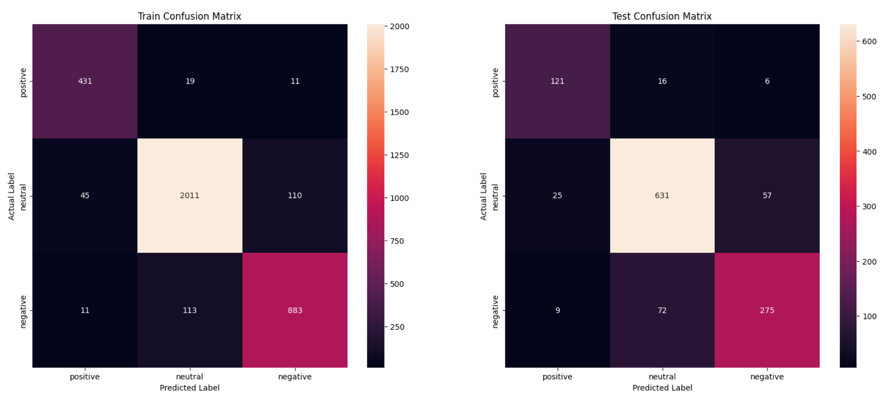
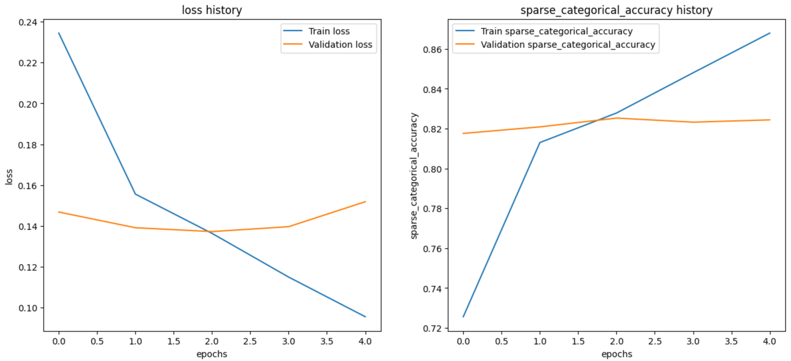

# 微调Gemma-7B，提升金融新闻标题情感分析的精准度

发布时间：2024年06月19日

`LLM应用

这篇论文主要探讨了如何利用情感分析技术解读金融新闻标题中的投资者情绪，并借助NLP和大型语言模型（LLM）的力量，特别关注了零售投资者的情绪反应。通过微调多个模型并进行有效性评估，研究展示了高级LLMs在金融信息分析中的应用潜力。因此，这篇论文应归类于LLM应用。` `情感分析`

> Fine-Tuning Gemma-7B for Enhanced Sentiment Analysis of Financial News Headlines

# 摘要

> 本研究深入探讨了如何利用情感分析技术解读金融新闻标题中的投资者情绪。借助NLP和LLM的力量，我们特别关注了零售投资者的情绪反应。基于包含分类情感的FinancialPhraseBank数据集，我们微调了distilbert-base-uncased、Llama和gemma-7b等多个模型，并进行了有效性评估。实验结果显示，经过微调的gemma-7b模型在精确度、召回率和F1分数上均领先，尤其在捕捉金融情感的微妙变化上表现出色。这一发现不仅增强了我们对市场动态的理解，也为风险管理和投资决策提供了有力支持。研究结果强调了高级LLMs在金融信息分析中的巨大潜力，为业界人士提供了一项强大的分析工具。

> In this study, we explore the application of sentiment analysis on financial news headlines to understand investor sentiment. By leveraging Natural Language Processing (NLP) and Large Language Models (LLM), we analyze sentiment from the perspective of retail investors. The FinancialPhraseBank dataset, which contains categorized sentiments of financial news headlines, serves as the basis for our analysis. We fine-tuned several models, including distilbert-base-uncased, Llama, and gemma-7b, to evaluate their effectiveness in sentiment classification. Our experiments demonstrate that the fine-tuned gemma-7b model outperforms others, achieving the highest precision, recall, and F1 score. Specifically, the gemma-7b model showed significant improvements in accuracy after fine-tuning, indicating its robustness in capturing the nuances of financial sentiment. This model can be instrumental in providing market insights, risk management, and aiding investment decisions by accurately predicting the sentiment of financial news. The results highlight the potential of advanced LLMs in transforming how we analyze and interpret financial information, offering a powerful tool for stakeholders in the financial industry.

[Arxiv](https://arxiv.org/abs/2406.13626)