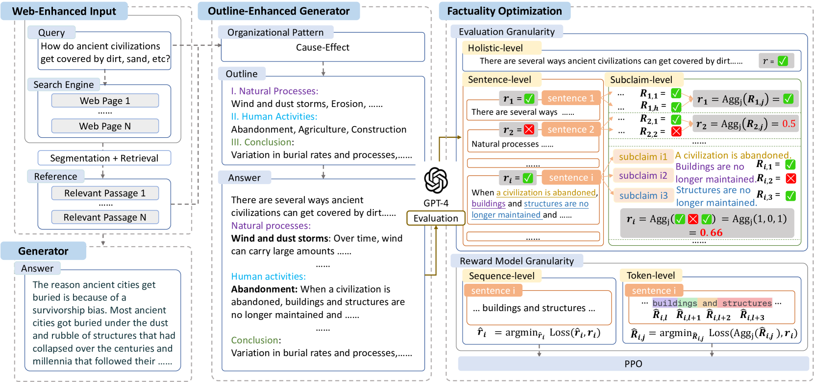
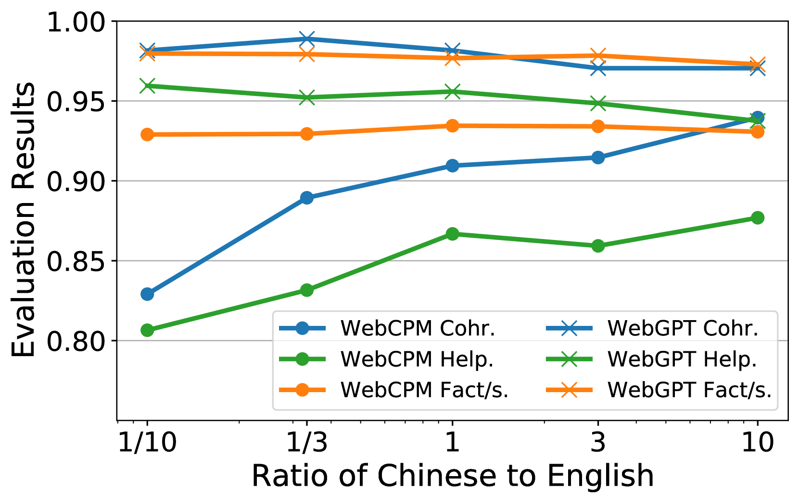

# FoRAG：优化事实性的检索增强生成技术，专为网络增强的长篇问答设计

发布时间：2024年06月19日

`RAG

这篇论文主要关注检索增强生成（RAG）技术在长格式问答（LFQA）中的应用，特别是在提高答案的事实性和逻辑清晰度方面。论文提出了一种新的提纲增强生成器和基于双重细粒度RLHF框架的事实性优化策略，并通过实验证明了这些方法的有效性。因此，这篇论文应归类于RAG，因为它专注于RAG技术的改进和应用。` `问答系统`

> FoRAG: Factuality-optimized Retrieval Augmented Generation for Web-enhanced Long-form Question Answering

# 摘要

> 检索增强生成（RAG）因其利用搜索引擎提升长格式问答（LFQA）质量的能力而在问答领域广受欢迎。尽管市面上已有多种开源工具和如Bing Chat这样的网络增强系统，但生成长格式答案时的事实性和逻辑清晰度问题仍未得到妥善解决。本文通过系统研究网络增强LFQA中的答案生成，针对性地解决了这些问题。我们首先创新性地提出了提纲增强生成器，确保多方面答案生成时的逻辑清晰，并为此建立了两个专门的数据集。接着，我们开发了一种基于双重细粒度RLHF框架的事实性优化策略，该框架在不同细节层次上进行自动评估和奖励建模。我们的方法不仅包含了传统的细粒度RLHF技术，还通过大量实验证明了其在中英文基准上的优越性。特别地，当我们的方法应用于Llama2-7B-chat时，生成的FoRAG-L-7B模型在连贯性、有用性和事实性三个关键指标上超越了庞大的WebGPT-175B，而其参数数量仅为后者的1/24。我们已将相关数据集和模型公开，以促进研究的可复现性：https://huggingface.co/forag。

> Retrieval Augmented Generation (RAG) has become prevalent in question-answering (QA) tasks due to its ability of utilizing search engine to enhance the quality of long-form question-answering (LFQA). Despite the emergence of various open source methods and web-enhanced commercial systems such as Bing Chat, two critical problems remain unsolved, i.e., the lack of factuality and clear logic in the generated long-form answers. In this paper, we remedy these issues via a systematic study on answer generation in web-enhanced LFQA. Specifically, we first propose a novel outline-enhanced generator to achieve clear logic in the generation of multifaceted answers and construct two datasets accordingly. Then we propose a factuality optimization method based on a carefully designed doubly fine-grained RLHF framework, which contains automatic evaluation and reward modeling in different levels of granularity. Our generic framework comprises conventional fine-grained RLHF methods as special cases. Extensive experiments verify the superiority of our proposed \textit{Factuality-optimized RAG (FoRAG)} method on both English and Chinese benchmarks. In particular, when applying our method to Llama2-7B-chat, the derived model FoRAG-L-7B outperforms WebGPT-175B in terms of three commonly used metrics (i.e., coherence, helpfulness, and factuality), while the number of parameters is much smaller (only 1/24 of that of WebGPT-175B). Our datasets and models are made publicly available for better reproducibility: https://huggingface.co/forag.

[Arxiv](https://arxiv.org/abs/2406.13779)