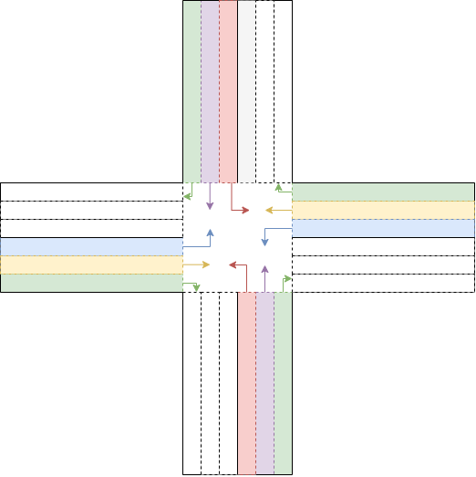

# 从单一控制到多代理协作：提升交通信号系统的智能调控

发布时间：2024年06月19日

`Agent

理由：这篇论文主要关注的是通过增加代理数量来优化信号控制问题，以缩短平均旅行时间。这里的“代理”指的是在系统中执行任务的实体，它们可能是软件程序或算法，用于模拟或辅助决策过程。论文通过实验验证了引入多个代理在特定情况下的有效性，这与Agent分类下的研究内容相符，即研究如何设计和使用代理来解决特定问题。虽然论文中提到了大型语言模型（LLM），但这里的重点是代理的应用，而不是LLM的理论或应用。因此，将其归类为Agent更为合适。` `交通控制` `城市规划`

> From Single Agent to Multi-Agent: Improving Traffic Signal Control

# 摘要

> 随着城市化的快速发展，信号控制问题的解决变得愈发重要。本文探讨了多种现有解决方案，并提出通过增加代理数量来缩短平均旅行时间的策略。通过两个数据集的实验验证，我们发现，在特定情况下，引入多个代理能够优化现有方法。对于经过精细调整的大型语言模型，其在各项性能指标上均有所提升。

> Due to accelerating urbanization, the importance of solving the signal control problem increases. This paper analyzes various existing methods and suggests options for increasing the number of agents to reduce the average travel time. Experiments were carried out with 2 datasets. The results show that in some cases, the implementation of multiple agents can improve existing methods. For a fine-tuned large language model approach there is small enhancement on all metrics.

[Arxiv](https://arxiv.org/abs/2406.13693)