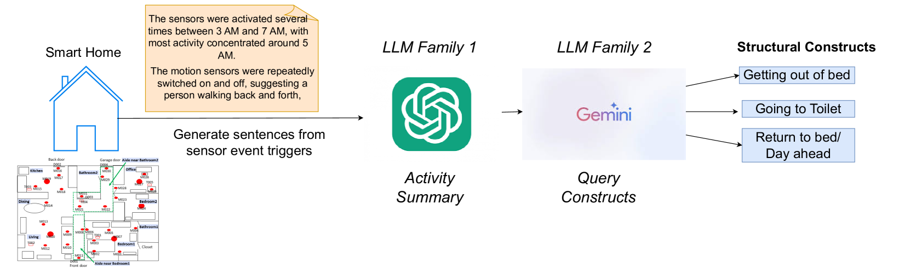
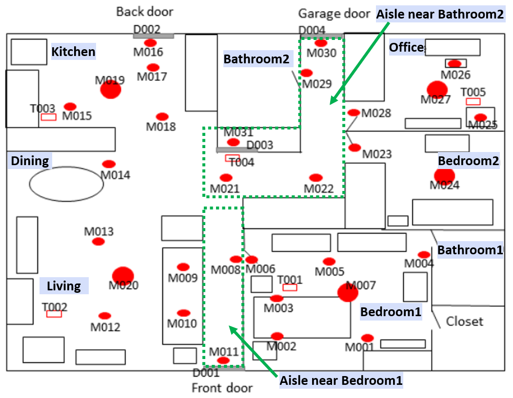
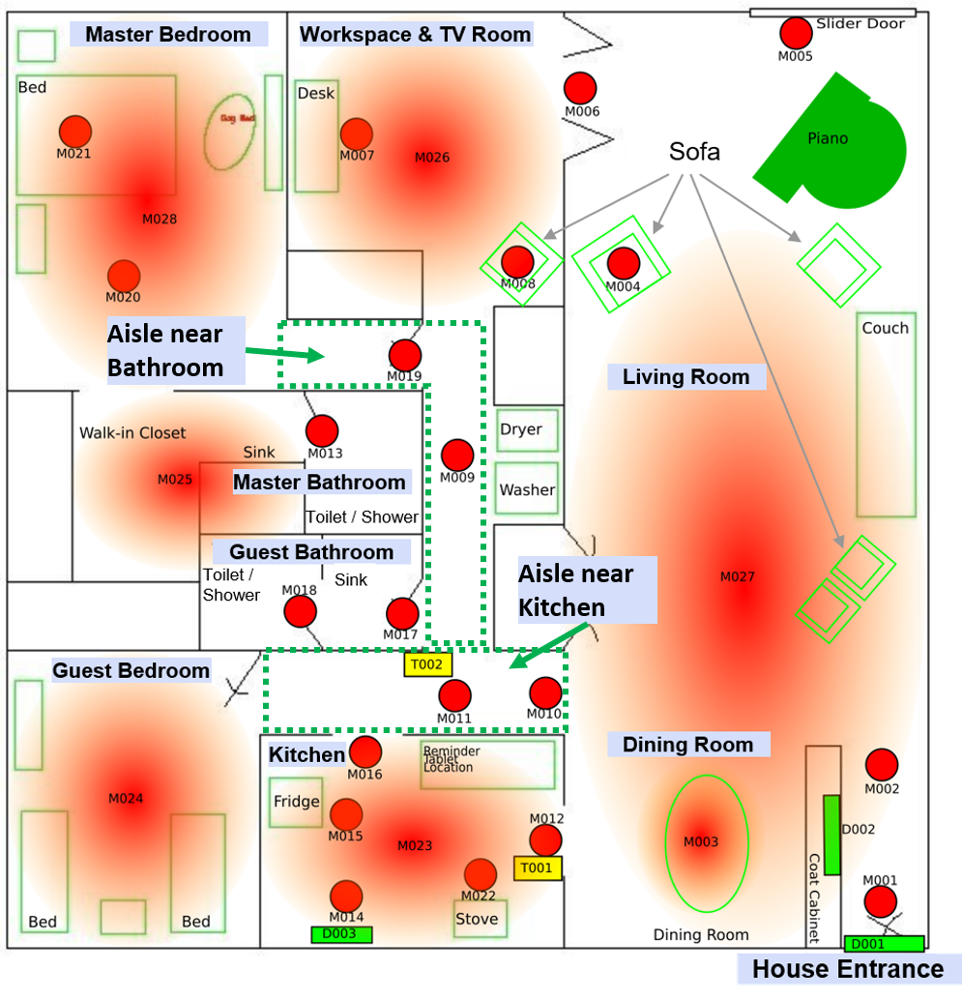

# 大型语言模型探秘：揭示活动中结构构造的奥秘

发布时间：2024年06月19日

`Agent

理由：该论文摘要描述了一种利用大型语言模型（LLM）来识别和模拟人类活动的基本结构单元的方法，这些单元用于构建活动模型，以提高智能家居中的活动监控效率。这种方法涉及到创建一个能够理解和模拟人类活动的智能系统，因此可以被归类为Agent，即一个能够执行特定任务或模拟特定行为的智能实体。这与RAG（检索增强生成）、LLM应用（特定应用场景下的LLM使用）或LLM理论（LLM的理论研究）的分类不符，因为它的重点在于创建一个能够响应和适应环境的智能系统，而不是在特定应用场景下使用LLM，也不是对LLM的理论研究。` `智能家居` `活动识别`

> Game of LLMs: Discovering Structural Constructs in Activities using Large Language Models

# 摘要

> 人类活动识别，这一时间序列分析问题，传统上依赖于一个理想化的窗口长度来构建识别系统。但在智能家居的多样场景中，活动的时长与频率千差万别，固定的窗口假设已不再适用。过往研究揭示，这些活动实则由一系列基本单元构成。我们的研究聚焦于利用大型语言模型，精准捕捉这些活动的基本结构单元。这一探索对于识别那些短暂且不常见的活动尤为关键。基于此，我们提出了一种新的活动识别方法，它通过模拟这些基本单元来构建活动模型，从而为智能家居中的活动监控提供了更有效的解决方案。

> Human Activity Recognition is a time-series analysis problem. A popular analysis procedure used by the community assumes an optimal window length to design recognition pipelines. However, in the scenario of smart homes, where activities are of varying duration and frequency, the assumption of a constant sized window does not hold. Additionally, previous works have shown these activities to be made up of building blocks. We focus on identifying these underlying building blocks--structural constructs, with the use of large language models. Identifying these constructs can be beneficial especially in recognizing short-duration and infrequent activities. We also propose the development of an activity recognition procedure that uses these building blocks to model activities, thus helping the downstream task of activity monitoring in smart homes.

[Arxiv](https://arxiv.org/abs/2406.13777)