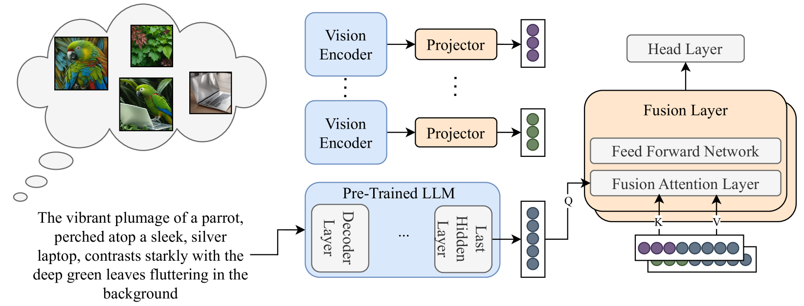
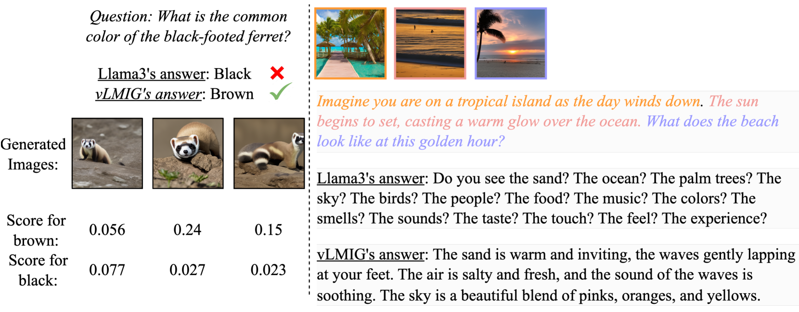
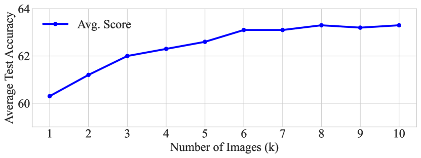

# 借助多图像生成，提升语言模型中的视觉常识理解

发布时间：2024年06月19日

`LLM应用

这篇论文探讨了如何将视觉信息融入大型语言模型（LLMs）中，以增强其在常识推理等任务中的表现。通过提出一种方法，即根据文本提示生成图像并将这些图像的预测概率混合到模型决策中，作者们旨在结合视觉理解和文本基础的语言推理。这种方法涉及后期融合层的使用，将视觉特征与预训练的LLM输出结合，以支持更全面的图像-文本知识或仅文本的预测。论文的结果显示，这种方法不仅在视觉常识推理上取得了进步，也在传统的NLP任务上实现了性能提升。因此，这篇论文属于LLM应用类别，因为它专注于改进和应用LLMs的具体技术，以解决实际问题。` `计算机视觉`

> Improving Visual Commonsense in Language Models via Multiple Image Generation

# 摘要

> 常识推理依赖于多模态知识，但现有大型语言模型（LLMs）主要依赖文本数据，难以融入视觉信息。相反，擅长视觉任务的视觉语言模型在非视觉任务如常识推理上表现不佳。这揭示了一个关键挑战：如何将强大的视觉理解与文本基础的语言推理相结合。为此，我们提出了一种方法，通过根据文本提示生成多张图像，并将这些图像的预测概率混合到模型决策中，来增强LLMs的视觉常识能力。我们采用了一个后期融合层，将视觉特征与仅基于文本的预训练LLM输出结合，以支持基于全面图像-文本知识或仅文本的预测。通过结合视觉常识推理和传统NLP任务（如常识推理和阅读理解），我们的方法显著超越了现有基准。在最新的顶级LLMs（如Llama3）上应用时，我们不仅在视觉常识上取得了进步，也在传统NLP基准上实现了提升。相关代码和模型已公开在https://github.com/guyyariv/vLMIG。

> Commonsense reasoning is fundamentally based on multimodal knowledge. However, existing large language models (LLMs) are primarily trained using textual data only, limiting their ability to incorporate essential visual information. In contrast, Visual Language Models, which excel at visually-oriented tasks, often fail at non-visual tasks such as basic commonsense reasoning. This divergence highlights a critical challenge - the integration of robust visual understanding with foundational text-based language reasoning. To this end, we introduce a method aimed at enhancing LLMs' visual commonsense. Specifically, our method generates multiple images based on the input text prompt and integrates these into the model's decision-making process by mixing their prediction probabilities. To facilitate multimodal grounded language modeling, we employ a late-fusion layer that combines the projected visual features with the output of a pre-trained LLM conditioned on text only. This late-fusion layer enables predictions based on comprehensive image-text knowledge as well as text only when this is required. We evaluate our approach using several visual commonsense reasoning tasks together with traditional NLP tasks, including common sense reasoning and reading comprehension. Our experimental results demonstrate significant superiority over existing baselines. When applied to recent state-of-the-art LLMs (e.g., Llama3), we observe improvements not only in visual common sense but also in traditional NLP benchmarks. Code and models are available under https://github.com/guyyariv/vLMIG.

[Arxiv](https://arxiv.org/abs/2406.13621)