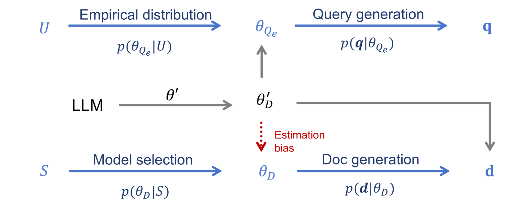

# 利用风险最小化策略优化零-shot LLM 重排序器的性能

发布时间：2024年06月19日

`RAG

理由：这篇论文主要讨论了在RAG（Retrieval-Augmented Generation）系统中使用大型语言模型（LLMs）作为无监督的查询似然模型（QLMs）时存在的问题，并提出了一个新的框架$\mathrm{UR^3}$来解决这些问题。这个框架旨在减少LLMs模拟QLMs时的固有偏差，并通过贝叶斯决策理论来优化查询和文档生成概率。因此，这篇论文的内容与RAG系统的改进和优化直接相关，属于RAG分类。` `问答系统` `信息检索`

> Improving Zero-shot LLM Re-Ranker with Risk Minimization

# 摘要

> 在RAG系统中，大型语言模型（LLMs）作为无监督的查询似然模型（QLMs），根据文档内容生成查询的概率对文档进行重新排序。但直接让LLMs模拟QLMs存在固有偏差，可能导致估计分布与实际文档分布不符。为此，我们提出了一个名为$\mathrm{UR^3}$的新框架，它运用贝叶斯决策理论来评估并减少这种偏差。$\mathrm{UR^3}$ 通过最大化文档生成概率，统一了查询和文档生成概率的优化目标。实证显示，$\mathrm{UR^3}$ 在提升Top-1准确性方面效果显著，尤其在问答任务中，它能以更少的文档输入达到更高的准确率。

> In the Retrieval-Augmented Generation (RAG) system, advanced Large Language Models (LLMs) have emerged as effective Query Likelihood Models (QLMs) in an unsupervised way, which re-rank documents based on the probability of generating the query given the content of a document. However, directly prompting LLMs to approximate QLMs inherently is biased, where the estimated distribution might diverge from the actual document-specific distribution. In this study, we introduce a novel framework, $\mathrm{UR^3}$, which leverages Bayesian decision theory to both quantify and mitigate this estimation bias. Specifically, $\mathrm{UR^3}$ reformulates the problem as maximizing the probability of document generation, thereby harmonizing the optimization of query and document generation probabilities under a unified risk minimization objective. Our empirical results indicate that $\mathrm{UR^3}$ significantly enhances re-ranking, particularly in improving the Top-1 accuracy. It benefits the QA tasks by achieving higher accuracy with fewer input documents.

[Arxiv](https://arxiv.org/abs/2406.13331)