# 快速压缩上下文：大型语言模型的闪电加速器

发布时间：2024年06月19日

`LLM应用

理由：这篇论文主要关注的是如何通过创新的In-Context Former（IC-Former）方法来降低大型语言模型（LLMs）的推理成本，特别是在处理速度和计算量方面的优化。这种方法的提出和实验结果表明，它能够显著提高处理速度并减少计算量，这对于实际应用中的成本降低具有重要意义。因此，这篇论文属于LLM应用类别，因为它专注于LLM的实际应用和优化，而不是理论研究或Agent、RAG相关的研究。` `机器学习`

> In-Context Former: Lightning-fast Compressing Context for Large Language Model

# 摘要

> 随着Transformer架构的大型语言模型（LLMs）的普及，如何降低其推理成本成为研究热点。现有方法多依赖LLM的自注意力机制进行上下文压缩，虽有效但时间复杂度高。为此，我们创新性地提出了In-Context Former（IC-Former），它通过交叉注意力机制和少量摘要令牌，独立于目标LLMs进行信息提炼，大幅减少推理时间，实现线性时间复杂度。实验显示，IC-Former在保持90%以上基准性能的同时，处理速度提升68至112倍，计算量仅为基准的1/32。这一突破使得实时压缩成为现实，显著降低了成本。

> With the rising popularity of Transformer-based large language models (LLMs), reducing their high inference costs has become a significant research focus. One effective approach is to compress the long input contexts. Existing methods typically leverage the self-attention mechanism of the LLM itself for context compression. While these methods have achieved notable results, the compression process still involves quadratic time complexity, which limits their applicability. To mitigate this limitation, we propose the In-Context Former (IC-Former). Unlike previous methods, IC-Former does not depend on the target LLMs. Instead, it leverages the cross-attention mechanism and a small number of learnable digest tokens to directly condense information from the contextual word embeddings. This approach significantly reduces inference time, which achieves linear growth in time complexity within the compression range. Experimental results indicate that our method requires only 1/32 of the floating-point operations of the baseline during compression and improves processing speed by 68 to 112 times while achieving over 90% of the baseline performance on evaluation metrics. Overall, our model effectively reduces compression costs and makes real-time compression scenarios feasible.

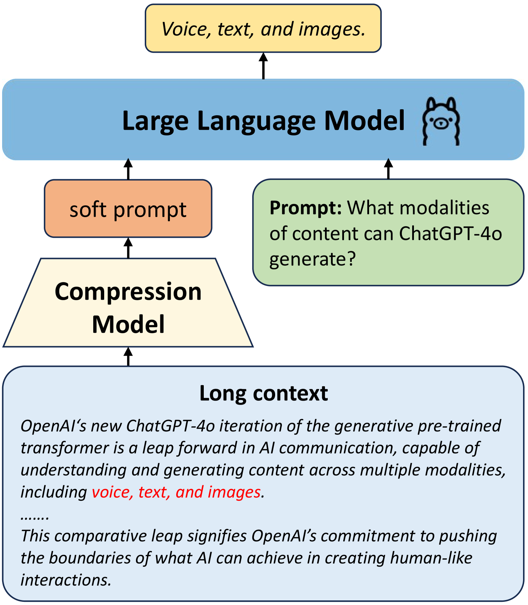

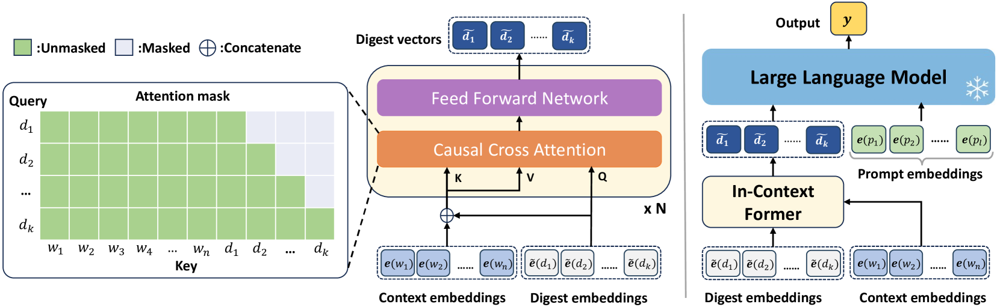

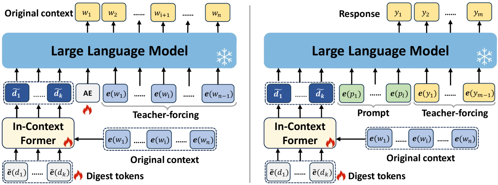

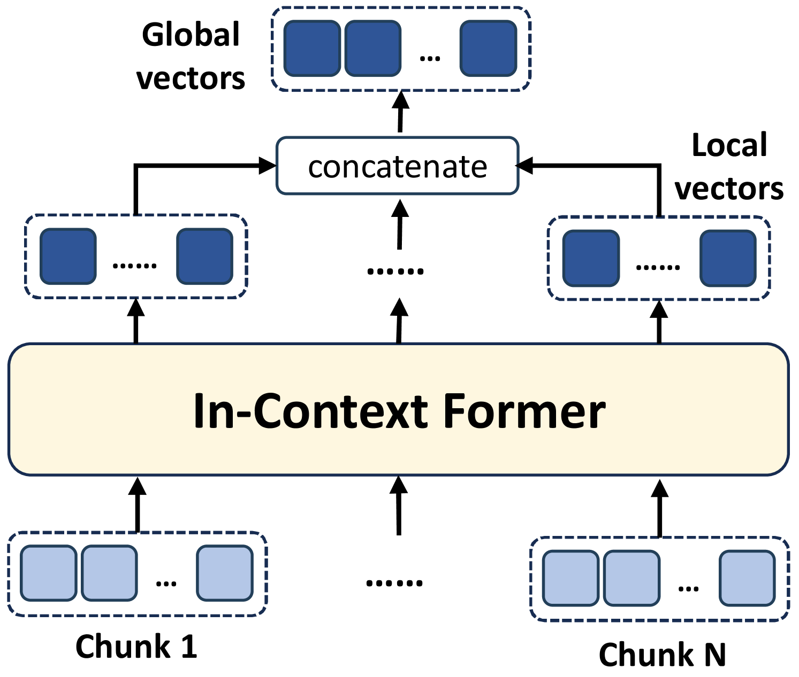

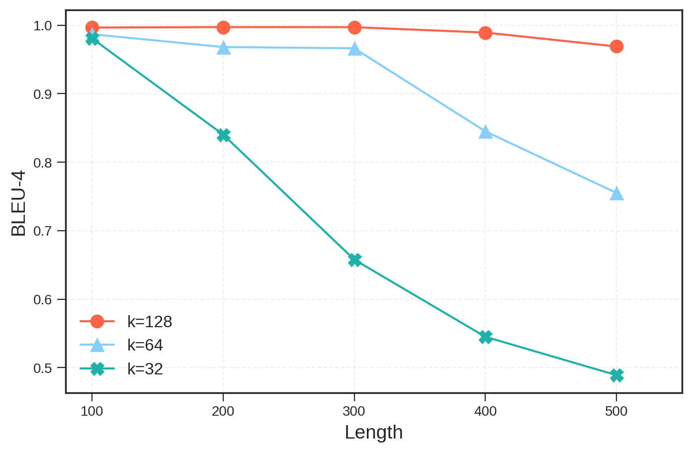

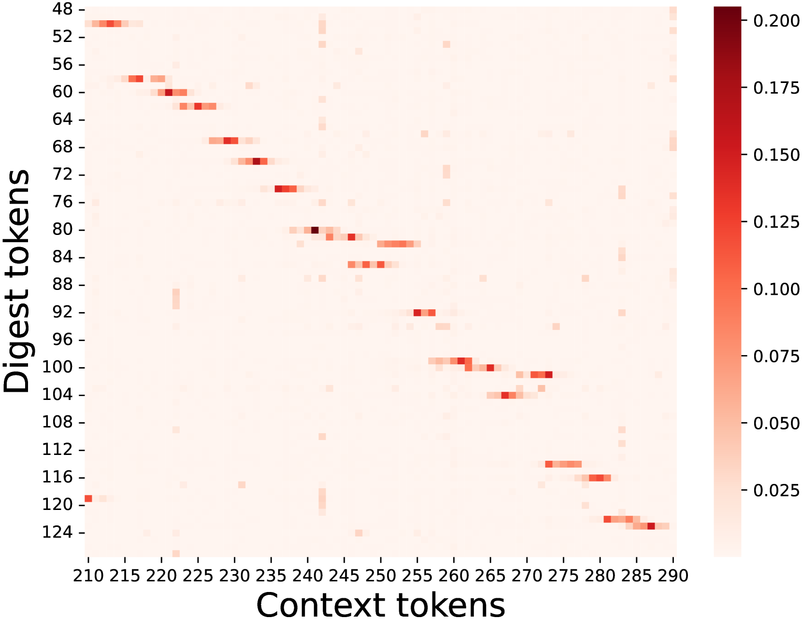

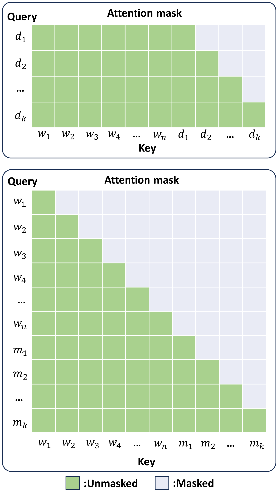

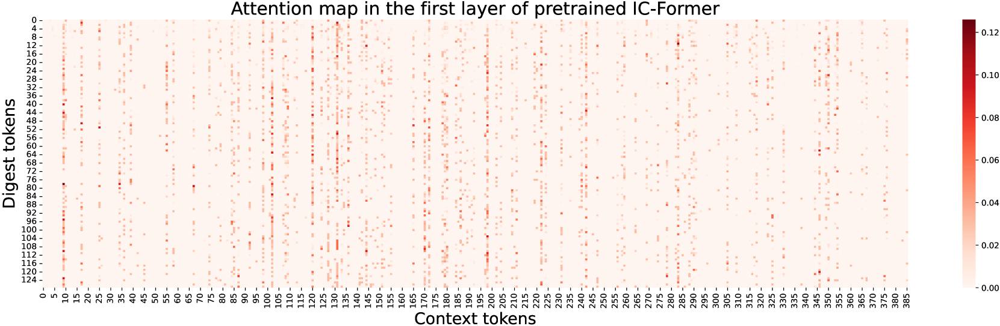

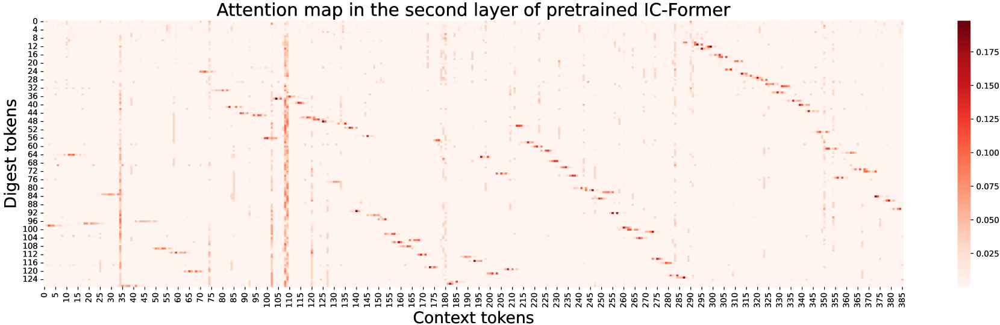

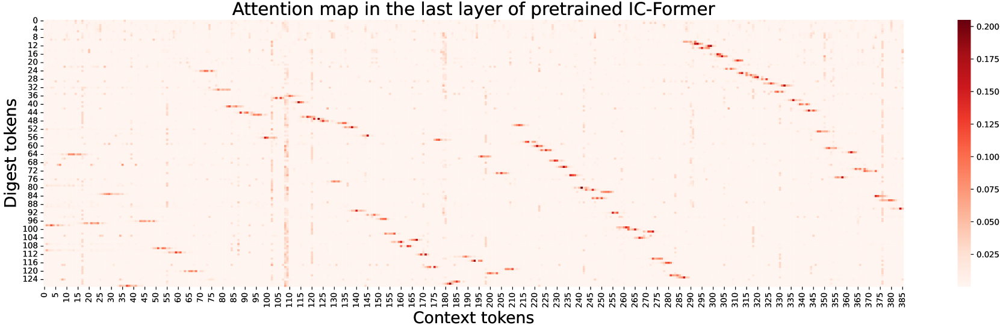

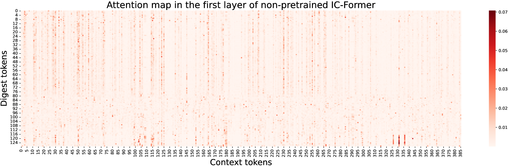

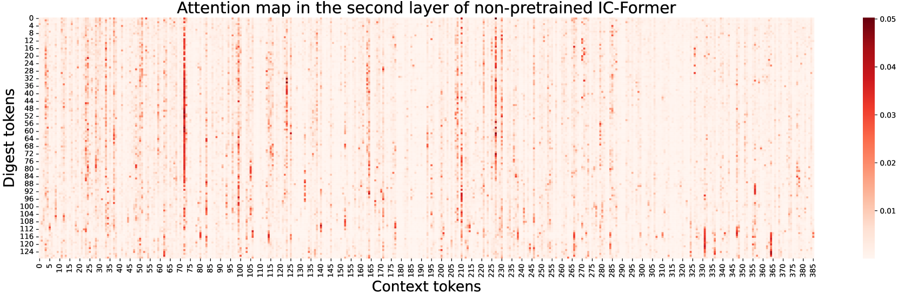

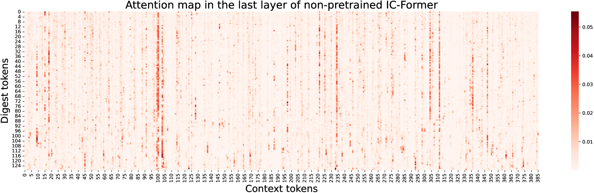

[Arxiv](https://arxiv.org/abs/2406.13618)