# InstructRAG：借助显式去噪技术，指导检索增强生成过程

发布时间：2024年06月19日

`RAG

理由：这篇论文主要讨论了检索增强生成（RAG）模型中的问题，并提出了一种新的方法（InstructRAG）来改进模型的准确性和事实性，通过让模型自我解释其决策过程来实现去噪。这种方法直接关联到RAG模型的改进和优化，因此属于RAG分类。` `知识密集型任务`

> InstructRAG: Instructing Retrieval-Augmented Generation with Explicit Denoising

# 摘要

> 检索增强生成（RAG）展现出提升语言模型准确性和事实性的潜力，但检索器的不完善或数据集的噪声可能引入误导性信息，影响生成质量。现有方法虽能直接预测答案，但去噪过程难以解释和验证。为此，我们提出InstructRAG，通过让模型自我解释如何从检索文档中得出正确答案，实现显式去噪学习。这种方法无需额外监督，简化了验证过程，并显著提升了生成准确性。实验证明，InstructRAG在多个知识密集型任务中超越了现有方法，平均提升了8.3%。此外，它展现出良好的扩展性和强大的泛化能力，即使在域外数据集上也能有效去噪。

> Retrieval-augmented generation (RAG) has shown promising potential to enhance the accuracy and factuality of language models (LMs). However, imperfect retrievers or noisy corpora can introduce misleading or even erroneous information to the retrieved contents, posing a significant challenge to the generation quality. Existing RAG methods typically address this challenge by directly predicting final answers despite potentially noisy inputs, resulting in an implicit denoising process that is difficult to interpret and verify. On the other hand, the acquisition of explicit denoising supervision is often costly, involving significant human efforts. In this work, we propose InstructRAG, where LMs explicitly learn the denoising process through self-synthesized rationales -- First, we instruct the LM to explain how the ground-truth answer is derived from retrieved documents. Then, these rationales can be used either as demonstrations for in-context learning of explicit denoising or as supervised fine-tuning data to train the model. Compared to standard RAG approaches, InstructRAG requires no additional supervision, allows for easier verification of the predicted answers, and effectively improves generation accuracy. Experiments show InstructRAG consistently outperforms existing RAG methods in both training-free and trainable scenarios, achieving a relative improvement of 8.3% over the best baseline method on average across five knowledge-intensive benchmarks. Extensive analysis indicates that InstructRAG scales well with increased numbers of retrieved documents and consistently exhibits robust denoising ability even in out-of-domain datasets, demonstrating strong generalizability.

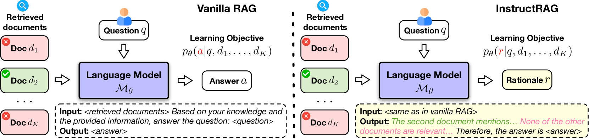

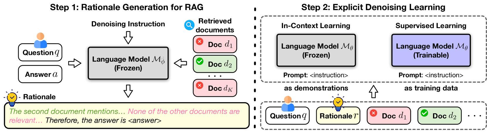

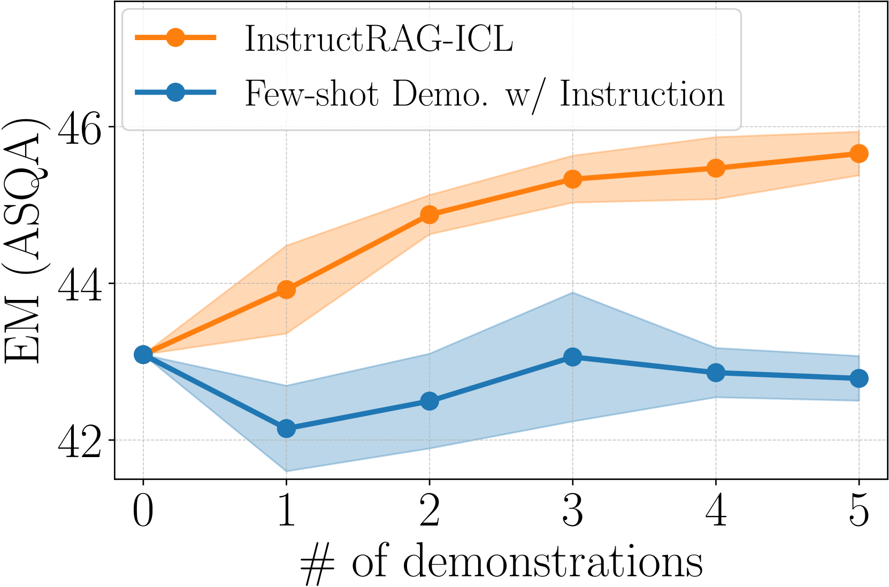

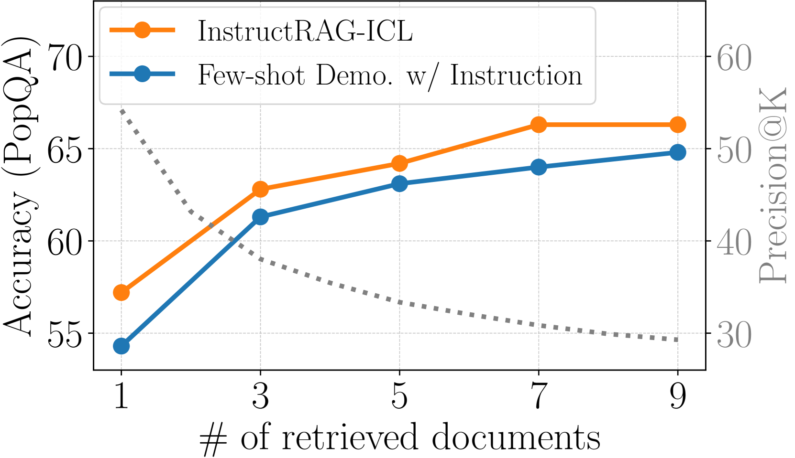

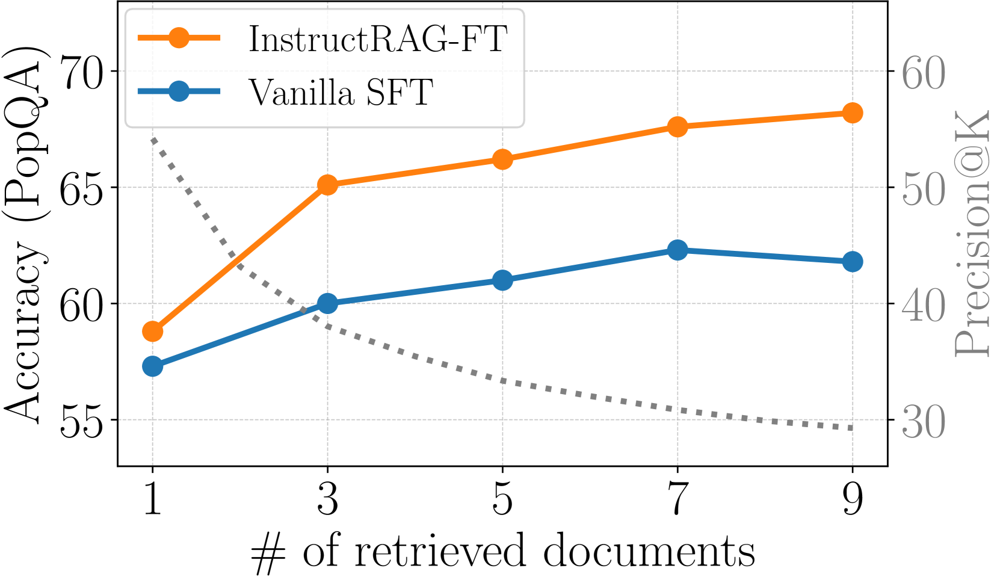

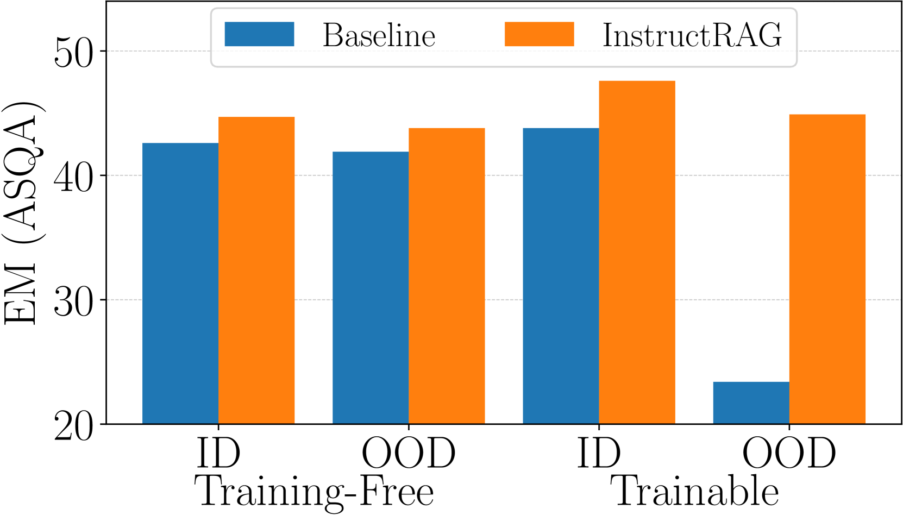

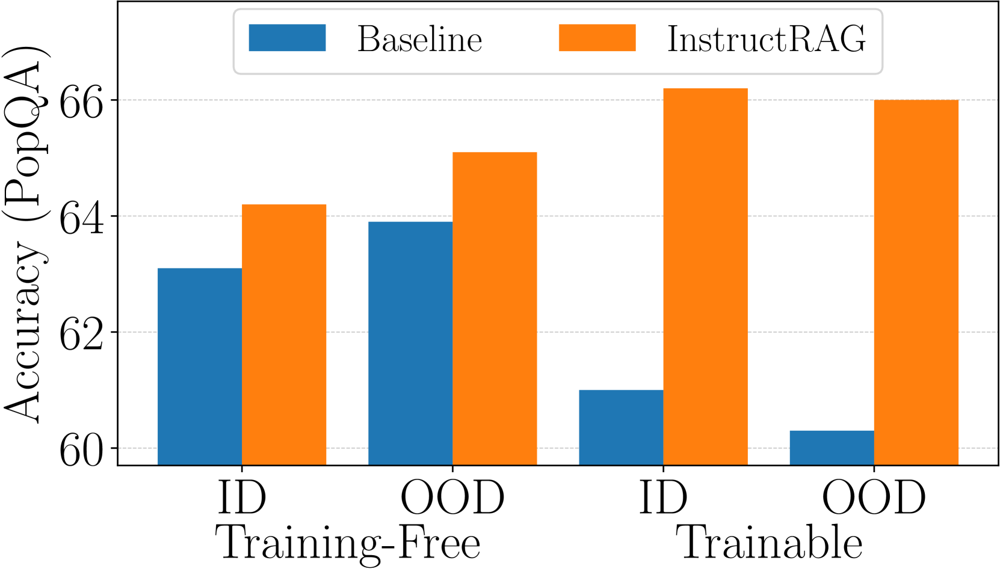

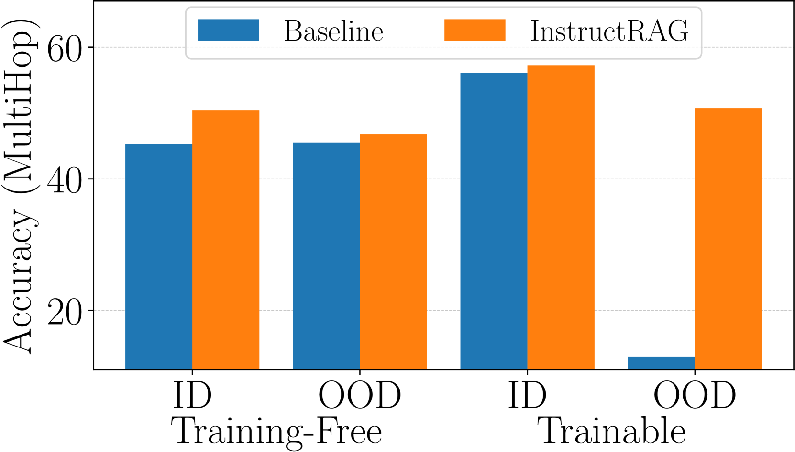

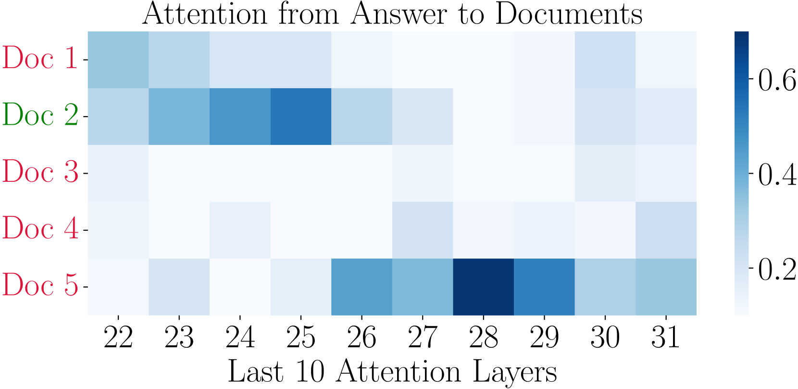

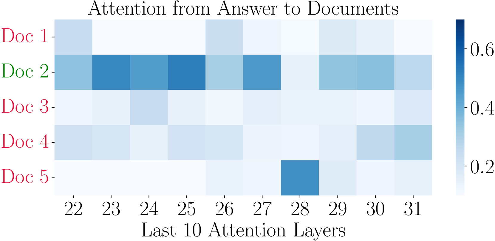

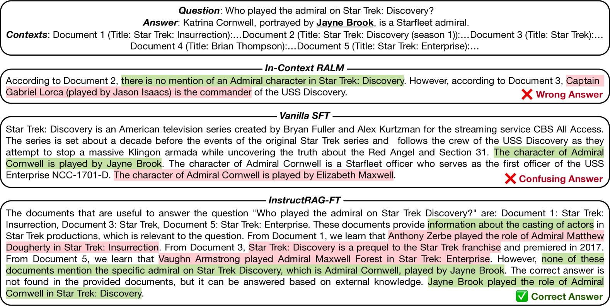

[Arxiv](https://arxiv.org/abs/2406.13629)