# AI 也能逗你笑？HumorDB：探索图形幽默的精选数据集与评测基准。

发布时间：2024年06月19日

`LLM应用

理由：这篇论文介绍了HumorDB数据集，该数据集旨在深化视觉幽默的理解，并通过结合大型语言模型的视觉语言模型来评估和提升对幽默的感知能力。这表明论文主要关注的是如何应用大型语言模型（LLM）来解决特定问题（即视觉幽默的理解），因此属于LLM应用类别。` `计算机视觉` `幽默研究`

> Is AI fun? HumorDB: a curated dataset and benchmark to investigate graphical humor

# 摘要

> 尽管计算机视觉技术日新月异，但解读复杂场景中的幽默依旧是一大难题。为此，我们推出了HumorDB，一个专为深化视觉幽默理解而精心打造的图像数据集。HumorDB收录了对比鲜明的幽默图像对，突出了引发笑点的微妙视觉元素，并力求减少偏见。通过二元分类、幽默程度评分及图像幽默度对比等任务，该数据集精准捕捉了幽默感知的多样性。初步实验表明，纯视觉模型难以应对，而结合大型语言模型的视觉语言模型则展现出潜力。HumorDB亦有望成为评估大型多模态模型零-shot能力的宝贵基准。我们依据CC BY 4.0许可，公开了数据集及代码。

> Despite significant advancements in computer vision, understanding complex scenes, particularly those involving humor, remains a substantial challenge. This paper introduces HumorDB, a novel image-only dataset specifically designed to advance visual humor understanding. HumorDB consists of meticulously curated image pairs with contrasting humor ratings, emphasizing subtle visual cues that trigger humor and mitigating potential biases. The dataset enables evaluation through binary classification(Funny or Not Funny), range regression(funniness on a scale from 1 to 10), and pairwise comparison tasks(Which Image is Funnier?), effectively capturing the subjective nature of humor perception. Initial experiments reveal that while vision-only models struggle, vision-language models, particularly those leveraging large language models, show promising results. HumorDB also shows potential as a valuable zero-shot benchmark for powerful large multimodal models. We open-source both the dataset and code under the CC BY 4.0 license.

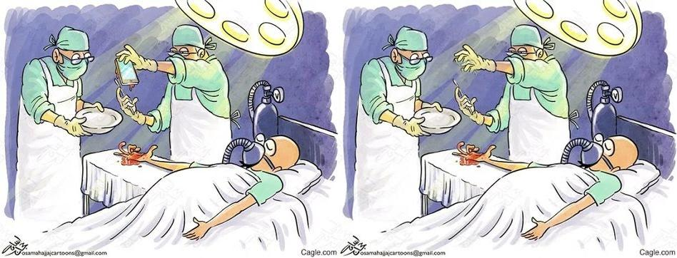

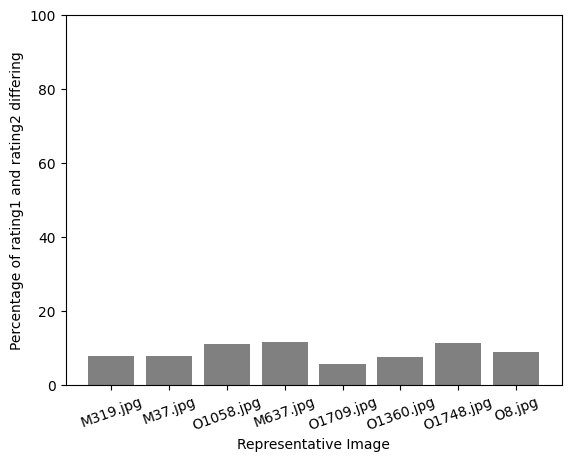

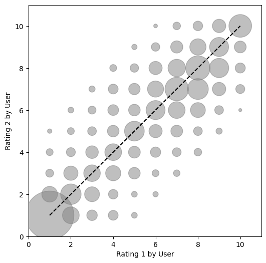

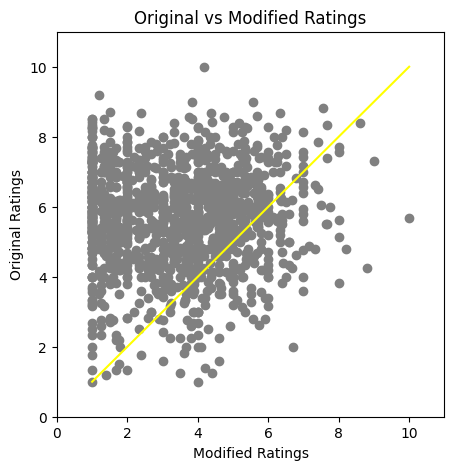

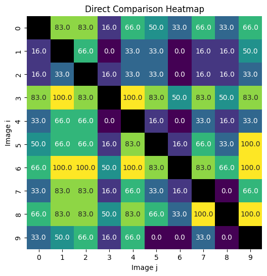

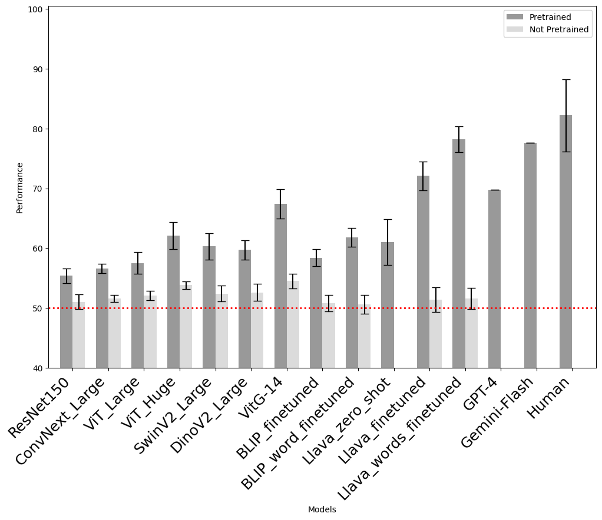

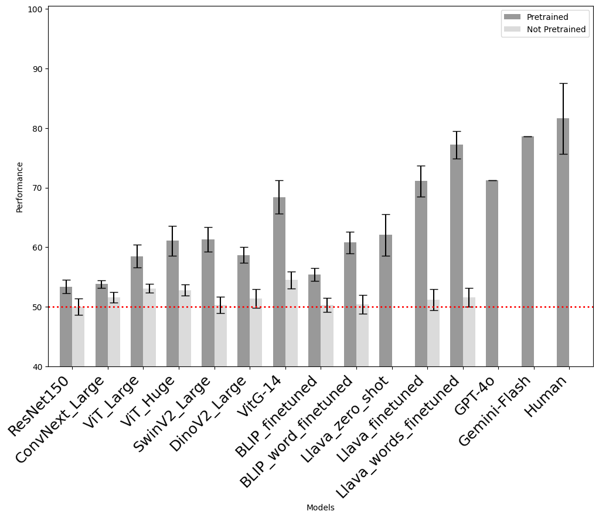

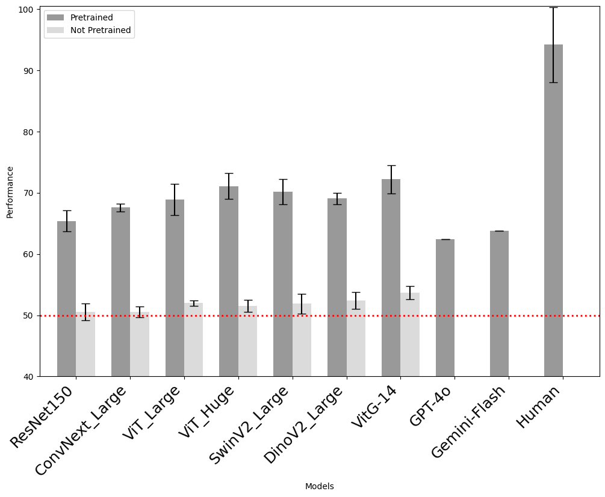

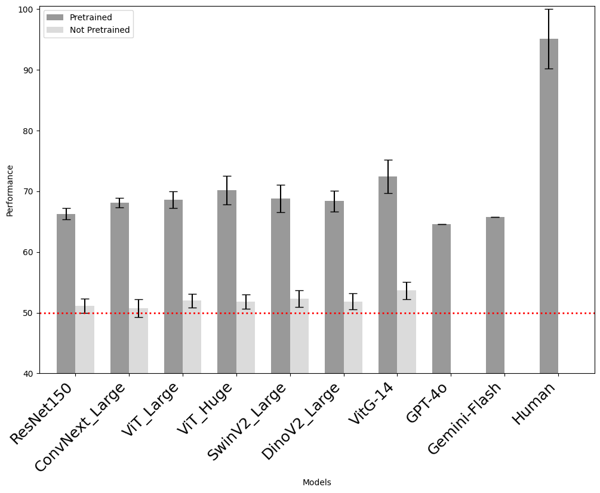

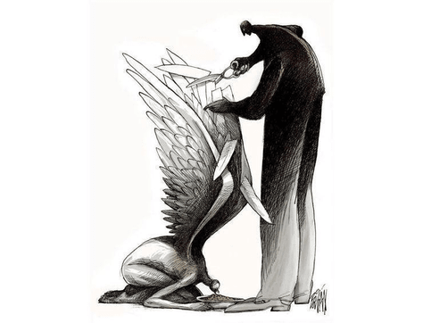

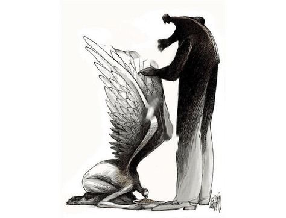

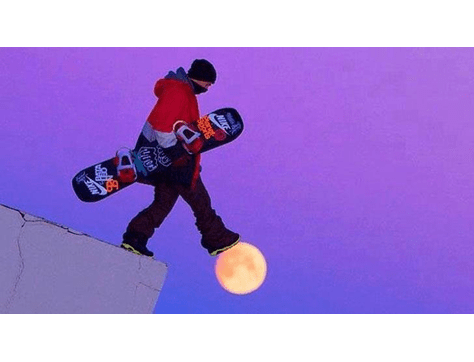

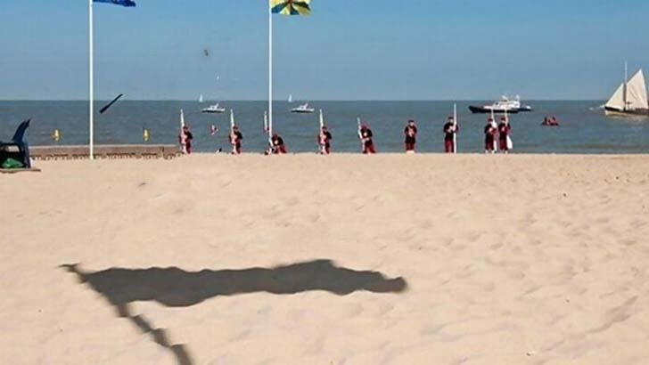

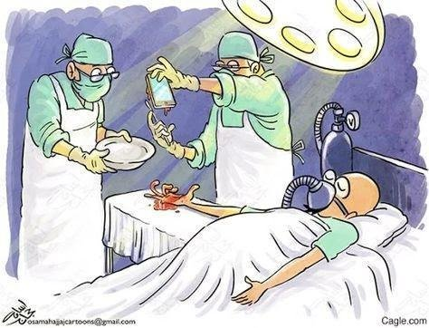

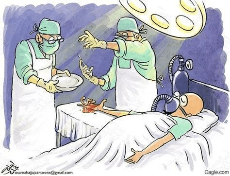

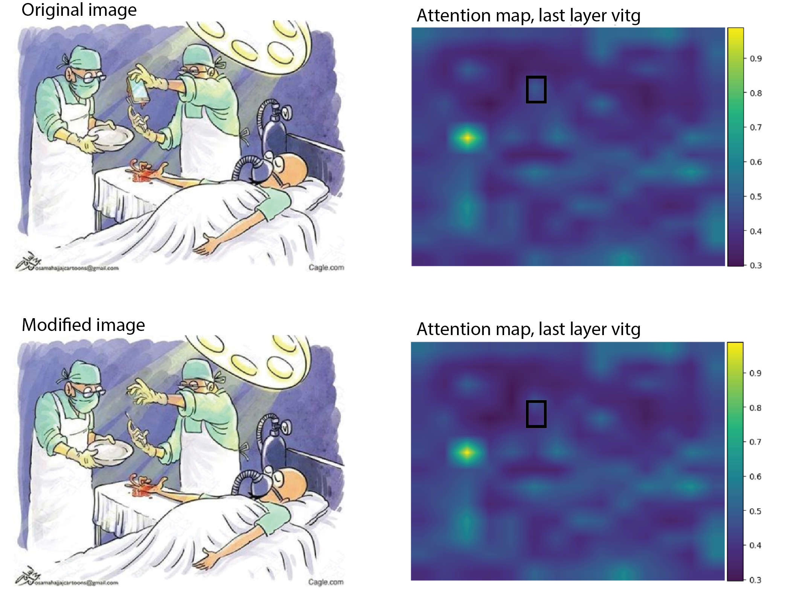

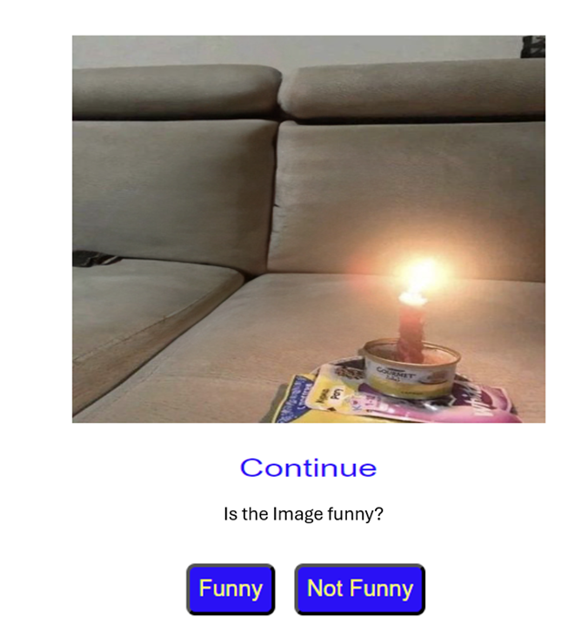

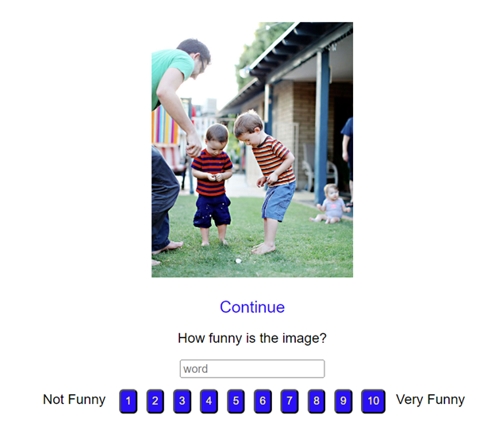

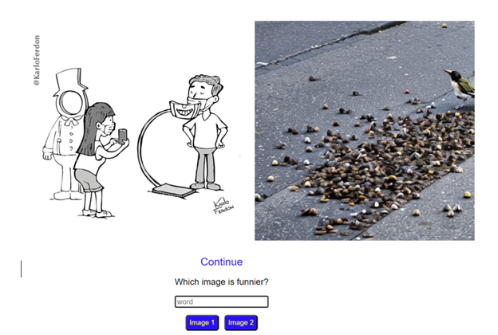

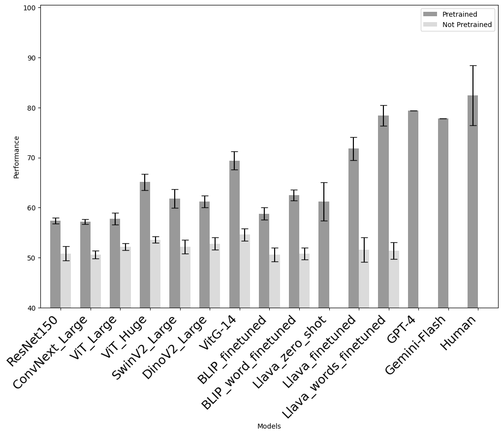

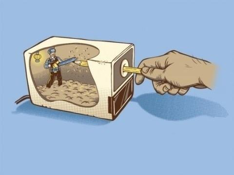

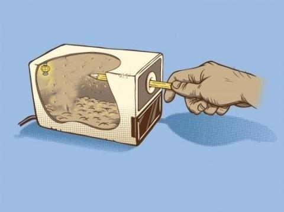

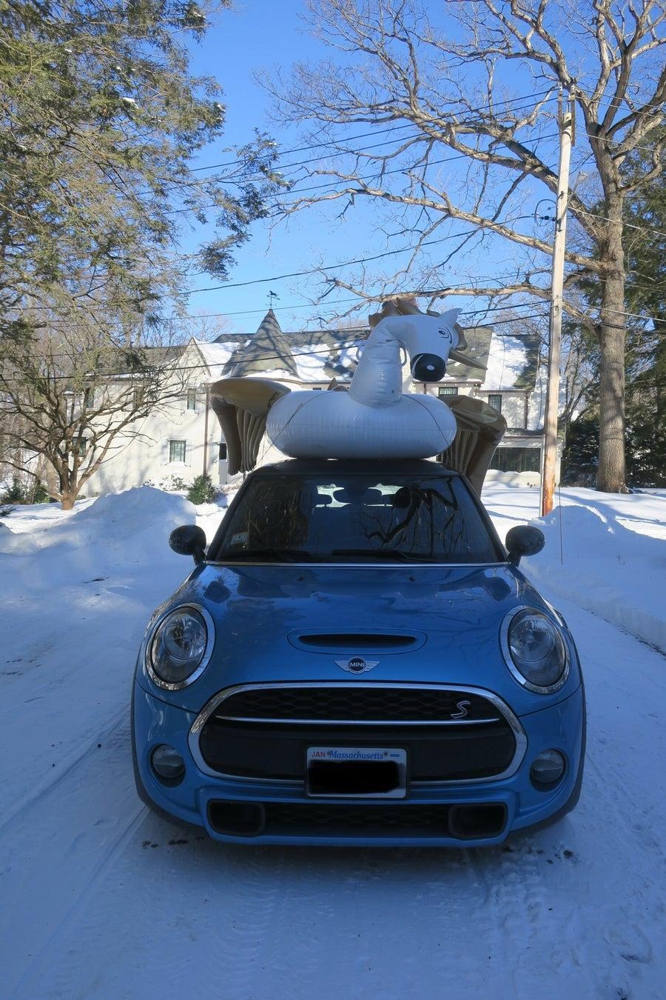

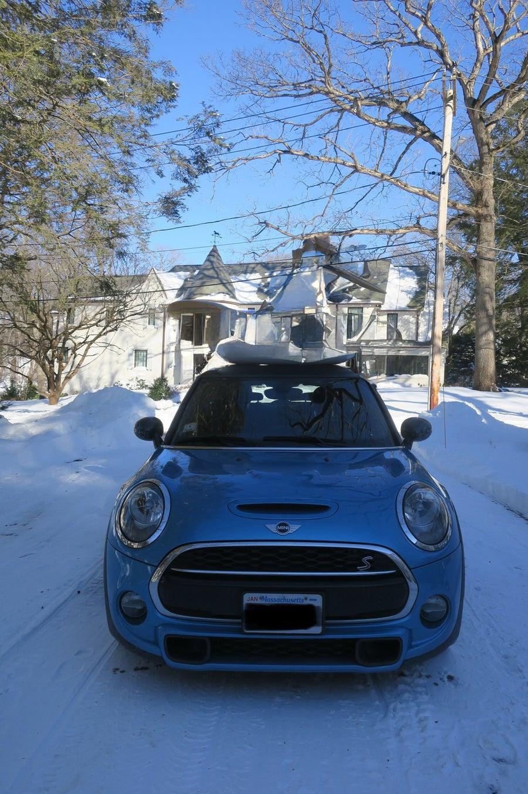

[Arxiv](https://arxiv.org/abs/2406.13564)