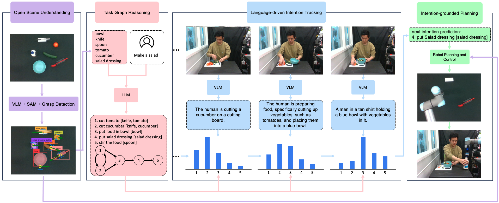
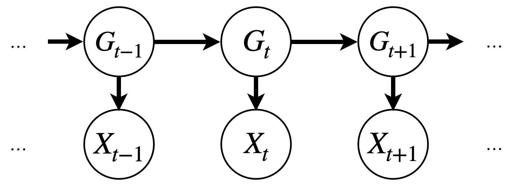
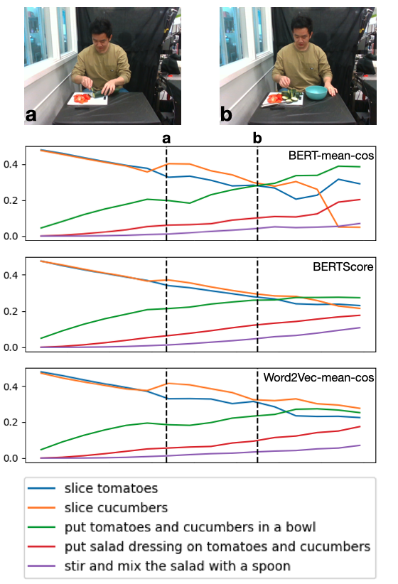

# 大型语言模型驱动的意图追踪技术：主动人机协作中的机器人副厨应用

发布时间：2024年06月19日

`Agent

这篇论文主要讨论了如何利用大型语言模型（LLM）和视觉语言模型（VLM）来增强机器人的自主性和协作能力，特别是在长期协作任务中预测人类用户的意图。这种方法通过语言驱动的意图跟踪（LIT）来实现，使得机器人能够更主动地参与协作，而不是仅仅依赖频繁的提示。因此，这篇论文更符合Agent分类，因为它关注的是如何构建和使用智能代理（在这里是机器人）来执行任务和与人类协作。` `机器人技术` `人机交互`

> LIT: Large Language Model Driven Intention Tracking for Proactive Human-Robot Collaboration -- A Robot Sous-Chef Application

# 摘要

> 大型语言模型与视觉语言模型的结合，赋予了机器人在开放世界中通过自然语言提示执行任务的能力。但在面对长期协作任务时，这种方法却导致了在任务的每一步都需要频繁地提示机器人动作的启动或澄清。为此，我们提出了语言驱动的意图跟踪（LIT），这一方法利用LLM和VLM来捕捉人类用户的长期行为模式，并预测其下一步意图，从而引导机器人进行主动协作。在协作烹饪任务的实践中，我们展示了基于LIT的机器人与人类用户之间无缝协调的场景。

> Large Language Models (LLM) and Vision Language Models (VLM) enable robots to ground natural language prompts into control actions to achieve tasks in an open world. However, when applied to a long-horizon collaborative task, this formulation results in excessive prompting for initiating or clarifying robot actions at every step of the task. We propose Language-driven Intention Tracking (LIT), leveraging LLMs and VLMs to model the human user's long-term behavior and to predict the next human intention to guide the robot for proactive collaboration. We demonstrate smooth coordination between a LIT-based collaborative robot and the human user in collaborative cooking tasks.

[Arxiv](https://arxiv.org/abs/2406.13787)